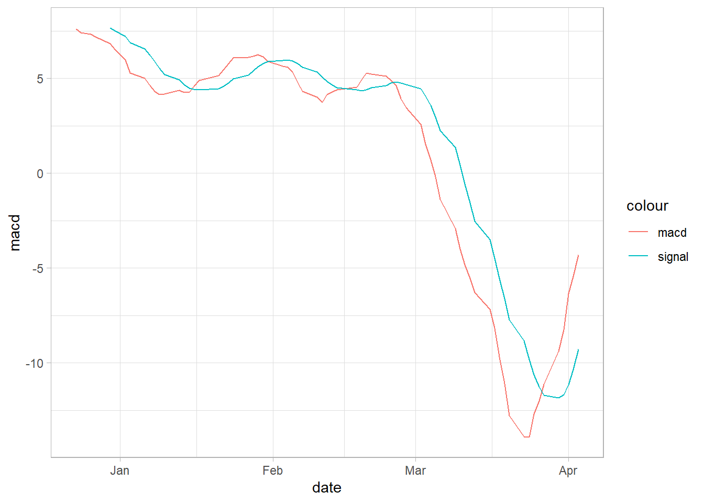
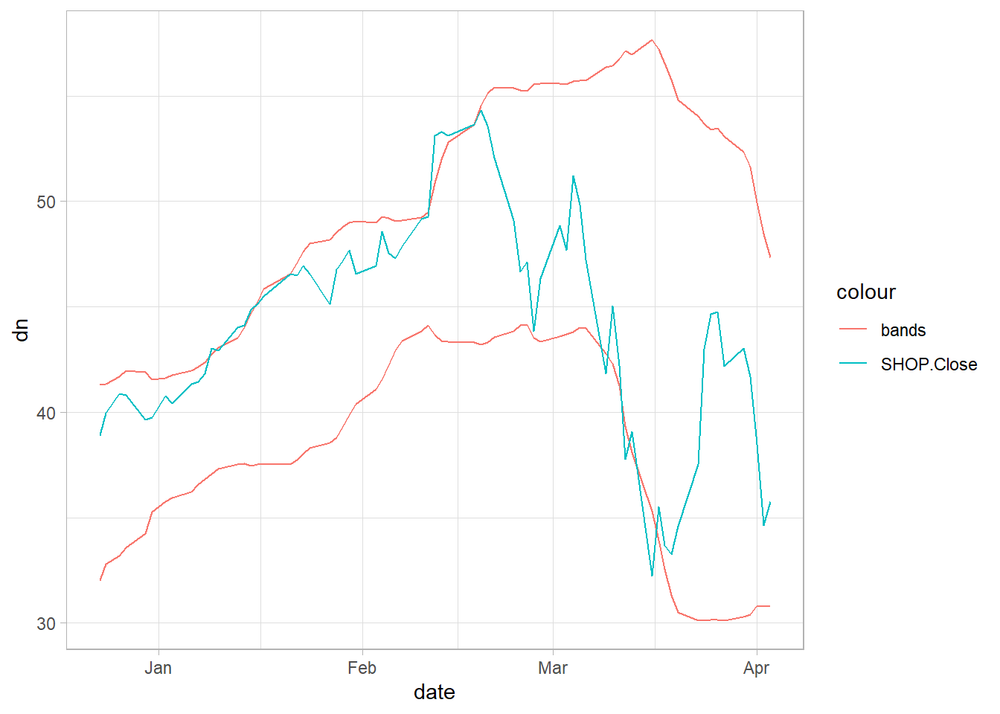
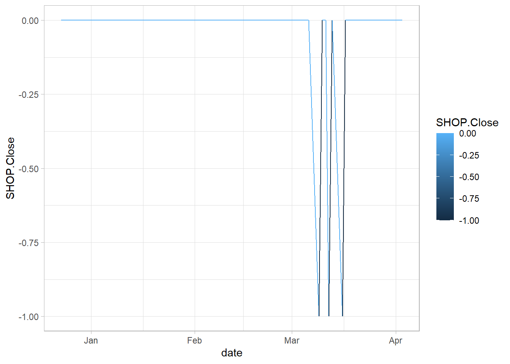
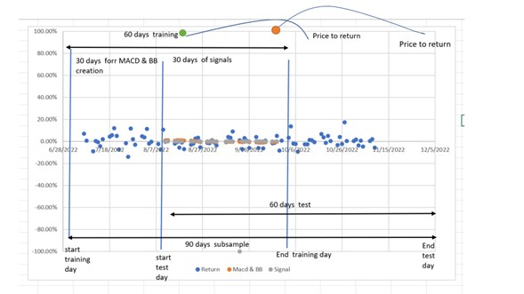
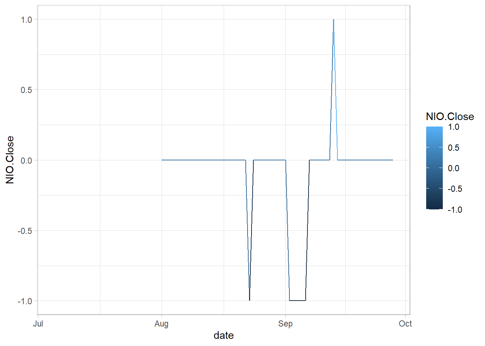

# Applied market anomalies. Momentum market anomalies


```r
library(xts)
library(dplyr)
library(PerformanceAnalytics)
library(quantmod)
library(ggplot2)
```


## Overview of the momentum market anomalies

In chapter 7, we applied the EMH test for variance for many assets in building a portfolio. As you remember, we filter to get only those stocks for which the EMH fails, or the test suggests that it is an inefficient market, then we can make a prediction based on past information.

The final goal is to create a portfolio of filtered stocks and submit it to a trading platform, such as interactive brokers. For this chapter, we make another filter applying the momentum effect, which is a market anomaly. We follow the methodology of the article [@momentum]. 

Short run momentum (3 to 12 months). The strategy consists of buying assets when their prices are trending up and selling them when it is down. The idea is that the asset prices with previous higher returns (winners), in the short run, will continue to have high returns, and the asset prices with previous lower returns (losses) will continue to have lower returns. The strategy applyed to portfolio, consist of taking long positions in previous higher returns (winners), and short positions previous lower returns (losses) ones. When applied to portfolio, the strategy consists of taking long positions in previous higher returns (winners) and short ones in lower returns (losses). 

Long run momentum or reversal effect (2 to 5 years). We expect the opposite effect in the long run. The reversal effect occurs when the asset prices with previous higher returns (winners) reverse and show lower returns. The asset prices with previous lower returns (losses) will have higher returns.

For this chapter, we will apply the Short run momentum strategy. We look for stocks for which we could apply trading strategies using historical information (that is why we made the EMH test). To reach that end, we will apply what is called algorithm trading. In this case, we will create a signal to buy(long position ) or sell (long position) based on variables created from past information. We will estimate the strategy return for each stock to filter those stocks that consistently show to be wines or losers. 

## Data preparation

On Nov 11, we downloaded some tickers from the yahoo finance Screener, like this one:


```r

```

<div class="figure" style="text-align: center">

<p class="caption">(\#fig:unnamed-chunk-2)...</p>
</div>


As a result, we got the tickers and the prices and estimated the returns. In the next code, we import both the prices and the returns. 


```r
library(xts)
# The Returns 
ret_o<-read.csv("https://raw.githubusercontent.com/abernal30/BookAFP/main/data/ret_momentum_orig.csv")

# I deleted these two columns because they were causing errors in the code because of the missing values.
del<-c(17,117)
ret_o<-ret_o[-del]

# We will need also the original prices. 
price_o<-read.csv("https://raw.githubusercontent.com/abernal30/BookAFP/main/data/price_momentum_orig.csv")
price_o<-price_o[-del]
head(price_o[,1:3])
#>         Date SHOP.Close SQ.Close
#> 1 11/11/2019     30.332    63.79
#> 2 11/12/2019     30.556    61.54
#> 3 11/13/2019     31.431    61.51
#> 4 11/14/2019     31.245    62.99
#> 5 11/15/2019     31.238    64.70
#> 6 11/18/2019     32.298    65.74
```

The following are to transform the data frame date into xts.


```r
#  Instead of doing the procedure twice, we create function, call it my_xts, that transform into xts a data frame that has as first column the date.

my_xts<-function(data,date_format){
  date<-data[,1]
  datax<- xts(data[,-1],
              order.by = as.Date(date,date_format))
  datax
}

#-------- ends here---------


#---- Here we apply the function

# You need to look at the date format, Example: "%Y-%m-%d" "%y/%m/%d",  Y for 4 digits year
#  (y for 2 digits), m for month and d for day.
  
# In the previous chunk we can see that the date format is %m/%d/%Y

# Here we use the function 
price_xts<-my_xts(price_o,"%m/%d/%Y")
ret_xts<-my_xts(ret_o,"%m/%d/%Y")
head(ret_xts[,1:3])
#>              SHOP.Close     SQ.Close     SE.Close
#> 2019-11-12  0.007384907 -0.035271986  0.185806387
#> 2019-11-13  0.028635947 -0.000487537 -0.042981450
#> 2019-11-14 -0.005917693  0.024061194  0.049459864
#> 2019-11-15 -0.000224036  0.027147086 -0.014626138
#> 2019-11-18  0.033932997  0.016074205  0.006871907
#> 2019-11-19 -0.020744319  0.009583283  0.010373928
```


We want apply a short momentum strategy of 30 days. In other words, we want to verify if, for the winners assess, we can buy the stock, and make a profit 30 days after, because we expect that the stock price will be increasing.  For example, suppose the algorithm generates a buy signal, the strategy would imply to buy the stock today, and sell it 30 days after. 


##  Signal creation for one stock

For exposition proposes, we start by applying the strategy on the first stock of our data set, in  subsequent section we apply a code for making the procedure for all the stocks in the data set.  

To create the signal, we follow the book [@jeet]. The idea is to combining two technical analysis indicators, the Moving Average Converge Diverge (MACD) and Bollinger Bands (BB) (see the Appendix).

Firts we create the MACD and plot a few observations.


```r
macd<-MACD(price_xts[,1] , nFast = 12  , nSlow =26 , nSig = 9, maType="SMA")
```


We use the ggplot library for making the graph.

```r
data<-macd 
macd_df<-as.data.frame(data[30:100,])
date<-as.Date(rownames(macd_df),format = "%Y-%m-%d")
macd_df<-cbind(date,macd_df)
ggplot(macd_df, aes(x = date)) +
geom_line(aes(y = macd, colour ="macd", col="blue")) +
geom_line(aes(y = signal,colour="signal",col="red"))
```




Regarding the MACD, usually traders may buy the security when the MACD (red) crosses above its signal line (blue)  and sell - or short - the security when the MACD (red) crosses below the signal line (blue).


The **Bollinger Bands** are also a technical analysis indicator.

```r
bb<-BBands(price_xts[,1] , n = 20, maType="SMA", sd = 2)
bb<-cbind(bb,price_xts[,1])

bb_df<-as.data.frame(bb[30:100,])
date<-as.Date(rownames(bb_df),format = "%Y-%m-%d")
bb_df<-cbind(date,bb_df)

ggplot(bb_df, aes(x = date)) +
geom_line(aes(y = dn, colour ="bands",col=col2)) +
geom_line(aes(y = up, colour ="bands",col=col2)) +
geom_line(aes(y =SHOP.Close ,colour="SHOP.Close",col=col1))
```




In the BB case, usually traders consider that when the price (blue) continually touches the upper Bollinger Band (red), it can indicate an overbought signal, while continually touching the lower band (red) indicates an oversold signal.


We now combine the indicators to create the signal in the following way: when the price is higher than the "up" band, and the macd is higher than its signal is a buy signal (1). When the price is lower than the "dn" band, and the macd is lower than its signal is a sell, or short sale, signal (-1). Other wise a neutral signal, or doing nothing (0).


```r
i<-1 # This is because we are aplying the signal on the first stock, column

data<-price_xts[,i]
signal <- ifelse(data > bb[,'up'] & macd[,'macd'] >macd[,'signal'],1,ifelse(data[,i]< bb[,'dn'] &macd[,'macd'] <macd[,'signal'],-1,0))

signal_df<-as.data.frame(signal[30:100,])
date<-as.Date(rownames(signal_df),format = "%Y-%m-%d")
signal_df<-cbind(date,signal_df)

ggplot(signal_df, aes(x = date)) +
geom_line(aes(y =SHOP.Close, colour=SHOP.Close))
```



## Back testing


To back-test the momentum strategy, we have to divide the data set into training and testing, for example, as in machine learning. In [@jeet], they call it in_sample and out_sample.


Remember that we want to verify the strategy return 30 days after we buy (sell) the stock. To prove that, we have two alternatives: 

Alternative 1: Wait in time, 30 days, to verify if the strategy works or not; if it does not work, then we have to calibrate the strategy and prove it again, waiting another 30 days and so on.

Alternative 2 (The one we will apply): Assuming that we still don't know what happened in the last 30 days. We can test our strategy and compare it with what happens in those 30 days. If it does not work, we must calibrate the strategy before.


In total, we are creating a 90 days window for this case. The training sample will be a 60 days window, 90 days before the date of the last price known and 60 days after that day. The test sample will also be in a 60 days window, 60 days before the date of the last price known.

In the following figure, we explain why. 


```r

```

<div class="figure" style="text-align: center">

<p class="caption">(\#fig:unnamed-chunk-10)...</p>
</div>

Regarding the 60 days windows of the training sample, the strategy involves estimating moving averages of 26 days; then, we need a window period for that estimation and a 30-day window for creating the signals. 

Regarding the test sample, suppose our algorithm generates a signal like the green or orange dots. The backtesting implies estimating the return 30 days after. If we do not know the 30-day last price, we may have to wait a few days or almost a month to verify our strategy return. Finally, the test set is a 60 days window because, in the finale stage, we will compare the return in this window with the return of the train set window to verify the consistency and make a filter. 


```r

dim<-dim(price_xts) #dimension
dim_ret<-dim(ret_xts)
momen_days<- 30 # This is the period  of the momentum strategy
#days<-momen_days*2

# momen_days in this case a 90 days window
start_train<-dim[1]-momen_days*3

# in this case 60 days after strat train
end_train<-start_train+momen_days*2

# in this case 30 days after strat train
start_test<-start_train+momen_days

# the most current price
end_test<-dim_ret[1]

price_train<-price_xts[start_train:end_train,] #cinitial date
price_test<-price_xts[start_test:end_test,] #cinitial date


ret_train<-ret_xts[start_train:end_train,] #cinitial date
ret_test<-ret_xts[start_test:end_test,] #cinitial date
```


We need to create again the signal on the price_train data set, this time for the column 5. 

```r
i<-5 # Is column number that we can change

macd<-MACD(price_train[, i] , nFast =12  , nSlow =26 , nSig = 9, maType="SMA")
  
bb<-BBands(price_train[, i], n = 20, maType="SMA", sd = 2)

signal <- ifelse(price_train[,i]> bb[,'up'] & macd[,'macd'] >macd[,'signal'],1,ifelse(price_train[,i]< bb[,'dn'] &macd[,'macd'] <macd[,'signal'],-1,0))

signal_df<-as.data.frame(signal)

date<-as.Date(rownames(signal_df),format = "%Y-%m-%d")
signal_df<-cbind(date,signal_df)

ggplot(signal_df, aes(x = date)) +
geom_line(aes(y =NIO.Close, colour=NIO.Close))
```



o estimate our strategy return, we need to verify what happens 30 days after we buy(sell) the asset (30 days is because it is a 30 days momentum strategy). Then we need to take the price of the day of buy (sale) in the training data set and the price 30 days after in the test data set.


We will search in the signal object and gets only the buying (1) or sale (-1) signals, and stores the dates of the signal, moment_days (30 in this case), days after, and the return. For example, in row 44 there is a sell signal.


```r
signal[44,1][1]
#>            NIO.Close
#> 2022-09-02        -1
```

For this case, the day of the signal is 2022-09-02. The next code creates a data frame to store that date, the signal, and a date 30 days after that signal.


```r
df<-data.frame(sig_data="2022-09-02",signal=signal[44,1][1], sig_data_30_after=as.Date("2022-09-02")+30,return=NA,ticker=colnames(signal))
colnames(df)[2]<-"Signal"
df
#>              sig_data Signal sig_data_30_after return    ticker
#> 2022-09-02 2022-09-02     -1        2022-10-02     NA NIO.Close
```
For the moment we let the return column empty, an NA. 

Now we estimate the return of this particular signal. We estimate the annualized geometric return:

$$ geometric\ return =\prod_{i=1}^{n} (1+HPR)^{scale/n}$$


where $\prod_{i=1}^{n} (1+HPR)$ is the product of  (1+HPR). Also,  n is the number of observations, scale is number of periods in a year (daily scale = 252, monthly scale = 12, quarterly scale = 4) and HPR is the Holding Period Return:

$$HPR=  \frac{Price_{t} - Price_{t-1}}{Price_{t-1}}$$

First, we make a sample window from 2022-09-02 to 2022-10-02. 
 

```r

sub_price_test<-window(price_test [, i], start =df[,"sig_data"], end = df[,"sig_data_30_after"])
head(sub_price_test)
#>            NIO.Close
#> 2022-09-02     17.73
#> 2022-09-06     17.11
#> 2022-09-07     17.48
#> 2022-09-08     17.68
#> 2022-09-09     19.16
#> 2022-09-12     21.75
tail(sub_price_test)
#>            NIO.Close
#> 2022-09-23     17.64
#> 2022-09-26     17.62
#> 2022-09-27     17.19
#> 2022-09-28     17.33
#> 2022-09-29     15.58
#> 2022-09-30     15.77
```

Now we estimate the arithmetic return on that sum sample, and apply the Return.annualized function.


```r
sub_ret<-Delt(sub_price_test[,1])
reti<-Return.annualized(sub_ret,geometric = T,scale= 252)
reti[1]
#> [1] -0.788549
```


```r
df[,"return"] <- reti[1]*df[,"Signal"]
colnames(df)[4]<-"return"
df
#>              sig_data Signal sig_data_30_after   return    ticker
#> 2022-09-02 2022-09-02     -1        2022-10-02 0.788549 NIO.Close
```


The next code does the same procedure for all the signals of the stock we are analyzing. 


```r
# Remember that in an R function, you do not need to change the content of the function; only use it. Except if you have the knowledge to do it, which we do not expect in this course

#-------Do not change from her-----------

# This function has only one argument, a data frame with the signals we created in the previous chunk. It searches on the signal object and gets only for buying (1) or sale (-1) signals, and stores the dates of the signal, and moment_days (30 in this case) days after. 

strat_results<-function(signal,data){

  signal_na<-na.omit(signal)
  sig_date<-as.Date(c())
  sig_sig<-c()
  tick<-colnames(signal)
  
for (i in 1:length(signal_na)){
    if (signal_na[i,1]==1 | signal_na[i,1]== -1 ) {
      sig_date<-c(sig_date,index(signal_na[i]))
      sig_sig<-c(sig_sig,signal_na[i])
    }
}

ma<-
le2 <-length(sig_date)
ma<-matrix(0,1,le2)

res_signal0<-data.frame(sig_date=sig_date,sig_sig=sig_sig,momen_days_sig=c(1:le2),strat_ret=ma[1,],ticker=tick)

res_signal0[,"momen_days_sig"]<-as.Date(res_signal0[,"sig_date"]+momen_days)

#res_signal0<-mr
di<-dim(res_signal0)

for (iz in 1:di[1]) {

sub<-window(data[,i], start =res_signal0[iz,"sig_date"], end = res_signal0[iz,"momen_days_sig"])
sub_ret<-Delt(sub)

ret_annual<-t(Return.annualized(sub_ret,geometric = T,scale= 252))

res_signal0[iz,"strat_ret"]<-ret_annual[,1]*res_signal0[iz,"sig_sig"]
}
res_signal0

}

mr<-strat_results(signal, price_test)
mr
#>     sig_date sig_sig momen_days_sig   strat_ret    ticker
#> 1 2022-08-23      -1     2022-09-22  0.95452790 NIO.Close
#> 2 2022-09-02      -1     2022-10-02  0.78848347 NIO.Close
#> 3 2022-09-06      -1     2022-10-06 -0.02053551 NIO.Close
#> 4 2022-09-13       1     2022-10-13 -0.58211173 NIO.Close
```


## Appendix

### The MACD and signals (from investopedia).

Moving Average Convergence Divergence (MACD) is a trend-following momentum indicator that shows the relationship between two moving averages of a security’s price. The MACD is calculated by subtracting the 26-period Exponential Moving Average (EMA) from the 12-period EMA.

The result of that calculation is the MACD line. A nine-day EMA of the MACD called the “signal line,” is then plotted with the MACD line, which can be a signal for buy and sell. Traders may buy the security when the MACD crosses above its signal line and sell - or short - the security when the MACD crosses below the signal line.

An exponential moving average (EMA) is a type of moving average (MA) that places a greater weight and significance on the most recent data points. The exponential moving average is also referred to as the exponentially weighted moving average. An exponentially weighted moving average reacts more significantly to recent price changes than a simple moving average (SMA), which applies an equal weight to all observations in the period.

In the next example, by default, the function MACD creates a 12 days EMA and 26-days EMA.


### The Bollinger Bands (from investopedia)

Are a technical analysis tool developed by John Bollinger for generating oversold or overbought signals.

There are three lines that compose Bollinger Bands: A simple moving average (middle band) and an upper and lower band.

The upper and lower bands are typically 2 standard deviations +/- from a 20-day simple moving average (which is the center line), but they can be modified.

When the price continually touches the upper Bollinger Band, it can indicate an overbought signal while continually touching the lower band indicates an oversold signal.


