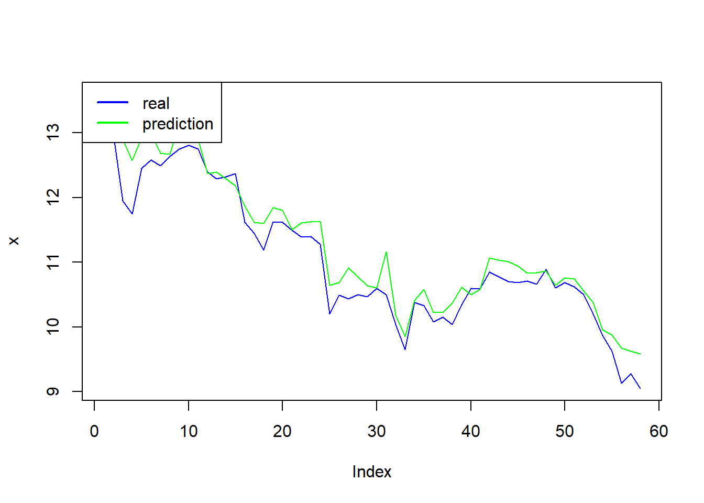

# Big data and machine learning

 


Predicting market direction of a price is quite a challenging task as market data involves lots of noise. The market moves either upward or downward, and the nature of the market movement is binary (Jeet and Vat, 2017).

In this chapter, we use a OLS, to predict a 1 day open price, the price of the 19 April 2022,  of a cryptocurency, in this case Bianance, "BNB-USD". Some ideas and code are adapted from  Jeet and Vat (2017). 

Binance Launched in July 2017, Binance is the biggest cryptocurrency exchange globally based on daily trading volume. Binance aims to bring cryptocurrency exchanges to the forefront of financial activity globally. The idea behind Binance’s name is to show this new paradigm in global finance — Binary Finance, or Binance.

## Data preparation


```r
library("quantmod")
ticker<-"CEMEXCPO.MX"
y<-getSymbols(ticker,from="2021-01-01",to="2022-04-18",warnings =FALSE,auto.assign=FALSE)

y<-y[,1]
colnames(y)<-"bnb"
head(y)
#>              bnb
#> 2021-01-04 10.32
#> 2021-01-05 10.38
#> 2021-01-06 10.71
#> 2021-01-07 11.61
#> 2021-01-08 11.72
#> 2021-01-11 11.54
```

We are going to start with an OLS (Ordinary least square) model. As independent variables we are using some lags of the independent variable. 

For simplicity, suppose that to predict the 19 April 2022 BNB price, we  make a regression, by OLS, of the following model:

$$bnb_{t}=\alpha\ +\beta1\ bnb_{t-1}+\beta2\ bnb_{t-2} + e $$

where $\alpha$ is intercept, $beta$ are the parameters to be estimated, $bnb_{t-1}$ are the bnb price of the traiding previouse day, in this case 18 April 2022, and  $bnb_{t-2}$ is the bnb price of the day before, 17 April 2022, and "e" is the the error term of the regression. In other words, the price of today is explained by the price of yesterday and the day before yesterday. 

data<-stats::lag(y,lag)

```r
lag<-1
lag1<-2
data<-stats::lag(y,lag)
data2<-stats::lag(y,lag1)
data<-cbind(y,data,data2)
colnames(data)[2:3]<-c("bnb_1","bnb_2")
```

Para realizar la regresión por OLS
lm(bnb~.,data=data)

```r
model<-lm(bnb~.,data=data)
summary(model)
#> 
#> Call:
#> lm(formula = bnb ~ ., data = data)
#> 
#> Residuals:
#>      Min       1Q   Median       3Q      Max 
#> -1.10065 -0.19085 -0.03598  0.20284  0.91287 
#> 
#> Coefficients:
#>              Estimate Std. Error t value Pr(>|t|)    
#> (Intercept)  0.125337   0.131553   0.953    0.341    
#> bnb_1        0.995516   0.056048  17.762   <2e-16 ***
#> bnb_2       -0.004747   0.056243  -0.084    0.933    
#> ---
#> Signif. codes:  0 '***' 0.001 '**' 0.01 '*' 0.05 '.' 0.1 ' ' 1
#> 
#> Residual standard error: 0.3295 on 319 degrees of freedom
#>   (2 observations deleted due to missingness)
#> Multiple R-squared:  0.973,	Adjusted R-squared:  0.9729 
#> F-statistic:  5753 on 2 and 319 DF,  p-value: < 2.2e-16
```


Also, suppose we found the following result of the regression:
$$bnb_{t}=\ 0.1253373\ +\ 0.9955164\ bnb_{t-1}\ -0.0047468\ bnb_{t-2}$$


In this case, the forecast of the 2022-04-14 would be:

0.1253373 + 0.9955164 * 9.05+ -0.0047468*9.28 = 9.0907102

The parameters $bnb_{t-1}$ and  $bnb_{t-2}$ are the ultimate and ante penultimate known prices, in the following chunk we print the last known prices: 


```r
tail(y)
#>              bnb
#> 2022-04-06 10.20
#> 2022-04-07  9.87
#> 2022-04-08  9.63
#> 2022-04-11  9.13
#> 2022-04-12  9.28
#> 2022-04-13  9.05
```

However, the last example was only for exposition purposes. In reality, we need to test other independent variables besides the lags of the dependent variable. For this session, besides the lags values if the close prices as the dependent variable, we are going to add some variables used in technical analysis, such as moving average, standard deviation, RSI (see appendix for a detailed explanation), MACD, and so on, which has some predictive power in market direction. These indicators can be constructed using the following commands:

## Variable creation

- SMA Calculate a moving averages 
SMA(x, n = 10, ...), where x is the time serie, n is the Number of periods to average over

- The rollapply is a function for applying a function to rolling margins of an array, in this case we used to make a moving standard deviation.
rollapply(x,n,sd), where sd is standard deviation

- The MACD is the moving average converge diverge (see Appendix)
- MACD(x, nFast = 12, nSlow = 26, nSig = 9, maType=SMA or EMA)

- RSI is the relative strength index 
RSI(x, n = 14, maType=SMA or EMA)


```r
lag2<-6
lag3<-9
lag4<-26
avg<-SMA(data[,1],lag2) # var1
std<- rollapply(data[,1],lag2,sd) # var2
colnames(std)<-"std"

macd<- MACD(data[,1], lag2,lag3,lag4, "SMA") # var2
colnames(macd)[2]<-"macd_signal"
  
rsi<-  RSI(data[,1],lag2,"SMA")# var3


data2<-cbind(data,avg,std,macd,rsi)
head(data2)
#>              bnb bnb_1 bnb_2      SMA       std macd macd_signal rsi
#> 2021-01-04 10.32    NA    NA       NA        NA   NA          NA  NA
#> 2021-01-05 10.38 10.32    NA       NA        NA   NA          NA  NA
#> 2021-01-06 10.71 10.38 10.32       NA        NA   NA          NA  NA
#> 2021-01-07 11.61 10.71 10.38       NA        NA   NA          NA  NA
#> 2021-01-08 11.72 11.61 10.71       NA        NA   NA          NA  NA
#> 2021-01-11 11.54 11.72 11.61 11.04667 0.6480638   NA          NA  NA
```


Then our model is:
$$bnb_{t}=\alpha\ +\beta1\ bnb_{t-1}+\beta2\ bnb_{t-2} +\beta3\ sma +\\ \beta4\ std\ +\beta5\ macd\ + \beta6\ rsi +\ e$$


As we see, because of the lags and new variables, we have many missing values in the early dates, then we apply the na.omit, to eliminate the rows with nas. 

```r
data2<-na.omit(data2)
```


## Sub samples 
We separate the sample into training and testing. The training data set is used for the building model process, and the testing dataset is used for evaluation purposes. 


This code automate the sub-sample creation, usually we split into 80% the training set and 20% the test set. 

```r
N<-dim(data2)[1]
n_train<-round(N*.8,0)
part<-index(data2)[n_train]
part
#> [1] "2022-01-19"
```

In this case, "2022-01-31" is the date that represents the 80% of all observations, where the starting date is "2022-01-01".

We use the function subset:

name<-subset(object,
  +index(object)>="YY-mm-dd" &
  +index(object)<="YY-mm-dd") 
  

```r

#This is the test data set.
train<-subset(data2,
  +index(data2)>=index(data2)[1] &
  +index(data2)<=part)

# The subset of the training data set.
test<-subset(data2,
  +index(data2)>=part+1 &
  +index(data2)<="2022-04-18")
```


To our forecast vs the real data, we are going to takeout the  real data of the BNB prices of the test set, and store it in an object call it y1.

```r
y1<-test[,1] 
head(test)
#>              bnb bnb_1 bnb_2      SMA       std       macd macd_signal
#> 2022-01-20 13.60 13.81 13.98 13.79333 0.1376469  1.3139639  0.35574084
#> 2022-01-21 12.99 13.60 13.81 13.66167 0.3566184  0.5931441  0.38949477
#> 2022-01-24 11.95 12.99 13.60 13.37167 0.7823405 -0.5824040  0.37404430
#> 2022-01-25 11.75 11.95 12.99 13.01333 0.9633829 -1.9506069  0.28418240
#> 2022-01-26 12.45 11.75 11.95 12.75833 0.8524416 -2.7895361  0.14200830
#> 2022-01-27 12.58 12.45 11.75 12.55333 0.6792545 -3.4441501 -0.05296758
#>                  rsi
#> 2022-01-20 60.504202
#> 2022-01-21 21.167883
#> 2022-01-24 12.500000
#> 2022-01-25  3.463203
#> 2022-01-26 23.890785
#> 2022-01-27 28.719723
```


## Making the model
We estimate a OLS model aplying the function lm, 

lm(bnb~.,data=train)

```r
model1<-lm(bnb~.,data=train)
summary(model1)
#> 
#> Call:
#> lm(formula = bnb ~ ., data = train)
#> 
#> Residuals:
#>      Min       1Q   Median       3Q      Max 
#> -0.69820 -0.10951 -0.00933  0.11320  0.60485 
#> 
#> Coefficients:
#>               Estimate Std. Error t value Pr(>|t|)    
#> (Intercept) -0.5477293  0.1620272  -3.380 0.000853 ***
#> bnb_1        0.1457424  0.0561005   2.598 0.009999 ** 
#> bnb_2       -0.2267351  0.0577742  -3.925 0.000116 ***
#> SMA          1.0653057  0.0755343  14.104  < 2e-16 ***
#> std          0.1499802  0.1105334   1.357 0.176180    
#> macd        -0.1363421  0.0185553  -7.348 3.68e-12 ***
#> macd_signal -0.0078826  0.0297987  -0.265 0.791615    
#> rsi          0.0157337  0.0008957  17.566  < 2e-16 ***
#> ---
#> Signif. codes:  0 '***' 0.001 '**' 0.01 '*' 0.05 '.' 0.1 ' ' 1
#> 
#> Residual standard error: 0.1936 on 225 degrees of freedom
#> Multiple R-squared:  0.9794,	Adjusted R-squared:  0.9788 
#> F-statistic:  1531 on 7 and 225 DF,  p-value: < 2.2e-16
```

To make the prediction, we need to apply the function predict, but on the test set.  

```r
pred<-predict(model1,test)
head(pred)
#> 2022-01-20 2022-01-21 2022-01-24 2022-01-25 2022-01-26 2022-01-27 
#>   13.77998   13.15960   12.89724   12.57447   12.92974   12.99951
pred
#> 2022-01-20 2022-01-21 2022-01-24 2022-01-25 2022-01-26 2022-01-27 2022-01-28 
#>  13.779981  13.159602  12.897245  12.574469  12.929737  12.999507  12.685198 
#> 2022-01-31 2022-02-01 2022-02-02 2022-02-03 2022-02-04 2022-02-08 2022-02-09 
#>  12.674351  13.164583  13.231589  12.902274  12.376268  12.398194  12.288838 
#> 2022-02-10 2022-02-11 2022-02-14 2022-02-15 2022-02-16 2022-02-17 2022-02-18 
#>  12.189159  11.870961  11.616433  11.602455  11.849330  11.805935  11.508132 
#> 2022-02-21 2022-02-22 2022-02-23 2022-02-24 2022-02-25 2022-02-28 2022-03-01 
#>  11.610196  11.626087  11.632577  10.649812  10.687183  10.913722  10.774856 
#> 2022-03-02 2022-03-03 2022-03-04 2022-03-07 2022-03-08 2022-03-09 2022-03-10 
#>  10.635500  10.604802  11.168214  10.184670   9.857020  10.413452  10.581255 
#> 2022-03-11 2022-03-14 2022-03-15 2022-03-16 2022-03-17 2022-03-18 2022-03-22 
#>  10.225329  10.223843  10.369493  10.614031  10.502113  10.582636  11.071733 
#> 2022-03-23 2022-03-24 2022-03-25 2022-03-28 2022-03-29 2022-03-30 2022-03-31 
#>  11.033770  11.012177  10.943852  10.833943  10.842324  10.863476  10.648959 
#> 2022-04-01 2022-04-04 2022-04-05 2022-04-06 2022-04-07 2022-04-08 2022-04-11 
#>  10.758467  10.740732  10.560178  10.382403   9.955414   9.879946   9.675480 
#> 2022-04-12 2022-04-13 
#>   9.624368   9.583836
```

Where the first prediction, of the 2022-04-04, 433.6627, is 

$$ bnb_{t}=\ -20.28047\ +\ 0.06146\ bnb_{t-1}\ -0.27979\ bnb_{t-2} + \\1.15805\ sma +\ 0.33934206\ std -3.76813\ macd\\ -6.68031\ macd\_ signal\ + 0.74661\ rsi $$
And so on. 

## Accuracy of the prediction

Lest make a  plot of the forecast vs the real value of BNB.

```r
pred2<-as.data.frame(pred)
y2<-as.data.frame(y1)
all<-cbind(y2,pred2)
plot(all[,1],type = "l",col="blue",ylab="x")
lines(all[,2],col="green")
legend(x= "topleft", legend = c("real","prediction"),lty = 1,lwd=2,col=c("blue","green"))
```




Finaly, to measure the accuracy of our prediction, we apply the Root Mean Square Error (RMSE). It gives an idea of how much error the system typically makes in its predictions. The formula of the RMSE is:

$$RMSE =\frac{1}{n}\ \sum_{i=1}^{n} (y_{i}-\hat{f(x_{i}))^{2}} $$
where $ \hat{f(x_{i})} $ is the prediction for the ith observation (the actual), $ y_{i} $ is the observation ith of the independent variable, and n is the number of observations. 

$$\hat{f(x_{i})}=\hat{\beta_{0}}+\hat{\beta_{1}}x_{1}+,..,+\hat{\beta_{n}}x_{n}$$


The RMSE is computed using the training data that was used to fit the model, and so should more accurately be referred to as the training RMSE. 


Where, the RMSE close to zero, is the better.
sqrt(mean((real-forecast)^2,na.rm = T ))


```r
sqrt(mean((all[,1]-all[,2])^2,na.rm = T ))
#> [1] 0.310193
```


## Appendix

The MACD and signals (from investopedia). 

Moving Average Convergence Divergence (MACD) is a trend-following momentum indicator that shows the relationship between two moving averages of a security’s price. The MACD is calculated by subtracting the 26-period Exponential Moving Average (EMA) from the 12-period EMA.

The result of that calculation is the MACD line. A nine-day EMA of the MACD called the "signal line," is then plotted with the MACD line, which can be a signal for buy and sell. Traders may buy the security when the MACD crosses above its signal line and sell - or short - the security when the MACD crosses below the signal line. 

An exponential moving average (EMA) is a type of moving average (MA) that places a greater weight and significance on the most recent data points. The exponential moving average is also referred to as the exponentially weighted moving average. An exponentially weighted moving average reacts more significantly to recent price changes than a simple moving average (SMA), which applies an equal weight to all observations in the period.

In the next example, by default, the function MACD creates a 12 days EMA and 26-days EMA.


The relative strength index (RSI)

Is a momentum indicator that measures the magnitude of recent price changes to evaluate overbought or oversold conditions in the price of a stock or other asset. The RSI is displayed as an oscillator (a line graph that moves between two extremes) and can have a reading from 0 to 100. The indicator was originally developed by J. Welles Wilder Jr. and introduced in his seminal 1978 book, New Concepts in Technical Trading Systems.

The Relative Strength Index (RSI) calculates a ratio of the recent upward price movements to the absolute price movement. Developed by J. Welles Wilder. The RSI calculation is RSI = 100 - 100 / ( 1 + RS ), where RS is the smoothed ratio of 'average' gains over 'average' losses. The 'averages' aren't true averages, since they're divided by the value of n and not the number of periods in which there are gains/losses.

Traditional interpretation and usage of the RSI are that values of 70 or above indicate that a security is becoming overbought or overvalued and may be primed for a trend reversal or corrective pullback (drop in a stock) in price. An RSI reading of 30 or below indicates an oversold or undervalued condition (Investopedia).

## Bibliography


Jeet, P  and Vat, P. (2017). Learning Quantitative finance with R (2017), Packt Publishing, Birmingham, UK.


