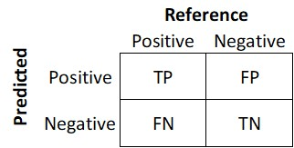
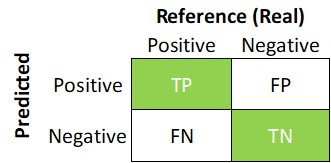
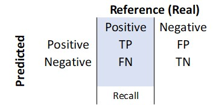
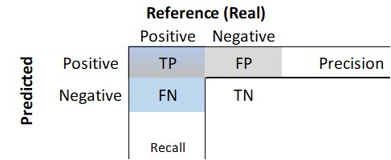
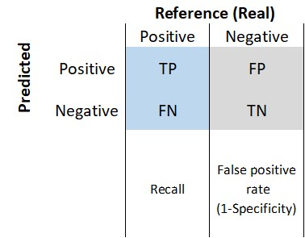
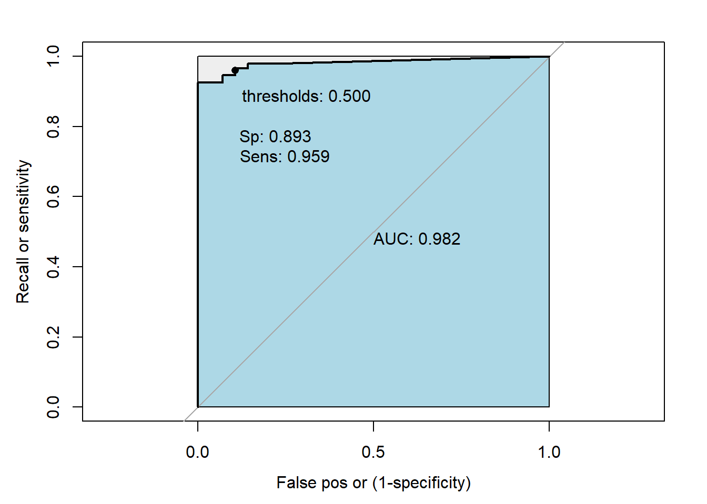
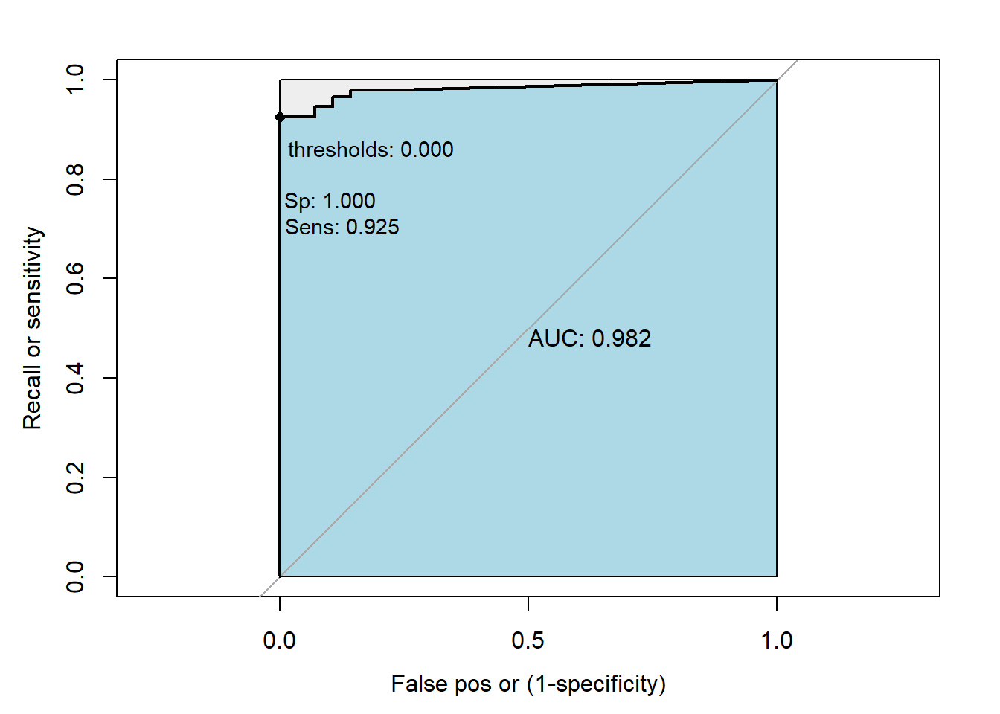

# Training and evaluating classification models


The linear regression, such as OLS, the dependent variable is continuous, such as the SalePrice variable, in the sense that the house price could be between \$62,383 and \$755000. However, there are other situations where the dependent variable has two categories: women or men, or in finance, a signal to buy or sell, etc. In that case, we call those variables categorical. One of the most popular classification models is logistic regression and linear discriminant analysis.

## Logit model

For this section we will work on the credit data set. Remember that we describe the credit data set in chapter one, where we define the model:

$$ Default=\beta_{0}+\beta_{1}\ x_{1} + \beta_{2}\ x_{2}+ ....+\beta_{n} x_{n}+\epsilon $$

The algorithm or procedures that runs the binary response models, such as logit, first transforms the categories, in this case "Charged Off" or "Fully Paid", into numerical values, zero and one. It assigns the probability that $y$ takes the value of one $P(y=1)= \pi$ and that takes the value of zero $P(y=0)= 1-\pi$. The statistical analysis aims to investigate the relationship between the probability $\pi(X)$ and the independent variables $X=x_{1}, x_{2}...x_{n}$ . It is convenient to construct a model capable of describing the effect on $pi$ of changes in $X=x_{1}, x_{2}...x_{n}$, in the form of a function $g(\pi)$ [@glm].

For the logic model the function is $g(\pi)=\log{(\pi/(1-\pi))}$

Then

$$g(\pi)=\log{(\pi/(1-\pi))}=beta_{0}+\beta_{1}x_{1}+,..,+\beta_{n}x_{n} $$

Taking the exponential of both sides, we get:

$$\pi/(1-\pi)= \exp{(beta_{0}+\beta_{1}x_{1}+,..,+\beta_{n}x_{n})}$$

To get a probability, we need a transformation like this:

$$\pi= \frac{\exp{(beta_{0}+\beta_{1}x_{1}+,..,+\beta_{n}x_{n})}}{1+\exp{(beta_{0}+\beta_{1}x_{1}+,..,+\beta_{n}x_{n})}}$$


```r
credit<-read.csv("https://raw.githubusercontent.com/abernal30/ml_book/main/credit.csv")

c2<-ifelse(credit[,"Default"]=="Charged Off" ,"No_default","default") 
credit[,"Default"]<-c2
```

The variable default is a categorical variable becasue it takes the folowing two values:


```r
table(credit[,"Default"])
#> 
#>    default No_default 
#>        728        145
```

The function to run a logistic model in R doesn´t accept character values, only numeric or factor. We transform that variable into a "factor."


```r
credit[,"Default"]<-factor(credit[,"Default"])
```

We split into training and test data sets, as we did in the housing example.


```r

set.seed (43)
dim<-dim(credit)
train_sample<-sample(dim[1],dim[1]*.8)
credit_train <- credit[train_sample, ]
credit_test  <- credit[-train_sample, ]
```

The function to run the logistic model is "glm".


```r
credit_model<-glm(Default ~ .,data= credit_train ,family=binomial())
summary(credit_model)
#> 
#> Call:
#> glm(formula = Default ~ ., family = binomial(), data = credit_train)
#> 
#> Deviance Residuals: 
#>        Min          1Q      Median          3Q         Max  
#> -8.169e-05  -2.100e-08  -2.100e-08  -2.100e-08   6.626e-05  
#> 
#> Coefficients:
#>                         Estimate Std. Error z value Pr(>|z|)
#> (Intercept)            2.897e+02  2.242e+06   0.000    1.000
#> term                   8.976e+01  6.971e+04   0.001    0.999
#> installment            1.223e-02  2.300e+02   0.000    1.000
#> grade                 -1.242e+01  3.695e+04   0.000    1.000
#> emp_title             -1.979e-02  2.551e+02   0.000    1.000
#> emp_length            -8.469e-01  2.485e+04   0.000    1.000
#> home_ownership        -9.860e+00  2.016e+04   0.000    1.000
#> annual_inc             9.569e-05  3.390e+00   0.000    1.000
#> verification_status   -4.514e+00  3.047e+04   0.000    1.000
#> purpose                4.467e+00  2.071e+04   0.000    1.000
#> title                 -1.085e+00  2.569e+04   0.000    1.000
#> zip_code               2.512e-02  8.173e+02   0.000    1.000
#> addr_state            -2.288e-01  3.921e+03   0.000    1.000
#> dti                    1.426e+00  8.380e+03   0.000    1.000
#> delinq_2yrs            3.129e+00  2.009e+04   0.000    1.000
#> earliest_cr_line      -3.055e-02  3.341e+02   0.000    1.000
#> fico_range_high       -5.329e-02  3.646e+03   0.000    1.000
#> inq_last_6mths         2.822e+00  4.734e+04   0.000    1.000
#> pub_rec                6.300e-01  1.310e+05   0.000    1.000
#> revol_bal             -1.205e-03  4.719e+00   0.000    1.000
#> revol_util            -8.785e-02  8.591e+03   0.000    1.000
#> total_acc              1.151e+01  5.819e+04   0.000    1.000
#> total_rec_int         -4.211e-03  1.308e+01   0.000    1.000
#> recoveries             1.110e-01  2.909e+02   0.000    1.000
#> last_pymnt_d           7.074e-01  2.275e+03   0.000    1.000
#> last_pymnt_amnt       -6.044e-03  1.338e+01   0.000    1.000
#> last_credit_pull_d     7.841e-01  4.390e+03   0.000    1.000
#> last_fico_range_high  -6.891e-01  4.561e+02  -0.002    0.999
#> last_fico_range_low    4.923e-03  2.849e+02   0.000    1.000
#> tot_coll_amt           1.224e-03  2.466e+00   0.000    1.000
#> tot_cur_bal            2.562e-05  3.973e-01   0.000    1.000
#> open_acc_6m            1.177e+01  6.376e+04   0.000    1.000
#> open_act_il            6.880e+00  3.555e+04   0.000    1.000
#> open_il_12m           -9.614e+00  1.184e+05   0.000    1.000
#> open_il_24m            6.398e+00  4.427e+04   0.000    1.000
#> mths_since_rcnt_il     3.689e-01  1.095e+03   0.000    1.000
#> total_bal_il           1.374e-04  2.479e+00   0.000    1.000
#> il_util                3.744e-01  3.611e+03   0.000    1.000
#> open_rv_12m           -1.147e+01  7.695e+04   0.000    1.000
#> open_rv_24m            1.252e+01  4.016e+04   0.000    1.000
#> max_bal_bc             5.577e-04  1.057e+01   0.000    1.000
#> all_util               3.889e-01  4.471e+03   0.000    1.000
#> total_rev_hi_lim       3.081e-04  3.123e+00   0.000    1.000
#> inq_fi                -1.414e-02  1.968e+04   0.000    1.000
#> total_cu_tl            3.728e+00  9.716e+03   0.000    1.000
#> inq_last_12m           8.275e-01  3.789e+04   0.000    1.000
#> acc_open_past_24mths  -1.146e+01  4.153e+04   0.000    1.000
#> avg_cur_bal           -1.149e-04  1.849e+00   0.000    1.000
#> bc_open_to_buy        -5.062e-04  1.554e+01   0.000    1.000
#> bc_util               -5.402e-02  1.391e+03   0.000    1.000
#> mo_sin_old_il_acct    -5.365e-02  4.233e+02   0.000    1.000
#> mo_sin_old_rev_tl_op   6.397e-03  8.812e+02   0.000    1.000
#> mo_sin_rcnt_rev_tl_op  2.013e-01  3.696e+03   0.000    1.000
#> mo_sin_rcnt_tl         3.205e-02  2.013e+03   0.000    1.000
#> mort_acc              -1.140e+01  7.505e+04   0.000    1.000
#> mths_since_recent_bc   8.572e-03  3.642e+03   0.000    1.000
#> mths_since_recent_inq -1.035e+00  4.052e+03   0.000    1.000
#> num_accts_ever_120_pd -4.406e+00  2.104e+04   0.000    1.000
#> num_actv_bc_tl         2.636e+00  7.399e+04   0.000    1.000
#> num_bc_sats           -4.123e+00  8.698e+04   0.000    1.000
#> num_bc_tl              3.302e+00  4.186e+04   0.000    1.000
#> num_il_tl             -1.397e+01  6.543e+04   0.000    1.000
#> num_op_rev_tl          6.232e+00  6.346e+04   0.000    1.000
#> num_rev_accts         -1.211e+01  4.019e+04   0.000    1.000
#> num_rev_tl_bal_gt_0    8.575e-01  6.424e+04   0.000    1.000
#> num_sats              -5.882e+00  3.720e+04   0.000    1.000
#> num_tl_op_past_12m     5.371e+00  9.234e+04   0.000    1.000
#> pct_tl_nvr_dlq         1.125e-01  3.589e+03   0.000    1.000
#> percent_bc_gt_75      -4.595e-02  3.134e+03   0.000    1.000
#> pub_rec_bankruptcies  -7.226e+00  1.451e+05   0.000    1.000
#> total_bc_limit         1.527e-04  1.590e+01   0.000    1.000
#> 
#> (Dispersion parameter for binomial family taken to be 1)
#> 
#>     Null deviance: 6.3112e+02  on 697  degrees of freedom
#> Residual deviance: 8.7225e-08  on 627  degrees of freedom
#> AIC: 142
#> 
#> Number of Fisher Scoring iterations: 25
```

In a paragraph below, we explain the warning in red: "glm.fit: fitted probabilities numerically 0 or 1 occurred".

We use the predict function to make the prediction.


```r
credit_predict<-predict(credit_model, newdata=credit_test, type="response")
head(credit_predict)
#>           15           19           24           26           32           34 
#> 2.220446e-16 2.220446e-16 2.220446e-16 2.220446e-16 2.220446e-16 2.220446e-16
```

The parameters we estimate with the "glm" function, adding the family=binomial() and the type= "response", are the parameters of the equation.

$$\pi= \frac{\exp{(beta_{0}+\beta_{1}x_{1}+,..,+\beta_{n}x_{n})}}{1+\exp{(beta_{0}+\beta_{1}x_{1}+,..,+\beta_{n}x_{n})}}$$

Consequently, when we make the prediction, we get a probability.

However, the expected prediction should be either Charged Off or Fully Paid, and our prediction has numbers between cero and one.


```r
summary(credit_predict)
#>    Min. 1st Qu.  Median    Mean 3rd Qu.    Max. 
#>  0.0000  0.0000  0.0000  0.1754  0.0000  1.0000
```

Finally, we must still resolve whether the prediction should be Charged Off or Fully Paid. We will transform with the following code.

```r
table(credit[,"Default"])
#> 
#>    default No_default 
#>        728        145
```


```r
credit_predict_char<-ifelse(credit_predict>.5,"No_default","default")
table(credit_predict_char)
#> credit_predict_char
#>    default No_default 
#>        144         31
```

When we transform our forecast in that category, we establish a threshold of 0.5; if our prediction is higher than 0.5, we convert it into "Fully Paid" and otherwise "Charged Off." It is "ok" if you wonder why our threshold is 0.5. After estimating the prediction accuracy of our model, we could change this threshold to improve the prediction performance.


Is suggest verifying and comparing the resulting structure with the original data structure. In this case, "Charged Off" is 82 % of the observations (144 / (144+31)).

In the complete data set (train + test), that percentage is 83%, which is a consistent result. An inconsistent result is 87% in our prediction.

## Performance Measure in clasification

Now we measure the prediction accuracy, applying the confusion Matrix:

Confusion matrix

It is a table that categorizes predictions according to whether they match the actual value. One of the table's dimensions indicates the possible categories of predicted values, while the other shows the same for actual values. Although we have only seen 2 x 2 confusion matrices so far, a matrix can be created for models that predict any number of class values. The following figure shows a generic confusion matrix.

<div class="figure" style="text-align: center">

<p class="caption">(\#fig:unnamed-chunk-11)Confusion matrix.</p>
</div>

Where True Positive (TP): Correctly classified as the class of interest. True Negative (TN) is Correctly classified as not the class of interest. False Positive (FP) is Incorrectly classified as the class of interest. False Negative (FN): Incorrectly classified as not the class of interest.

We use the confusionMatrix function from the library "caret" for the credit analysis example. The first argument is our prediction, and the second argument is the reference, in this case, the variable "Default" in the credit_test data set; both variables must be factors, which is only true for the variable inside credit_test.


```r
library("caret")
```


```r
Defaultf<-factor(credit_predict_char,levels=c("No_default","default"))
table(Defaultf)
#> Defaultf
#> No_default    default 
#>         31        144
```

Again I review the consistency of the data structure. In this case, it is consistent. It is important to keep the consistency of the levels; in this case, we write first "Charged Off" because the reference data set starts with that label first:


```r
head(credit_test[,"Default"])
#> [1] default default default default default default
#> Levels: default No_default
```

Finally, we apply the function. In this case, we are assuming that the positive class, the class of interest, is "Charged Off":


```r
confu<-confusionMatrix(Defaultf,credit_test[,"Default"],positive="default")
confu
#> Confusion Matrix and Statistics
#> 
#>             Reference
#> Prediction   default No_default
#>   default        141          3
#>   No_default       6         25
#>                                           
#>                Accuracy : 0.9486          
#>                  95% CI : (0.9046, 0.9762)
#>     No Information Rate : 0.84            
#>     P-Value [Acc > NIR] : 8.743e-06       
#>                                           
#>                   Kappa : 0.8166          
#>                                           
#>  Mcnemar's Test P-Value : 0.505           
#>                                           
#>             Sensitivity : 0.9592          
#>             Specificity : 0.8929          
#>          Pos Pred Value : 0.9792          
#>          Neg Pred Value : 0.8065          
#>              Prevalence : 0.8400          
#>          Detection Rate : 0.8057          
#>    Detection Prevalence : 0.8229          
#>       Balanced Accuracy : 0.9260          
#>                                           
#>        'Positive' Class : default         
#> 
```

There are several indicators in the output, which could be "confusing." We analyze it in parts. We start with the table:


```r
confu$table
#>             Reference
#> Prediction   default No_default
#>   default        141          3
#>   No_default       6         25
```

The matrix's left-superior/right-inferior numbers are the true positive/true negative or the number of observations where our prediction equals the reference. The left-inferior/ right-superior numbers in the matrix are the true positive/ true negative or the number of observations where our prediction is "Not" equal to the reference.


```r
confu$table[1]+confu$table[2]
#> [1] 147
```


From those numbers we get the following metrics.


```r
confu$overall[1]
#>  Accuracy 
#> 0.9485714
```

The accuracy is:

$$ accuracy =\frac{TP+TN}{TP+TN+FP+FN}$$

### The **accuracy**: 

Is the proportion of true positives and true negatives, divided by the total number of predictions. At the beginning it could be tempting to tuning a model to increase the Accuracy, increase the true predictions of default or no default, which would be fin. However, the machine larning clasficiation theory suggest considering other measures.

In therms of the confusion matrix, it would be the sum of the green squares of the toal number of observations.

<div class="figure" style="text-align: center">

<p class="caption">(\#fig:unnamed-chunk-20)Confusion matrix.</p>
</div>


To explain why we may need other measures, in our example, imagine a scenario where the company is concern of the default rates, because it has been increasing. A first thought to correct it, is tuning a model that predict almost always that a new customer is not going to pay, "Charge of". As consequence, the model would be discriminating bad new customers, that probably would´t pay the loan, but also good ones. The problem with that for a bank, is that ot may end with no business, a bank that does´t make loans, winch could has a negative effect on profits.

On the contrary, tuning a model that predict almost always that a new customer is going to pay, could cause granting loans to some customers that probably sould not pay, which also would have a negative on the profits to.

### The **sensitivity or Recall (also called the true positive rate)** 

Measures how well we are predicting the variable of interest regarding the total positive observations in the reference:

$$ Sensitivity\ or\ Recall =\frac{TP}{TP+FN}$$

In therms of the confusion matrix, it would be the blue vector:
<div class="figure" style="text-align: center">

<p class="caption">(\#fig:unnamed-chunk-21)Confusion matrix.</p>
</div>

The importance of this measure is relative to what is important for who is doing the analysis. In our example, imagine a scenario where the company is concern of the default rates, because it has been increasing. Mabe a first tougth to correct it, is a restrictive model to

In that case, it may be more problematic predicting that someone is going to pay a credit ( "Fully Paid") when in reality is not going to pay ("Charged Off") than predicting someone is not going to pay a credit ("Charged Off") when in reality she will pay it ( "Fully Paid"). in that case, the sensitivity would be a good indicator.


```r
confu$byClass[1]
#> Sensitivity 
#>   0.9591837
```


A sensitivity of 95.92% may not be high as expected, for example, if we follow the 95% or higher rule. On the other hand, in a scenario where the company has a low default rate and is expecting to expand the business. It could be more problematic to predict that someone is not going to pay a credit ("Charged Off") when in reality, she will pay it ( "Fully Paid").

In that case, the class of interest may be "Fully Paid."

Sensitivity by itself it´s a good measure, but wee need to complement it with other ones, because there could be some issues, even when it is very high, such as 100%, and it does´n necessarily mean it is a good. For example suppose the unlikely case that all our predictions are positive ones, or that every person is not going to pay the loan, let´s call it noisy model:


```r
pre_pos<-rep("default",length(Defaultf))
pre_pos_f<-factor(pre_pos,levels=c("default","No_default"))

noisy<-confusionMatrix(pre_pos_f,credit_test[,"Default"],positive="default")
noisy
#> Confusion Matrix and Statistics
#> 
#>             Reference
#> Prediction   default No_default
#>   default        147         28
#>   No_default       0          0
#>                                          
#>                Accuracy : 0.84           
#>                  95% CI : (0.7771, 0.891)
#>     No Information Rate : 0.84           
#>     P-Value [Acc > NIR] : 0.5502         
#>                                          
#>                   Kappa : 0              
#>                                          
#>  Mcnemar's Test P-Value : 3.352e-07      
#>                                          
#>             Sensitivity : 1.00           
#>             Specificity : 0.00           
#>          Pos Pred Value : 0.84           
#>          Neg Pred Value :  NaN           
#>              Prevalence : 0.84           
#>          Detection Rate : 0.84           
#>    Detection Prevalence : 1.00           
#>       Balanced Accuracy : 0.50           
#>                                          
#>        'Positive' Class : default        
#> 
```


We would have a sensitivity of 100%, but something is wrong, among other things by rejecting any credit application, whic is the problem of ending with no business and negative effect on profits. To prevent this, or something similar, there other metrics as the Precision.

### *Precision or Positive Predicted Values*

Measures how well we are predicting the variable of interest regarding the total positive observations in the prediction:

$$ Precision =\frac{TP}{TP+FP}$$

Is the proportion of true positive predictions of the positive predictions.The Sensitivity and Precision are similar because both measure the proportion of true positives, but, the former of the total positive values in the reference and the latter of the total positive values of the prediction.

In our example, the precision would penalize a model like the noisy one, which would be 0.84. It is intended to indicate how interesting and relevant a model's results are, or whether the predictions are diluted by meaningless noise [@Lantz].

The Precision in the original model is:


```r
pre<-round(confu$byClass[3],4)
pre
#> Pos Pred Value 
#>         0.9792
```


```
#> [1] 0.9792
```

A higher Precision model is not also something good by itself. For example, we could have a model that predicted few positive predictions, like 2, and by chance those two are well classified, then TP is 2, FP is zero, and Precision of 100%. But what if the reference, has 28 positive observations in total, like in our example, that would mean that we are very short in the number of positive observations we are predicting. In term of the bank-business, that would imply that the model will not be able to identify a large portion of customers who will default a credit, which is the other side of the problem that would have a negative on the profits.

Then we would need to have a balance between sensitivity (Recall) and precision.
A very good classification model may achieve 100% precision and 100% sensitivity, but in reality that is very unlikely to happens. Models usually trade off between precision and recall; typically the higher the precision, the lower the recall, and vicevers. In our noisy model precision is 0.84% and sensitivity 95.92% [@c3].

### The **F1 Score**

This metric measure how balanced  is the relationship between sensitivity (Recall) and precision. The formula i called harmonic mean.

$$F1\ Score= \frac{2*Precision*Recall}{Recall+Precision}$$
In therms of the confusion matrix, it would be the blue vector against the grey one.   
<div class="figure" style="text-align: center">

<p class="caption">(\#fig:unnamed-chunk-28)Confusion matrix.</p>
</div>

A model will have a high F1 score if both precision and recall are high. However, a model will have a low F1 score if one factor is low, even if the other is 100 percent [@c3]. In our example, the F1 Score is: 


```r
round(2*(sen*pre_v)/(sen+pre_v),4)
#> [1] 1.9386
```


### The **specificity** (true negative rate) measures the proportion of negatives that were correctly classified:

$$ specificity =\frac{TN}{TN+FP}$$


```r
confu$byClass[2]
#> Specificity 
#>   0.8928571
```


The latter implies that only 95.92% of the time, we are predicting well the class "Fully Paid.

### kappa

Adjusts accuracy by taking into account the class imbalance, which refers to the trouble associated with data having a large majority of records belonging to a single class. The kappa statistic adjust for data sets with severe class imbalance because a classifier can obtain high accuracy simply by always guessing the most frequent class [@Lantz]. It call agreement to the actual proportions of the the classes. 

    Poor agreement = less than 0.20
    Fair agreement = 0.20 to 0.40
    Moderate agreement = 0.40 to 0.60
    Good agreement = 0.60 to 0.80
    Very good agreement = 0.80 to 1.00

$$\kappa=\frac{Pr(a)-Pr(e)}{1-Pr(e)} $$
Where Pr(a) is the proportion of the actual agreement and Pr(e) refers to the expected agreement between the classifier and the true values, under the assumption that they were chosen at random


### The **ROC Curve**

The receiver operating characteristic (ROC) looks to do a similar balance, such as the Precision/Recall, but between the Recall and the false positive rate (FPR). It focus on the total 


$$false\_positive\_rate (FPR)=(1-Specificity)= \frac{FP}{FP+TN}$$


In therms of the confusion matrix, it would be the blue vector against the grey one. The proportion TP,  well positive predicted, of the positive total in the reference against the proportion of FP, bad positive predicted, of the negative total in the reference.   

<div class="figure" style="text-align: center">

<p class="caption">(\#fig:unnamed-chunk-32)Confusion matrix.</p>
</div>

We use the function "roc" of the "pROC" library [@Roc].  
The first argument is the reference (or the "response") and the second one is the prediction("predictor"), in probablity. 

```r
library(pROC)
ref<- credit_test[,"Default"]
predict_glm<-predict(credit_model, newdata=credit_test, type="response")
head(predict_glm)
#>           15           19           24           26           32           34 
#> 2.220446e-16 2.220446e-16 2.220446e-16 2.220446e-16 2.220446e-16 2.220446e-16
```

Also we need to add the levels:

```r
levels(ref)
#> [1] "default"    "No_default"
```
Here we apply the function:

```r
roc0<-roc(ref, predict_glm, levels = rev(levels(ref)),ret="coords") 
roc0
#> 
#> Call:
#> roc.default(response = ref, predictor = predict_glm, levels = rev(levels(ref)),     ret = "coords")
#> 
#> Data: predict_glm in 28 controls (ref No_default) > 147 cases (ref default).
#> Area under the curve: 0.982
```


In the reults, the message direction is comparing the  group where the median is higher and take the direction accordingly. It is used to generates some Sensitivities and specificity's given some probabilities (Thresholds). Remember that in previous chunk we trasnform the prediction, in porbability, into labels c("Fully Paid","Charged Off"), and we used the a code like this:

ifelse(credit_predict>.5,"Fully Paid","Charged Off"). In that example, we arbitrarily selected  Thresholds of 0.5. The function generates several thresholds considering the means between any two consecutive values observed in the data. In our example it generated 17  thresholds, then it estimate 17 sensitibities and `specificity's. 


 print.thres.pattern="thresholds: %.3f \n\nSp: %.3f \nSens: %.3f")

```r
# This function prints the ROC Curve. 
# roc0  is a object type "roc"
# p is a vector of probabilities 
# best is a method to estimate the best model (see an expination below)
My_roc<-function(roc0,best=c("FALSE","youden","closest.topleft"))
  {
  yl<-"Recall or sensitivity"
  xl<-"False pos or (1-specificity)"
  pat<-"thresholds: %.3f \n\nSp: %.3f \nSens: %.3f"
  if (best==F){
    plot(roc0,print.auc=TRUE, ylab=yl, xlab=xl,auc.polygon=TRUE, 
         
         legacy.axes=T,
         auc.polygon.col="lightblue",
         print.thres = c(.5),
         print.thres.pattern=pat,
         max.auc.polygon=TRUE,
         print.thres.pch=16)
     

  } else if (best=="youden") {  
    plot(roc0,  ylab=yl, xlab=xl, print.thres="best", print.thres.best.method="youden", 
         legacy.axes=TRUE, 
         print.auc=TRUE, auc.polygon=TRUE,auc.polygon.col="lightblue",
         print.thres.cex = .9 ,print.thres.pattern=pat,max.auc.polygon=TRUE,print.thres.pch=16)
  } else if (best=="closest.topleft")  {
    plot(roc0,  ylab=yl, xlab=xl, print.thres="best", 
         legacy.axes=TRUE, 
         print.thres.best.method="closest.topleft",print.auc=TRUE,
         auc.polygon=TRUE,auc.polygon.col="lightblue",
         print.thres.cex = .9,
         print.thres.pattern=pat,max.auc.polygon=TRUE,print.thres.pch=16)
}
}

My_roc(roc0,best=FALSE)
```




Best = "T" argument controls how the optimal threshold is determined.


The “youden” Youden’s J statistic (Youden, 1950) is employed. The optimal cut-off is the threshold that maximizes the distance to the identity (diagonal) line. Can be shortened to “y”. The optimality criterion is:

$$max(sensitivities + specificities)$$


```r
My_roc(roc0,best="youden")
```




The "closest.topleft” The optimal threshold is the point closest to the top-left part of the plot with perfect sensitivity or specificity. Can be shortened to “c” or “t”.
The optimality criterion is [@Roc]:


$$min((1-sensitivities)^2 + (1-specificities)^2)$$


```r
My_roc(roc0,best="closest.topleft")
```


