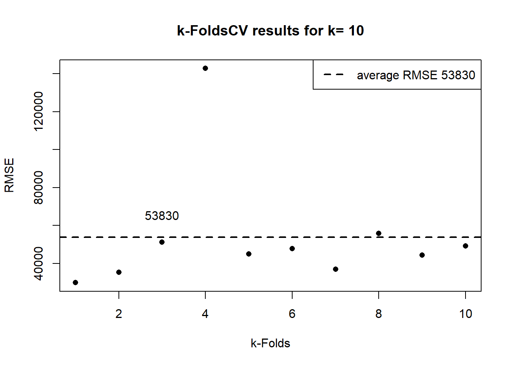
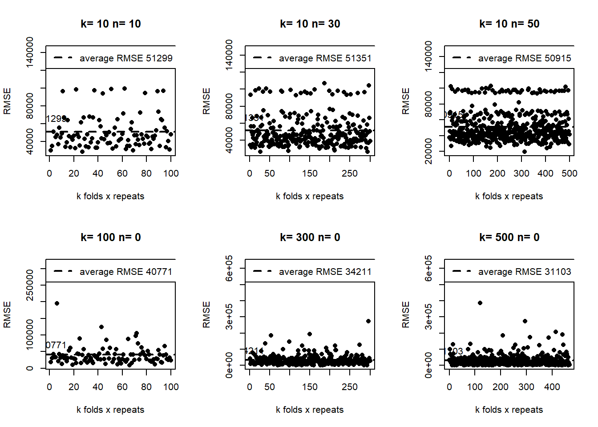

# Cross Validation


In the previous chapter, we split the sample into training and testing. But what if that partition is different from all the samples? Remember that in the last chapter, we got an RMSE on the house_test data set of 4.7889106\times 10^{4}. But what if we would be used another seed for the partition and we got lower, or worse, a higher RMSE? Don´t you think it would be better if we make many partitions and estimate each time the RMSE and verify how consistent our RMSE is? That is cross-validation. Instead of dividing the sample only once, cross-validation involves splitting the sample several times and estimating the RMSE, MAE or R-squared each. There are several cross validations methods. The most common are Leave-One-Out Cross-Validation (LOOCV) and k-Fold Cross-Validation (k-fold).

### Leave-One-Out Cross-Validation (LOOCV)


```
#>      Id SalePrice MSSubClass MSZoning
#> 64   64    163000         20        4
#> 540 540    170000         80        4
#> 200 200    155000         70        5
#> 171 171    142000         20        4
#> 41   41    250000         60        2
#> 268 268    155000         60        4
#>      Id SalePrice MSSubClass MSZoning
#> 77   77    274900         20        4
#> 480 480    186700         20        4
#> 452 452    135000         50        4
#> 580 580    240000         60        4
#> 139 139    207000        120        5
#> 162 162    245500        120        4
```


Understanding question. Why is the "id" in the previous output not in order (i.e., 1,2,3,…,n)?

Continuing with the housing example, we split the sample into "n" parts. "n" is the number of rows in the data set. The Cross-validation is in the training dataset; in our case, $n$ is 584.


The first fold is a partition taking out the first observation. As we see in the previous output, the 1rst observation is the one with the id=77.


The first fold is a partition taking out the first observation. As we see in the previous output, the 1rst observation is the one with the id=77.


```r
fold1<- house_train[2:dim[1],] 
head(fold1[,1:4])
#>      Id SalePrice MSSubClass MSZoning
#> 540 540    170000         80        4
#> 200 200    155000         70        5
#> 171 171    142000         20        4
#> 41   41    250000         60        2
#> 268 268    155000         60        4
#> 566 566    175900        120        4
tail(fold1[,1:4])
#>      Id SalePrice MSSubClass MSZoning
#> 77   77    274900         20        4
#> 480 480    186700         20        4
#> 452 452    135000         50        4
#> 580 580    240000         60        4
#> 139 139    207000        120        5
#> 162 162    245500        120        4
```


The second fold is taking out the second, the one with id=480

```r
fold2<- house_train[c(1,3:dim[1]),] 
head(fold2[,1:4])
#>      Id SalePrice MSSubClass MSZoning
#> 64   64    163000         20        4
#> 200 200    155000         70        5
#> 171 171    142000         20        4
#> 41   41    250000         60        2
#> 268 268    155000         60        4
#> 566 566    175900        120        4
tail(fold2[,1:4])
#>      Id SalePrice MSSubClass MSZoning
#> 77   77    274900         20        4
#> 480 480    186700         20        4
#> 452 452    135000         50        4
#> 580 580    240000         60        4
#> 139 139    207000        120        5
#> 162 162    245500        120        4
```

And so on, until we get $n$ folds, in this case, 467. One of the folds, usually the first, will be the validation set (like the test data set). With the other $n−1$ the model must be trained and tested, making the prediction on the fold1 and estimating the performance metric, such as the RMSE. For example:


```r
house_model<-lm(SalePrice~.,data=fold2)
house_predict<-predict(house_model,fold1)
sqrt(mean((fold1[,"SalePrice"]-house_predict)^2 ,na.rm = T))
#> [1] 41984.83
```

The processes repeat for the other n-2 folds, training the fold3 and testing it with fold1. In the end, we will get n-1 performance measures. The average of those RMSEs would be the LOOCV.


$$LOOCV =\frac{1}{n}\ \sum_{i=1}^{n} RMSE_{i} $$


In the last formula, we use RMSE, but it could be any other metric, such as MAE or Rsquared.

Fortunately, the function “train” from the library “caret” do the formerly described processes [@R-caret].

The train function has a similar structure as the “lm” function.

train(SalePrice ~ ., data = house_train, 
                 method = "lm", 
                 trControl = )
                 
                
The first argument is the equation, and the second is the database. For the cross-validation, we use the train data set and need to specify which model, in this case, “lm”. That function allows for 238 when we were writing the book, “lm” is one of them. As the name says, the argument “trControl” is to control the cross-validation parameters.

For convenience, the library developers suggest separating the “trControl” argument because that argument is ruled by another function, “trainControl”, which has many other parameters. We start by creating an object with that function, which argument is the method, in this case, “LOOCV”.


```r
library(caret)

fitControl <- trainControl(method = "LOOCV")                   
```

Then we use the function train, specifying the model "lm", and as a trControl we use the object fitControl.


```r
gbmFit1 <- train(SalePrice ~ ., data = house_train, 
                 method = "lm", 
                 trControl = fitControl)
gbmFit1
#> Linear Regression 
#> 
#> 467 samples
#>  51 predictor
#> 
#> No pre-processing
#> Resampling: Leave-One-Out Cross-Validation 
#> Summary of sample sizes: 466, 466, 466, 466, 466, 466, ... 
#> Resampling results:
#> 
#>   RMSE      Rsquared   MAE     
#>   54486.35  0.6468026  31103.23
#> 
#> Tuning parameter 'intercept' was held constant at a value of TRUE
```


In the previous result, we got an RMSE of 5.4486353\times 10^{4}, the average of the n-1 RMSE. To see the implication of the previous result, remember that in the previous chapter, we got an RMSE on the house_test data set of 4.7889106\times 10^{4}, which is the result of one partition. The last result, cross-validation, tells us, in this case, that by taking the RMSE of 4.7889106\times 10^{4} we would be over-estimating (thinking we have a good model when do not) (thinking we have a good model when doing not) the model performance.

Some arguments in the “trainControl” function, such as preprocessing, indicate if we want to process the data, for example, to center or scale.

The “No preprocessing” message in the previous output indicates that we didn´t select that option. The preprocess option is to improve the model performance. For example, adding the “nzv”, Zero- and Near Zero-Variance Predictors, and BoxCox is a transforming Predictors preprocess. For a further explanation of the preprocess alternatives, see the library Caret [@R-caret].


```r

gbmFit1 <- train(SalePrice ~ ., data = house_train, 
                 method = "lm", 
                 trControl = fitControl, preProcess= c("BoxCox","nzv"))

gbmFit1
#> Linear Regression 
#> 
#> 467 samples
#>  51 predictor
#> 
#> Pre-processing: Box-Cox transformation (36), remove (4) 
#> Resampling: Leave-One-Out Cross-Validation 
#> Summary of sample sizes: 466, 466, 466, 466, 466, 466, ... 
#> Resampling results:
#> 
#>   RMSE      Rsquared   MAE     
#>   50277.51  0.6939262  29454.77
#> 
#> Tuning parameter 'intercept' was held constant at a value of TRUE
```


Another alternative for preProcess=c(“center”, “scale”,“YeoJohnson”)
“center”, and “scale” are centering and scaling methods. “YeoJohnson” is another transforming Predictors preprocess option.

As we see in the previous output, the “Preprocessing” indicates that four variables were removed, which suggests that we improve the model performance by removing those four variables. To get those remaining variables, we use the code:


```r
head(gbmFit1$finalModel$xNames)
#> [1] "Id"          "MSSubClass"  "MSZoning"    "LotFrontage" "LotArea"    
#> [6] "LotShape"
```


Regarding the re-sampling: cross-validation is the name of the method. The summary of sample sizes is always $n−1$, in this case in this case 466. The RMSE of 466 is the average of the $n−1$ test predictions. Finally, the message “tuning parameter ‘intercept’ was…”, is because the “trControl” argument of the “train” function accepts other arguments to do the parameter tuning process, which we will cover in the next chapter.

Finally, the message “Tuning parameter ‘intercept’ was held constant at a value of TRUE” is an argument that could be changed as tuning parameters, and we will cover this in the next chapter.

### k-fold Cross Validation (k-FoldCV)

The k-FoldCV is similar to the LOOCV, except that instead of making $n$ partitions, it just requires $k$. A difference with the LOOCV is that usually, $k$ is less than $n$; for example, $k=10$. Another difference is that the $k$ partitions are randomly selected. For example, the first partition is called Fold1. It takes the database, for example, the house_train, and randomly splits into 80% the training and 20% the validation data set. The model is estimated with the training, and the prediction is validated with the validation set and estimating the metrics. The process is repeated $k$ times.

As we will see below, the “train” function has the rule to determine the % of the training and validation sets. The following formula summarizes the procedure for the RMSE.


$$k-FoldCV =\frac{1}{k}\ \sum_{i=1}^{k} RMSE_{i} $$

We use the “train” function for this example as we did with the LOOCV method. We apply ten folds or $k=10$ 

```r
k<-10
fitControl <- trainControl(method = "cv",
                           number = k)
```

In this case, the k-FoldCV method is only “cv.” The argument “number” indicates the number of folds or $k$

The arguments of the “train” function are similar to the LOOCV method.


```r
set.seed (26)

lmFit1 <- train(SalePrice ~ ., data = house_train, 
                 method = "lm", 
                 trControl = fitControl)
lmFit1
#> Linear Regression 
#> 
#> 467 samples
#>  51 predictor
#> 
#> No pre-processing
#> Resampling: Cross-Validated (10 fold) 
#> Summary of sample sizes: 420, 421, 421, 419, 420, 421, ... 
#> Resampling results:
#> 
#>   RMSE     Rsquared   MAE     
#>   53829.9  0.7130432  32074.47
#> 
#> Tuning parameter 'intercept' was held constant at a value of TRUE
```


```
#> [1] "420 467 90"
```

In the previous output, the “Summary of sample sizes” shows, for each fold, the number of observations of the training set, which in this case is 90% of the sample size, which in this case is 467. The Resampling results, RMSE, Rsquared and MAE are the average of the 10 folds. In the next plot, we show the 10 results.


```r
y<-as.data.frame(lmFit1$resample)[,"RMSE"] # this data frame has the RMSE results 
p1<-lmFit1$results[,"RMSE"] # this object has the average RMSE 

plot(y, ylab="RMSE", xlab="k-Folds", pch = 16, main= paste("k-FoldsCV results for k=",k))
abline(p1,0,col="black",lwd=2,lty = 2)
legend(x= "topright", legend = c(paste("average RMSE",round(p1,0))),lty = 2,lwd=2,col=c("black"))
text(x =3, y = p1*1.1, labels = round(p1,0),pos = 3)
```



 


The “train” function is programmed to have different partitions for the number of k-folds. For example, for k=5 the partition would be 80. The more the $k$, the more the % of the partition.

Authors such as [@statistical_lerarning], consider that k-FoldCV has the advantage of being less computationally intensive than a method like LOOCV. Also, he exemplifies how the results of a k-Fol=10 and LOOV are very similar regarding the bias-variance trade-off.

The “train” function allows for the repetition of each fold. For example, if we want to repeat each fold two times, we need to add the arguments, method = “repeatedcv”, and the number of repeats, in this case, 2. As a result, we end with 20 results.


```
#> Linear Regression 
#> 
#> 467 samples
#>  51 predictor
#> 
#> No pre-processing
#> Resampling: Cross-Validated (10 fold, repeated 2 times) 
#> Summary of sample sizes: 420, 421, 421, 419, 420, 421, ... 
#> Resampling results:
#> 
#>   RMSE      Rsquared   MAE     
#>   52572.29  0.7112406  31826.41
#> 
#> Tuning parameter 'intercept' was held constant at a value of TRUE
```
Because of how the algorithm of the “train” function was developed, we would get different results if we use k=20 than k=10 repeated 2 times.
 


For example, in the following plots, upper side, we show different examples of the “repeatedcv”. At the bottom, we show different examples of similar, in number, of the “cv” méthod. In all cases for the same seed. 



The results of the cv method are concentrated at the bottom. Meanwhile, the repeated-cv dispersion is higher. As a result, the RMSE average is lower in the “cv”.

A valid question here is, which is a better method? We need to evaluate the model with the test data set (not the validation) to answer this. For now, we answer that those results tell us that, depending on the resampling method, we are getting quite different results, which implies that we probably need to do something else to get more stable results in both methods.

For example, we can make the cross-validation for variable selection.


```r
k2<-10
set.seed (26)
fitControl3 <- trainControl(method = "cv",
                           number = k2)

step <- train(SalePrice ~ ., data = house_train, 
                 method = "lmStepAIC", 
                 trControl = fitControl3, trace=F)
step
#> Linear Regression with Stepwise Selection 
#> 
#> 467 samples
#>  51 predictor
#> 
#> No pre-processing
#> Resampling: Cross-Validated (10 fold) 
#> Summary of sample sizes: 420, 421, 421, 419, 420, 421, ... 
#> Resampling results:
#> 
#>   RMSE     Rsquared   MAE     
#>   53183.1  0.7218324  31441.74
```


Remember that the RMSE with all the variables was 5.3829898\times 10^{4}. To get the variables of the final model:


```r
mo<-colnames(step$finalModel$model)[-1]
mo
#>  [1] "MSSubClass"    "LotFrontage"   "LotArea"       "LotShape"     
#>  [5] "HouseStyle"    "OverallQual"   "OverallCond"   "Exterior1st"  
#>  [9] "MasVnrArea"    "ExterQual"     "Foundation"    "BsmtQual"     
#> [13] "BsmtExposure"  "BsmtFinType1"  "BsmtFinSF1"    "BsmtUnfSF"    
#> [17] "X1stFlrSF"     "X2ndFlrSF"     "BsmtFullBath"  "FullBath"     
#> [21] "HalfBath"      "KitchenQual"   "TotRmsAbvGrd"  "Fireplaces"   
#> [25] "FireplaceQu"   "GarageArea"    "SaleCondition"
```

### Stochastic Gradient Boosting

https://cran.r-project.org/web/packages/gbm/vignettes/gbm.pdf


```r
set.seed (26)
fitControl <- trainControl(method = "cv",
                           number = 10)

gbmFit1 <- train(SalePrice ~ ., data = house_train, 
                 method = "gbm", 
                 trControl = fitControl,
                 ## This last option is actually one
                 ## for gbm() that passes through
                 verbose = FALSE)
gbmFit1
#> Stochastic Gradient Boosting 
#> 
#> 467 samples
#>  51 predictor
#> 
#> No pre-processing
#> Resampling: Cross-Validated (10 fold) 
#> Summary of sample sizes: 420, 421, 421, 419, 420, 421, ... 
#> Resampling results across tuning parameters:
#> 
#>   interaction.depth  n.trees  RMSE      Rsquared   MAE     
#>   1                   50      47239.17  0.7444321  30600.93
#>   1                  100      46147.22  0.7537532  29225.96
#>   1                  150      45741.85  0.7555015  28969.01
#>   2                   50      45232.87  0.7570658  28665.82
#>   2                  100      44866.17  0.7601488  27908.81
#>   2                  150      45748.88  0.7554831  27734.49
#>   3                   50      44032.44  0.7708265  27661.85
#>   3                  100      43706.40  0.7775313  26762.67
#>   3                  150      44620.73  0.7733739  27046.71
#> 
#> Tuning parameter 'shrinkage' was held constant at a value of 0.1
#> 
#> Tuning parameter 'n.minobsinnode' was held constant at a value of 10
#> RMSE was used to select the optimal model using the smallest value.
#> The final values used for the model were n.trees = 100, interaction.depth =
#>  3, shrinkage = 0.1 and n.minobsinnode = 10.
```


```r
min(gbmFit1$results[,"RMSE"])
#> [1] 43706.4
```


  


