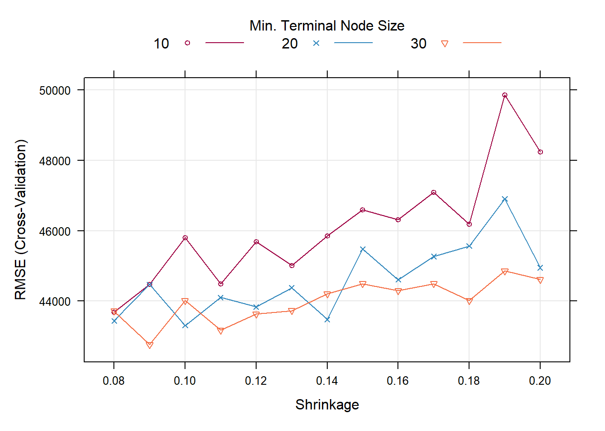

# Tuning parameters for improving performance 

## Parameter

Hyperparameters are model parameters that are specified before training a model – i.e., parameters that are different from model parameters – or weights that an AI/ML model learns during model training.

For many machine learning problems, finding the best hyperparameters is an iterative and potentially time-intensive process called “hyperparameter optimization.

Hyperparameters directly impact the performance of a trained machine-learning model. Choosing the right hyperparameters can dramatically improve prediction accuracy. However, they can be challenging to optimize because there is often a large combination of possible hyperparameter values.


Tuning a machine learning model is an iterative process. Data scientists typically run numerous experiments to train and evaluate models, trying out different features, different loss functions, different AI/ML models, and adjusting model parameters and hyperparameters. Examples of steps involved in tuning and training a machine learning model include feature engineering, loss function formulation, model testing and selection, regularization, and selection of hyperparameters Krishnan (2022).

Let’s assume that you now have a shortlist of promising models. It would help if you now fine-tuned them. Let’s look at a few ways you can do that.

Once we have retrieved optimum values of individual model parameters, we can use grid search to obtain a combination of hyperparameter (The parameters are also known as hyperparameters) values of a model that can give us the highest accuracy.

Grid Search evaluates all possible combinations of the parameter values.

Grid Search is exhaustive and uses brute force to evaluate the most accurate values. Therefore it is a computationally intensive task.


```r
house<-read.csv("https://raw.githubusercontent.com/abernal30/ml_book/main/housing.csv")
set.seed (26)
dim<-dim(house)
train_sample<-sample(dim[1],dim[1]*.8)
house_train <- house[train_sample, ]
house_test  <- house[-train_sample, ]
```


```r
library(caret)
set.seed (26)
fitControl <- trainControl(method = "cv",
                           number = 10)

gbmFit <- train(SalePrice ~ ., data = house_train, 
                 method = "gbm", 
                 trControl = fitControl, 
                 verbose = FALSE)
gbmFit
#> Stochastic Gradient Boosting 
#> 
#> 467 samples
#>  51 predictor
#> 
#> No pre-processing
#> Resampling: Cross-Validated (10 fold) 
#> Summary of sample sizes: 420, 421, 421, 419, 420, 421, ... 
#> Resampling results across tuning parameters:
#> 
#>   interaction.depth  n.trees  RMSE      Rsquared   MAE     
#>   1                   50      47239.17  0.7444321  30600.93
#>   1                  100      46147.22  0.7537532  29225.96
#>   1                  150      45741.85  0.7555015  28969.01
#>   2                   50      45232.87  0.7570658  28665.82
#>   2                  100      44866.17  0.7601488  27908.81
#>   2                  150      45748.88  0.7554831  27734.49
#>   3                   50      44032.44  0.7708265  27661.85
#>   3                  100      43706.40  0.7775313  26762.67
#>   3                  150      44620.73  0.7733739  27046.71
#> 
#> Tuning parameter 'shrinkage' was held constant at a value of 0.1
#> 
#> Tuning parameter 'n.minobsinnode' was held constant at a value of 10
#> RMSE was used to select the optimal model using the smallest value.
#> The final values used for the model were n.trees = 100, interaction.depth =
#>  3, shrinkage = 0.1 and n.minobsinnode = 10.
```

```r
min(gbmFit$results[,"RMSE"])
#> [1] 43706.4
```


```r
seq(0.08,0.2,.01)
#>  [1] 0.08 0.09 0.10 0.11 0.12 0.13 0.14 0.15 0.16 0.17 0.18 0.19 0.20
```


```r
set.seed (26)
fitControl <- trainControl(method = "cv",
                           number = 10)

gbmGrid <-  expand.grid(interaction.depth = 3, 
                        n.trees = 100, 
                        shrinkage = seq(0.08,0.2,.01),
                        n.minobsinnode = c(10,20,30))
                        
nrow(gbmGrid)
#> [1] 39


gbmFit2 <- train(SalePrice ~ ., data = house_train, 
                 method = "gbm", 
                 trControl = fitControl, 
                 verbose = FALSE, 
                 ## Now specify the exact models 
                 ## to evaluate:
                 tuneGrid = gbmGrid)
gbmFit2
#> Stochastic Gradient Boosting 
#> 
#> 467 samples
#>  51 predictor
#> 
#> No pre-processing
#> Resampling: Cross-Validated (10 fold) 
#> Summary of sample sizes: 420, 421, 421, 419, 420, 421, ... 
#> Resampling results across tuning parameters:
#> 
#>   shrinkage  n.minobsinnode  RMSE      Rsquared   MAE     
#>   0.08       10              43689.38  0.7757923  26414.49
#>   0.08       20              43439.41  0.7762678  26253.74
#>   0.08       30              43718.02  0.7740018  27043.45
#>   0.09       10              44482.73  0.7657377  26932.51
#>   0.09       20              44471.18  0.7694100  26930.13
#>   0.09       30              42765.74  0.7850388  26107.17
#>   0.10       10              45797.81  0.7565011  27752.53
#>   0.10       20              43305.74  0.7752004  26133.99
#>   0.10       30              44014.90  0.7733803  27155.20
#>   0.11       10              44489.95  0.7656922  26866.05
#>   0.11       20              44102.22  0.7772802  26763.98
#>   0.11       30              43173.50  0.7852119  26475.20
#>   0.12       10              45685.92  0.7560192  27278.29
#>   0.12       20              43837.29  0.7733656  26780.05
#>   0.12       30              43632.73  0.7731039  27097.95
#>   0.13       10              45015.04  0.7633598  27339.32
#>   0.13       20              44378.70  0.7733293  26922.59
#>   0.13       30              43729.28  0.7738287  26848.09
#>   0.14       10              45847.55  0.7616066  26985.59
#>   0.14       20              43476.83  0.7753577  27154.57
#>   0.14       30              44204.43  0.7733527  27236.38
#>   0.15       10              46597.58  0.7505296  27959.85
#>   0.15       20              45481.20  0.7606624  27931.86
#>   0.15       30              44495.46  0.7689698  27904.48
#>   0.16       10              46312.23  0.7551459  28093.47
#>   0.16       20              44609.52  0.7720711  26788.57
#>   0.16       30              44293.15  0.7709916  27231.55
#>   0.17       10              47092.71  0.7503482  27909.55
#>   0.17       20              45266.73  0.7597926  27838.44
#>   0.17       30              44495.99  0.7682215  27612.17
#>   0.18       10              46187.08  0.7560767  27455.96
#>   0.18       20              45563.69  0.7615617  28022.82
#>   0.18       30              44019.18  0.7697064  28476.80
#>   0.19       10              49851.20  0.7284168  29410.44
#>   0.19       20              46902.27  0.7505154  28841.09
#>   0.19       30              44854.58  0.7651957  28353.89
#>   0.20       10              48231.76  0.7329092  29188.07
#>   0.20       20              44947.66  0.7651168  27865.51
#>   0.20       30              44618.00  0.7586902  27987.05
#> 
#> Tuning parameter 'n.trees' was held constant at a value of 100
#> Tuning
#>  parameter 'interaction.depth' was held constant at a value of 3
#> RMSE was used to select the optimal model using the smallest value.
#> The final values used for the model were n.trees = 100, interaction.depth =
#>  3, shrinkage = 0.09 and n.minobsinnode = 30.
```


```r
trellis.par.set(caretTheme())
plot(gbmFit2) 
```




```r
gbmFit2$bestTune
#>   n.trees interaction.depth shrinkage n.minobsinnode
#> 6     100                 3      0.09             30
```


```r
set.seed (26)
fitControl <- trainControl(method = "cv",
                           number = 10)

gbmGrid <-  expand.grid(interaction.depth = 3, 
                        n.trees = 100, 
                        shrinkage = 0.09,
                        n.minobsinnode = 30)
                        

gbmFit1 <- train(SalePrice ~ ., data = house_train, 
                 method = "gbm", 
                 trControl = fitControl,
                 verbose = FALSE,tuneGrid = gbmGrid)
gbmFit1
#> Stochastic Gradient Boosting 
#> 
#> 467 samples
#>  51 predictor
#> 
#> No pre-processing
#> Resampling: Cross-Validated (10 fold) 
#> Summary of sample sizes: 420, 421, 421, 419, 420, 421, ... 
#> Resampling results:
#> 
#>   RMSE      Rsquared   MAE     
#>   43538.88  0.7755887  27051.03
#> 
#> Tuning parameter 'n.trees' was held constant at a value of 100
#> Tuning
#> 
#> Tuning parameter 'shrinkage' was held constant at a value of 0.09
#> 
#> Tuning parameter 'n.minobsinnode' was held constant at a value of 30
```


## Analyze the Best Models and Their Errors


```r
set.seed (26)

lmFit <- train(SalePrice ~ ., data = house_train, 
                 method = "lm", 
                 trControl = fitControl)
lmFit
#> Linear Regression 
#> 
#> 467 samples
#>  51 predictor
#> 
#> No pre-processing
#> Resampling: Cross-Validated (10 fold) 
#> Summary of sample sizes: 420, 421, 421, 419, 420, 421, ... 
#> Resampling results:
#> 
#>   RMSE     Rsquared   MAE     
#>   53829.9  0.7130432  32074.47
#> 
#> Tuning parameter 'intercept' was held constant at a value of TRUE
```


```r
k2<-10
set.seed (26)
fitControl3 <- trainControl(method = "cv",
                           number = k2)

step <- train(SalePrice ~ ., data = house_train, 
                 method = "lmStepAIC", 
                 trControl = fitControl3, trace=F)
step
#> Linear Regression with Stepwise Selection 
#> 
#> 467 samples
#>  51 predictor
#> 
#> No pre-processing
#> Resampling: Cross-Validated (10 fold) 
#> Summary of sample sizes: 420, 421, 421, 419, 420, 421, ... 
#> Resampling results:
#> 
#>   RMSE     Rsquared   MAE     
#>   53183.1  0.7218324  31441.74
```


```r
resamps <- resamples(list(GBM = gbmFit1,
                          lm= lmFit,
                          step = step))
summary(resamps)
#> 
#> Call:
#> summary.resamples(object = resamps)
#> 
#> Models: GBM, lm, step 
#> Number of resamples: 10 
#> 
#> MAE 
#>          Min.  1st Qu.   Median     Mean  3rd Qu.     Max. NA's
#> GBM  16916.01 22683.84 26802.82 27051.03 33250.31 34700.58    0
#> lm   24099.97 27569.17 32581.94 32074.47 33796.23 46936.58    0
#> step 23457.60 27519.35 31131.39 31441.74 33246.95 47069.12    0
#> 
#> RMSE 
#>          Min.  1st Qu.   Median     Mean  3rd Qu.      Max. NA's
#> GBM  21042.28 29863.83 42580.60 43538.88 53434.67  68983.63    0
#> lm   29902.95 38797.25 46407.32 53829.90 50676.37 142708.97    0
#> step 29473.14 38261.54 45661.85 53183.10 49510.85 142365.64    0
#> 
#> Rsquared 
#>           Min.   1st Qu.    Median      Mean   3rd Qu.      Max. NA's
#> GBM  0.4466954 0.7499098 0.7749271 0.7755887 0.8692610 0.9222225    0
#> lm   0.1182236 0.7380041 0.7705471 0.7130432 0.7989847 0.8440776    0
#> step 0.1201389 0.7623466 0.7765474 0.7218324 0.7931811 0.8461111    0
```

```r
theme1 <- trellis.par.get()
theme1$plot.symbol$col = rgb(.2, .2, .2, .4)
theme1$plot.symbol$pch = 16
theme1$plot.line$col = rgb(1, 0, 0, .7)
theme1$plot.line$lwd <- 2
trellis.par.set(theme1)
bwplot(resamps, layout = c(3, 1))
```


