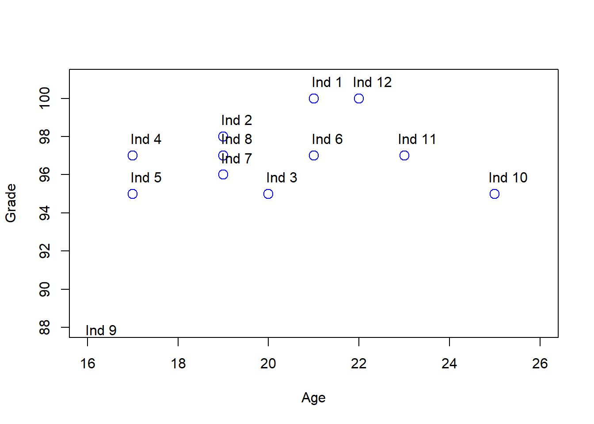
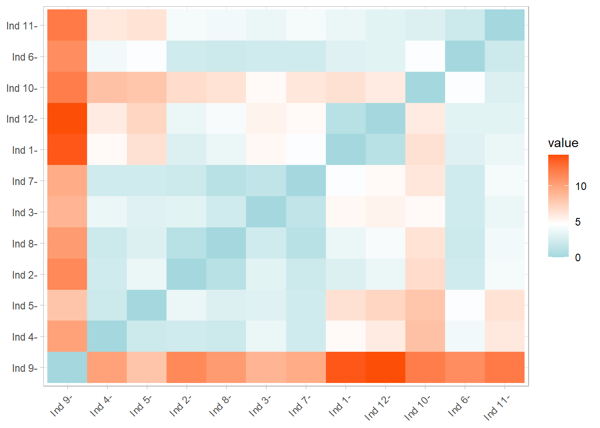
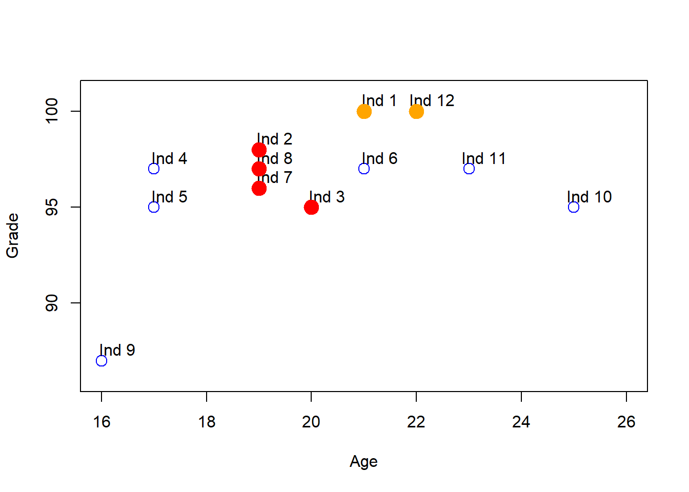
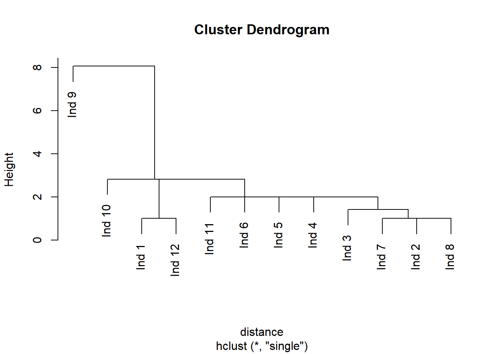
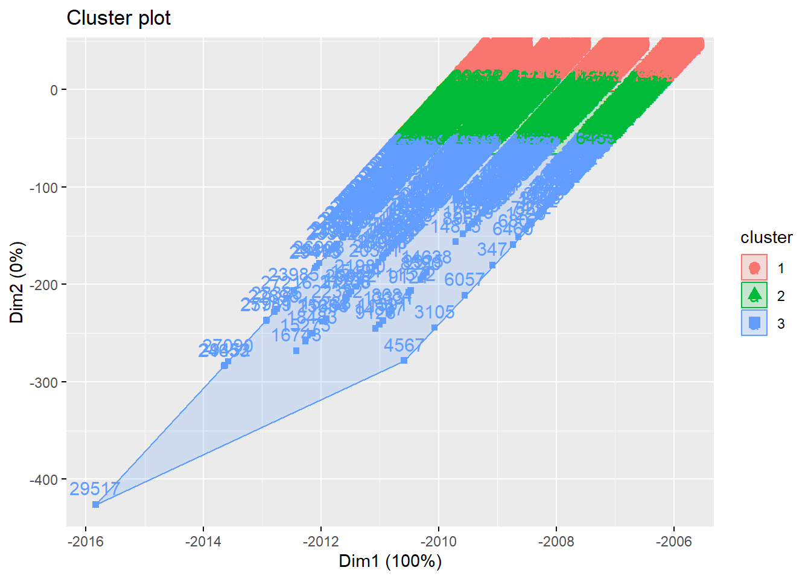
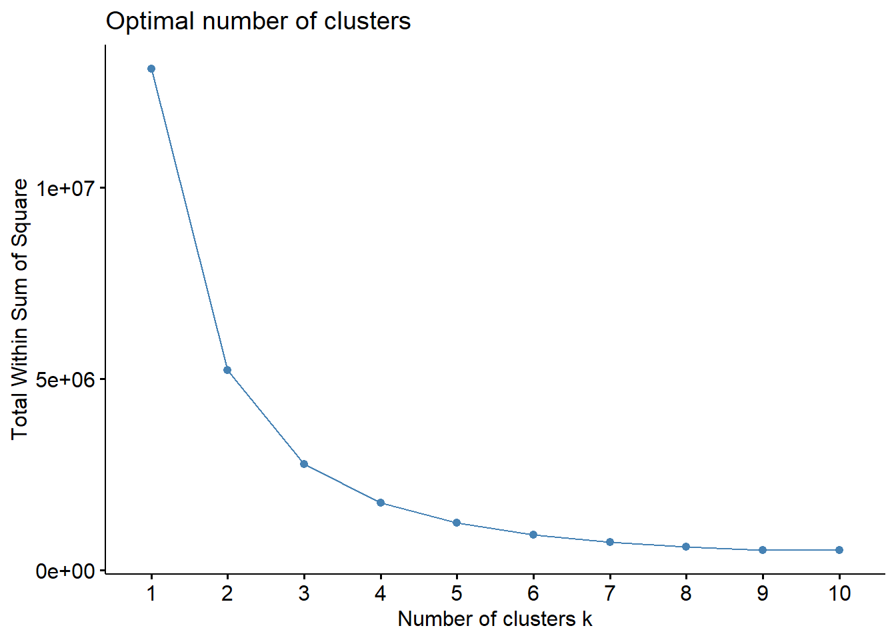
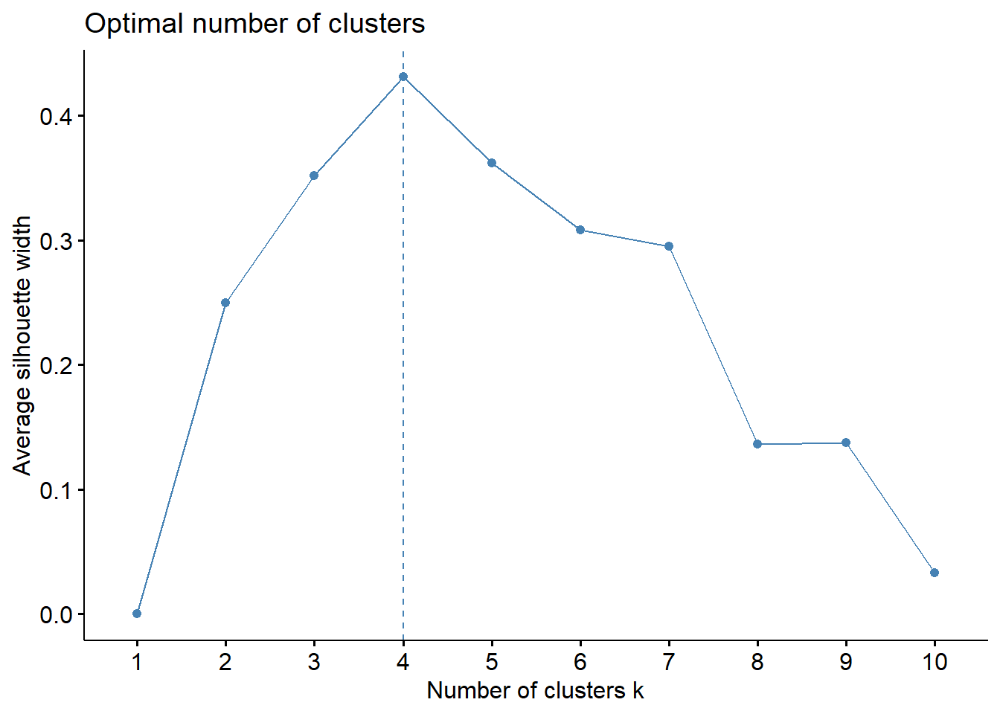
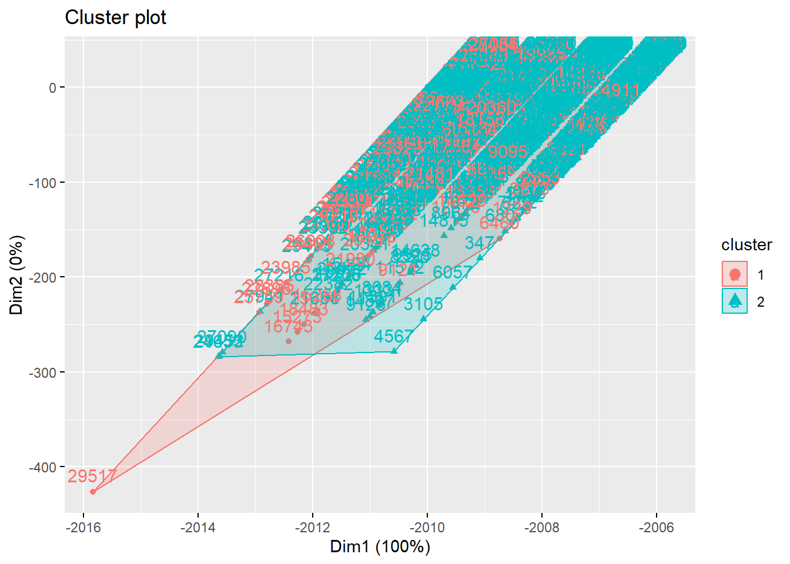
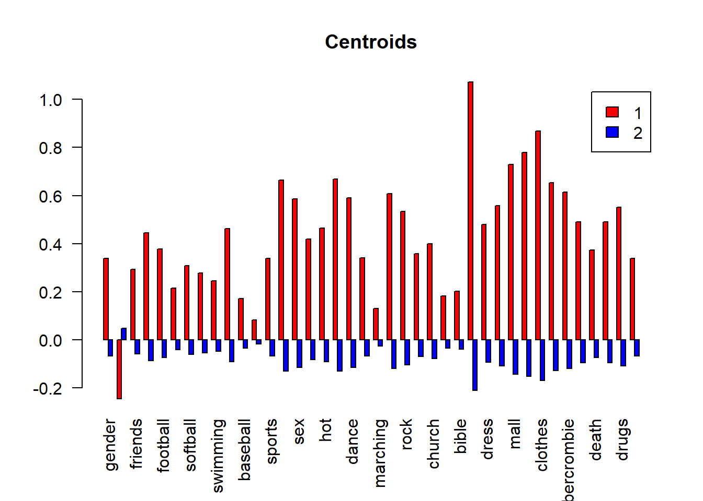
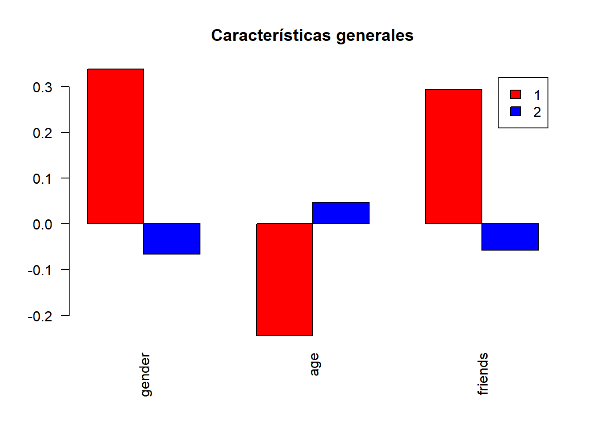

# Clustering

Unsupervised learning - Clustering


Clustering is a technique that aims to group similar data points so that the points in the same group have similar features to those in the other groups. The group of similar data points is called a Cluster.

For example, suppose we have the following data frame, with hypothetical data of students ages and grades in course:

```r
set.seed(1100)
x <- round(rnorm(12, 20, 3),0)
y <- round(rnorm(12, 95, 4),0)
y<-ifelse(y>100,100,y)
df<- data.frame(Age=x, Grade=y)
rownames(df)<-paste("Ind",rownames(df))
df
#>        Age Grade
#> Ind 1   21   100
#> Ind 2   19    98
#> Ind 3   20    95
#> Ind 4   17    97
#> Ind 5   17    95
#> Ind 6   21    97
#> Ind 7   19    96
#> Ind 8   19    97
#> Ind 9   16    87
#> Ind 10  25    95
#> Ind 11  23    97
#> Ind 12  22   100
```

For a betther undestandng of what is a plot, the following plot shows how each person is similar to other in terms of age and grade.  

```r
plot(df[,"Age"], df[,"Grade"], col = "blue", pch = 1, cex = 1.5,ylab="Grade",xlab="Age",ylim=c(88,101),xlim=c(16,26))
text(df[,"Age"] + .3, df[,"Grade"] + 0.9, labels = rownames(df))
```



One one to identify if a person or a group of persons are similar in terms of age and grade to other, which is equivalent to say that are in the same cluster, is using the Euclidean Distance (ED):

$$d_{euc}(p,q)= \sqrt{ \sum_{i=1}^{n} (p_{i}-q_{i}})^{2}$$

where $p_{i}$, $p_{i}$ are two points in the euclidean space. In our example, are two different persons of the data set. $n$ is the number of features, in our example are two, age anf grade. For example, the Euclidean Distance for person 1 and 2 is:


```r
sqrt((df["Ind 1","Age"]-df["Ind 2","Age"])^2+(df["Ind 1","Grade"]-df["Ind 2","Grade"])^2)
#> [1] 2.828427
```
The lower (higher) the ED between two persons, the more similars (different) they are, and is porbably that are grouped (not grouped) in the same cluster.

To estimate the Euclidean Distance for all the persons in the data set, we use the funciton "get_dist", from the library  "factoextra":


```r
library(factoextra) #
distance<-get_dist(df, method = "euclidean")
distance
#>            Ind 1     Ind 2     Ind 3     Ind 4     Ind 5     Ind 6     Ind 7
#> Ind 2   2.828427                                                            
#> Ind 3   5.099020  3.162278                                                  
#> Ind 4   5.000000  2.236068  3.605551                                        
#> Ind 5   6.403124  3.605551  3.000000  2.000000                              
#> Ind 6   3.000000  2.236068  2.236068  4.000000  4.472136                    
#> Ind 7   4.472136  2.000000  1.414214  2.236068  2.236068  2.236068          
#> Ind 8   3.605551  1.000000  2.236068  2.000000  2.828427  2.000000  1.000000
#> Ind 9  13.928388 11.401754  8.944272 10.049876  8.062258 11.180340  9.486833
#> Ind 10  6.403124  6.708204  5.000000  8.246211  8.000000  4.472136  6.082763
#> Ind 11  3.605551  4.123106  3.605551  6.000000  6.324555  2.000000  4.123106
#> Ind 12  1.000000  3.605551  5.385165  5.830952  7.071068  3.162278  5.000000
#>            Ind 8     Ind 9    Ind 10    Ind 11
#> Ind 2                                         
#> Ind 3                                         
#> Ind 4                                         
#> Ind 5                                         
#> Ind 6                                         
#> Ind 7                                         
#> Ind 8                                         
#> Ind 9  10.440307                              
#> Ind 10  6.324555 12.041595                    
#> Ind 11  4.000000 12.206556  2.828427          
#> Ind 12  4.242641 14.317821  5.830952  3.162278
```

As we see in the output, the result shows the ED between each person. Is important to notice that the output is not a data frame, is a "dist" object:

```r
class(distance)
#> [1] "dist"
```
The previous outpt is not giving us infromation about how people are grouped in clusters, but the following plot does, using the function "fviz_dist", wich has as first argument the "dist" object we made in the last "chunk": 

```r
fviz_dist(distance,  gradient = list(low = "#00AFBB", mid = "white", high = "#FC4E07"))
```




In the previous plot, the red color squares are persons with a higher ED and the blue ones lower ones. 


In terms of the scatter plot we made before, if we take the individual pairs that has a ED less than 2, for example, we get the following results:


```r
plot(df[,"Age"], df[,"Grade"], col = "blue", pch = 1, cex = 1.5,ylab="Grade",xlab="Age",ylim=c(86,101),xlim=c(16,26))
text(df[,"Age"] + .3, df[,"Grade"] + 0.6, labels = rownames(df))
points(df[ind[1, ],"Age"], df[ind[1, ],"Grade"], col = "orange", pch = 19, cex = 2)
points(df[ind[2, ],"Age"], df[ind[2, ],"Grade"], col = "red", pch = 19, cex = 2)
points(df[ind[3, ],"Age"], df[ind[3, ],"Grade"], col = "red", pch = 19, cex = 2)
points(df[ind[4, ],"Age"], df[ind[4, ],"Grade"], col = "red", pch = 19, cex = 2)
```



```r
#segments(x0 = 19, y0 = 96,x1=20,y1=95) 

```

We see that the red dots are kind  of grouped between them, and also the yellow ones. In this sense, we could say that the individuals in red dots could be a cluster, and the individuals in yellow other cluster. We  could repeat the procees for the no-color individuales, but for the moment we waned to explian how clusters are formed.   


## Agglomerative hierarchical clustering


As we prove in the last method, we need a partition to define the similarity beetween two individuals, to be in th sale cluster.  Hierarchical clustering algorithms doesn´t need a predefined  partition to generate the clusters.  

First, using a particular proximity measure a dissimilarity matrix is constructed and all the data points are visually represented at the bottom of the dendrogram. The closest sets of clusters are merged at each level and then the dissimilarity matrix is updated correspondingly. This process of agglomerative merging is carried on until the final maximal cluster (that contains all the data objects in a single cluster) is obtained. This would represent the apex of our dendrogram and mark the completion of the merging process. We will now discuss the different kinds of proximity measures which can be used in agglomerative hierarchical clustering. Subsequently, we will also provide a complete version of the agglomerative hierarchical clustering algorithm in


The most popular agglomerative clustering methods are single link and complete link clusterings. In single link clustering [36, 46], the similarity of two clusters is the similarity between their most similar (nearest neighbor) members. This method intuitively gives more importance to the regions where clusters are closest, neglecting the overall structure of the cluster. Hence, this method falls under the category of a local similarity-based clustering method. Because of its local behavior, single linkage is capable of effectively clustering nonelliptical, elongated shaped groups of data objects. However, one of the main drawbacks of this method is its sensitivity to noise and outliers in the data.

Complete link clustering [27] measures the similarity of two clusters as the similarity of their most dissimilar members. This is equivalent to choosing the cluster pair whose merge has the smallest diameter. As this method takes the cluster structure into consideration it is nonlocal in behavior and generally obtains compact shaped clusters. However, similar to single link clustering, this method is also sensitive to outliers. Both single link and complete link clustering have their graph-theoretic interpretations [16], where the clusters obtained after single link clustering would correspond to the connected components of a graph and those obtained through complete link would correspond to the maximal cliques of the graph.


The Lance and Williams recurrence formula gives the distance between a group k and a group (ij) formed by the fusion of two groups (i and j) as :

$$ d_{k(ij)}= \alpha\ d_{ki}+\beta\ d_{ij}+\gamma\ |d_{ki}-d_{kj}|, $$

where $d_{ij}$ is s the distance between groups i and j. Lance and Williams used the formula to define a new ‘flexible’ scheme, with parameter values αi + αj + β = 1, αi = αj, β < 1, γ = 0. By allowing β to vary, clustering schemes with various characteristics can be obtained. They suggest small negative values for β, such as −0.25, although Scheibler and Schneider (1985) suggest −0.50 [@Everitt].

hClustering <-  hclust(distance object,method)
method=c(ward.D", "ward.D2", "single", "complete", "average", "mcquitty" , "median" or "centroid" )

plot(hClustering object)

```r
hClustering <-  hclust(distance ,method="single") # cuidado por que le pusimos distance también al de teens
plot(hClustering)
```



This chart can be used to visually inspect the number of clusters that would be created for a selected distance threshold . The number of vertical lines a hypothetical straight, horizontal line will pass through is the number of clusters created for that distance threshold value.  All  data points (leaves) from that branch would be labeled as that cluster that the horizontal line passed through.

members of each cluster
memb <-cutree(hClustering object, k = )

 k= número de clusters que se desean
 
 h= cut number of the dendrogram

```r
memb <-cutree(hClustering, k = 3)
head(memb)
#> Ind 1 Ind 2 Ind 3 Ind 4 Ind 5 Ind 6 
#>     1     1     1     1     1     1
tail(memb)
#>  Ind 7  Ind 8  Ind 9 Ind 10 Ind 11 Ind 12 
#>      1      1      2      3      1      1
```


```r
cent <- NULL
for(k in 1:10){
  cent <- rbind(cent, colMeans(df[memb == k, , drop = FALSE]))
}
```


## K-Means Clustering

K-means clustering is the most commonly used unsupervised machine learning algorithm for partitioning a given data set into a set of k groups (i.e. k clusters), where k represents the number of groups pre-specified by the analyst. It classifies objects in multiple groups (i.e., clusters), such that objects within the same cluster are as similar as possible (i.e., high intra-class similarity), whereas objects from different clusters are as dissimilar as possible (i.e., low inter-class similarity). In k-means clustering, each cluster is represented by its center (i.e, centroid) which corresponds to the mean of points assigned to the cluster.

The Basic Idea

The basic idea behind k-means clustering consists of defining clusters so that the total intra-cluster variation (known as total within-cluster variation) is minimized. There are several k-means algorithms available. The standard algorithm is the Hartigan-Wong algorithm (1979), which defines the total within-cluster variation as the sum of squared distances Euclidean distances between items and the corresponding centroid:

$$ W(C_{k})=\sum_{x_{i}\in C_{k}}(x_{i}- \mu_{k})^2$$

$x_{i}$ is a data point belonging to the cluster Ck.

\mu_{k} is the mean value of the points assigned to the cluster Ck


Each observation (xi) is assigned to a given cluster such that the sum of squares (SS) distance of the observation to their assigned cluster centers (μk) is minimized.


We define the total within-cluster variation as follows:
$$ tot.withiness=\sum_{k=1}^k W(C_{k})=\sum_{k=1}^k \sum_{x_{i}\in C_{k}}(x_{i}- \mu_{k})^2$$


The total within-cluster sum of square measures the compactness (i.e goodness) of the clustering and we want it to be as small as possible.


kmeans(df object, centers = )
centers is number of clusters

nstart, Select randomly k objects from the data set as the initial cluster centers or means

```r
set.seed(1234)
# regresamos a df con dos variables
teens<-read.csv("https://raw.githubusercontent.com/abernal30/ml_book/main/teens_clean.csv")

set.seed(200)
teens_na<-na.omit(teens)
#dim arroja el npumero de renglones y columas de un data frame
dim<-dim(teens_na)
# genera números del 1 al 27,276(dim[1]) pero solo arrojame 1,000. 
samp<-sample(dim[1],10000)
# Del objeto teens_na, toma solo las observaciones que hay en samp
teens_2<-teens_na[samp,]
teens_2[,"gender"]<-ifelse(teens_2[,"gender"]=="F",1,0)

km<-kmeans(teens_2, centers = 3) # centers es el número de clusters
```
fviz_cluster(kmenas object, data =, stand=F)

ylim=c(90,101),xlim=c(17,27)

```r
fviz_cluster(km, data = teens_2 , stand=F)
```




```r
set.seed(123)
fviz_nbclust(teens_2 , kmeans, method = "wss")
```



Elbow Method

Recall that, the basic idea behind cluster partitioning methods, such as k-means clustering, is to define clusters such that the total intra-cluster variation (known as total within-cluster variation or total within-cluster sum of square) is minimized:


```r
set.seed(123)
fviz_nbclust(teens_2, kmeans, method = "wss")
```


Average Silhouette Method

In short, the average silhouette approach measures the quality of a clustering. That is, it determines how well each object lies within its cluster. A high average silhouette width indicates a good clustering. The average silhouette method computes the average silhouette of observations for different values of k. The optimal number of clusters k is the one that maximizes the average silhouette over a range of possible values for k.2

We can use the silhouette function in the cluster package to compuate the average silhouette width. The following code computes this approach for 1-15 clusters. The results show that 2 clusters maximize the average silhouette values with 4 clusters coming in as second optimal number of clusters.


```r
set.seed(123)
fviz_nbclust(df, kmeans, method = "silhouette")
```




## Cluster intuition


We do the cluster intuition only for the k-means, but it could apply for other methods, such as hierarchical clustering.

```r
teens_scale<-as.data.frame(lapply(teens_2[,2:41], scale))
summary(teens_scale)
#>      gender             age               friends          basketball     
#>  Min.   :-2.0727   Min.   :-3.306980   Min.   :-0.8569   Min.   :-0.3403  
#>  1st Qu.: 0.4824   1st Qu.:-0.829209   1st Qu.:-0.7455   1st Qu.:-0.3403  
#>  Median : 0.4824   Median :-0.007369   Median :-0.2720   Median :-0.3403  
#>  Mean   : 0.0000   Mean   : 0.000000   Mean   : 0.0000   Mean   : 0.0000  
#>  3rd Qu.: 0.4824   3rd Qu.: 0.843353   3rd Qu.: 0.3687   3rd Qu.:-0.3403  
#>  Max.   : 0.4824   Max.   : 2.396008   Max.   :11.8721   Max.   :15.4215  
#>     football           soccer           softball         volleyball     
#>  Min.   :-0.3696   Min.   :-0.2452   Min.   :-0.2245   Min.   :-0.2259  
#>  1st Qu.:-0.3696   1st Qu.:-0.2452   1st Qu.:-0.2245   1st Qu.:-0.2259  
#>  Median :-0.3696   Median :-0.2452   Median :-0.2245   Median :-0.2259  
#>  Mean   : 0.0000   Mean   : 0.0000   Mean   : 0.0000   Mean   : 0.0000  
#>  3rd Qu.:-0.3696   3rd Qu.:-0.2452   3rd Qu.:-0.2245   3rd Qu.:-0.2259  
#>  Max.   :13.8005   Max.   :28.5005   Max.   :16.2346   Max.   :17.2642  
#>     swimming        cheerleading       baseball          tennis       
#>  Min.   :-0.2829   Min.   :-0.211   Min.   :-0.193   Min.   :-0.1663  
#>  1st Qu.:-0.2829   1st Qu.:-0.211   1st Qu.:-0.193   1st Qu.:-0.1663  
#>  Median :-0.2829   Median :-0.211   Median :-0.193   Median :-0.1663  
#>  Mean   : 0.0000   Mean   : 0.000   Mean   : 0.000   Mean   : 0.0000  
#>  3rd Qu.:-0.2829   3rd Qu.:-0.211   3rd Qu.:-0.193   3rd Qu.:-0.1663  
#>  Max.   :15.8853   Max.   :16.050   Max.   :25.838   Max.   :22.9600  
#>      sports             cute              sex               sexy        
#>  Min.   :-0.2982   Min.   :-0.4074   Min.   :-0.2128   Min.   :-0.2697  
#>  1st Qu.:-0.2982   1st Qu.:-0.4074   1st Qu.:-0.2128   1st Qu.:-0.2697  
#>  Median :-0.2982   Median :-0.4074   Median :-0.2128   Median :-0.2697  
#>  Mean   : 0.0000   Mean   : 0.0000   Mean   : 0.0000   Mean   : 0.0000  
#>  3rd Qu.:-0.2982   3rd Qu.:-0.4074   3rd Qu.:-0.2128   3rd Qu.:-0.2697  
#>  Max.   :25.1558   Max.   :18.1970   Max.   :46.3166   Max.   :22.5086  
#>       hot              kissed            dance              band        
#>  Min.   :-0.2614   Min.   :-0.1958   Min.   :-0.3761   Min.   :-0.2958  
#>  1st Qu.:-0.2614   1st Qu.:-0.1958   1st Qu.:-0.3761   1st Qu.:-0.2958  
#>  Median :-0.2614   Median :-0.1958   Median :-0.3761   Median :-0.2958  
#>  Mean   : 0.0000   Mean   : 0.0000   Mean   : 0.0000   Mean   : 0.0000  
#>  3rd Qu.:-0.2614   3rd Qu.:-0.1958   3rd Qu.:-0.3761   3rd Qu.:-0.2958  
#>  Max.   :18.5623   Max.   :45.3319   Max.   :18.7830   Max.   :19.2610  
#>     marching           music              rock             god         
#>  Min.   :-0.1366   Min.   :-0.6308   Min.   :-0.339   Min.   :-0.4049  
#>  1st Qu.:-0.1366   1st Qu.:-0.6308   1st Qu.:-0.339   1st Qu.:-0.4049  
#>  Median :-0.1366   Median :-0.6308   Median :-0.339   Median :-0.4049  
#>  Mean   : 0.0000   Mean   : 0.0000   Mean   : 0.000   Mean   : 0.0000  
#>  3rd Qu.:-0.1366   3rd Qu.: 0.1974   3rd Qu.:-0.339   3rd Qu.: 0.4508  
#>  Max.   :33.7073   Max.   :21.7306   Max.   :24.272   Max.   :21.8440  
#>      church            jesus            bible             hair        
#>  Min.   :-0.2773   Min.   :-0.194   Min.   :-0.105   Min.   :-0.4028  
#>  1st Qu.:-0.2773   1st Qu.:-0.194   1st Qu.:-0.105   1st Qu.:-0.4028  
#>  Median :-0.2773   Median :-0.194   Median :-0.105   Median :-0.4028  
#>  Mean   : 0.0000   Mean   : 0.000   Mean   : 0.000   Mean   : 0.0000  
#>  3rd Qu.:-0.2773   3rd Qu.:-0.194   3rd Qu.:-0.105   3rd Qu.:-0.4028  
#>  Max.   :47.2192   Max.   :49.328   Max.   :37.729   Max.   :17.0580  
#>      dress             blonde             mall            shopping      
#>  Min.   :-0.2432   Min.   :-0.1838   Min.   :-0.3705   Min.   :-0.4936  
#>  1st Qu.:-0.2432   1st Qu.:-0.1838   1st Qu.:-0.3705   1st Qu.:-0.4936  
#>  Median :-0.2432   Median :-0.1838   Median :-0.3705   Median :-0.4936  
#>  Mean   : 0.0000   Mean   : 0.0000   Mean   : 0.0000   Mean   : 0.0000  
#>  3rd Qu.:-0.2432   3rd Qu.:-0.1838   3rd Qu.:-0.3705   3rd Qu.: 0.8737  
#>  Max.   :20.2934   Max.   :39.8700   Max.   :16.5196   Max.   :10.4445  
#>     clothes          hollister        abercrombie           die         
#>  Min.   :-0.3166   Min.   :-0.2004   Min.   :-0.1825   Min.   :-0.3078  
#>  1st Qu.:-0.3166   1st Qu.:-0.2004   1st Qu.:-0.1825   1st Qu.:-0.3078  
#>  Median :-0.3166   Median :-0.2004   Median :-0.1825   Median :-0.3078  
#>  Mean   : 0.0000   Mean   : 0.0000   Mean   : 0.0000   Mean   : 0.0000  
#>  3rd Qu.:-0.3166   3rd Qu.:-0.2004   3rd Qu.:-0.1825   3rd Qu.:-0.3078  
#>  Max.   :16.1428   Max.   :22.1627   Max.   :23.7896   Max.   :26.2269  
#>      death             drunk             drugs             female       
#>  Min.   :-0.2529   Min.   :-0.2217   Min.   :-0.1757   Min.   :-2.0727  
#>  1st Qu.:-0.2529   1st Qu.:-0.2217   1st Qu.:-0.1757   1st Qu.: 0.4824  
#>  Median :-0.2529   Median :-0.2217   Median :-0.1757   Median : 0.4824  
#>  Mean   : 0.0000   Mean   : 0.0000   Mean   : 0.0000   Mean   : 0.0000  
#>  3rd Qu.:-0.2529   3rd Qu.:-0.2217   3rd Qu.:-0.1757   3rd Qu.: 0.4824  
#>  Max.   :30.9186   Max.   :19.6631   Max.   :32.2532   Max.   : 0.4824
```

teen_clusters <- kmeans(data, k)

```r
set.seed(2345)
#Ayer  
teen_clusters <- kmeans(teens_scale, 2)

centroids<-teen_clusters$centers
class(centroids)
#> [1] "matrix" "array"
```

```r
fviz_cluster(teen_clusters, data = teens_2 , stand=F)
```




Transforming into matrix, for making a plot.
as.matrix(teen_clusters$centers)

```r
barplot(height =centroids,main="Centroids",legend.text = TRUE,
        beside = TRUE,col=c("red","blue"),las=2)
```



Function to make a bar plot

```r
# data is a matrix object with the centroids
# name is the plot name (main argument)
my_plot<-function(data,name){
  
barplot(height =data,main=name,legend.text = TRUE,
        beside = TRUE,col=c("red","blue"),las=2)}
```


```r

se<-seq(1,2,1) 
hc_caract<-centroids[,c("gender","age","friends")]

my_plot(hc_caract,"Características generales")
```




