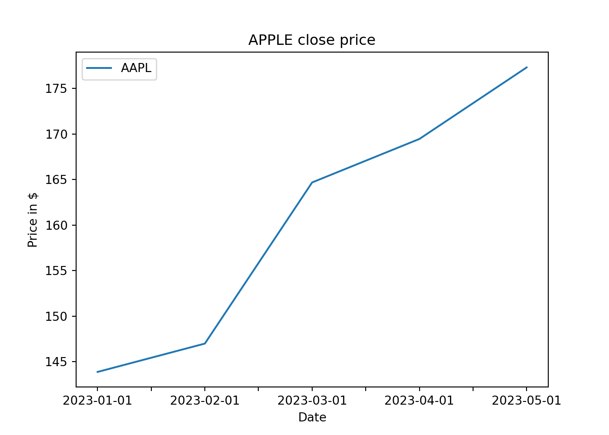

# Python Basics

This section covers the topics required in the following chapters. We suggest covering this section for someone who has yet to gain previous knowledge of Python programming.

## 1 Jupyter Notebook

In this book, we will work on Jupyter Notebook, which is the original web application for creating and sharing computational documents. It offers a simple, streamlined, document-centric experience.


See more about in <https://jupyter.org/>.

## Data types, numerical and text objects

Python is a programming language that lets us work quickly and integrate systems more effectively and contains many data types as part of the core language [@py].

The entities that we can create and manipulate in Python are called objects. We could make those objects by applying the assignment operator ('=').

For example, we create the object "a"; winch has assigned the value 4.


```python
x=4
x
#> 4
```

Each object in Python has tho characteristics, object type and object value.

Object type tells Python what kind of an object it's dealing with. A type could be a number, a string, a list, or something else. In this book, we will use those types of objects. Also, we will cover more complex data structures such as dictionaries, arrays and data frames.

The function type() shows us the object type. For example, the object x is an integer(int):


```python
type(x)
#> <class 'int'>
```

In this example, the object type is an integer(int), and the value is 4.

Besides integers, Python provides other numeric types, floating point numbers, and complex numbers (for example (5j). For example:


```python
type(1.23)
#> <class 'float'>
```

An example of string (str) would be:


```python
y="Apple"
type(y)
#> <class 'str'>
```

We are adding the " " to tell Python that Apple is a string.

## List and object attributes

A list is another useful object in Python, a vector of integers, strings, or both.


```python
liste=[1,2,3]
liste
#> [1, 2, 3]
```


```python
type(liste)
#> <class 'list'>
```

Objects whose value can change are called mutable objects, whereas objects whose value is unchangeable after they've been created are called immutable.


```python
4 # is inmutable

# but liste is mutable
#> 4
liste=["a","b"]
```

Most Python objects have either data or functions or both associated with them. These are known as attributes. The name of the attribute follows the name of the object. And these two are separated by a dot in between them. The two types of attributes are called either data attributes or methods.

The "list" data type has some more methods. Here are all of the methods of "list" objects:


```python
s=[1,2,3,4]
dir(s)[1:10]
#> ['__class__', '__class_getitem__', '__contains__', '__delattr__', '__delitem__', '__dir__', '__doc__', '__eq__', '__format__']
```

We printed only the first ten methods. But in the list, you can find more methods. In this section, we will cover some examples—the method append, which appends an object to the end of the list.


```python
s.append(6)
s
#> [1, 2, 3, 4, 6]
```

A data attribute contains information about the object. For example, to get the number of elements of a list, we use the data method "len." 


```python
len(s)
#> 5
```

There are other ways to manipulate a "list" without a method. For instance, to concatenate two different lists:


```python
t=[12,14,16]
s=s+t
s
#> [1, 2, 3, 4, 6, 12, 14, 16]
```

To select an element of a list, for example, selecting the second element of the list:


```python
s[1]
#> 2
```

As you can see, instead of typing the s[2], we write the number one because Python starts counting to zero.


```python
s[0]
#> 1
```

For example, replace the number 3 in lis "s" with the number 100 to replace an element of a list.


```python
s[2]=100
s
#> [1, 2, 100, 4, 6, 12, 14, 16]
```

To remove an element, for example, number 2:


```python
s.remove(2)
s
#> [1, 100, 4, 6, 12, 14, 16]
```

## Dictionaries

Dictionaries are useful objects for performing fast look-ups on underscored data.


```python
grades_dict={"Paulina": 100, "Coral":95} 
grades_dict
#> {'Paulina': 100, 'Coral': 95}
```

The "dictionaries" have two components, keys and values. The keys:


```python
grades_dict.keys()
#> dict_keys(['Paulina', 'Coral'])
```

And values:


```python
grades_dict.values()
#> dict_values([100, 95])
```

Dictionaries are mutable, then we can modify their content, by adding a new element:


```python
grades_dict["Alejandra"]=120
grades_dict
#> {'Paulina': 100, 'Coral': 95, 'Alejandra': 120}
```

Or modifying an element:


```python
# modify an element
grades_dict["Alejandra"]=grades_dict["Alejandra"]-30
grades_dict
#> {'Paulina': 100, 'Coral': 95, 'Alejandra': 90}
```

We could ask for an element in the dictionary:

```python
# members

"Karina" in grades_dict
#> False
```

We could combine two or more lists into a dictionary, having two keys and four values each:


```python
names=["Eugenio","Luis","Isa","Gisell"]
numbers=[9,17,80,79]
combine = {"Letthers":names,"Colors":numbers}
combine
#> {'Letthers': ['Eugenio', 'Luis', 'Isa', 'Gisell'], 'Colors': [9, 17, 80, 79]}
```

Or we may want to use one list for the keys and the other for the values:


```python
stud= dict(zip(names, numbers))
stud
#> {'Eugenio': 9, 'Luis': 17, 'Isa': 80, 'Gisell': 79}
```

## Python modules

Python also contains building functions that all Python programs can use. The user could make functions or could be developed by someone else in a library.

The Python modules are code libraries, and you can import Python modules using the import statements. Two of the most popular libraries in Python are Pandas and Numpy.

### Pandas data frames

It is a Python package that provides fast, flexible, and expressive data structures designed to make working with "relational" or "labeled" data easy and intuitive. It is the fundamental high-level building block for practical, real-world data analysis in Python. Additionally, it aims to become the most powerful and flexible open-source data analysis/manipulation tool available in any language. It is already well on its way toward this goal.

We will use it to create and manipulate data frames, which are two-dimensional, size-mutable, potentially heterogeneous tabular data.

To install the Pandas module, we write in a notebook cell or in the Conda terminal prompt "pip install pandas" in the Terminal prompt.

```         
pip install pandas
```

To import the library we use the "import" statement:


```python
import pandas as pd
```

After the name Pandas, we use the "as" statement to give pandas a short name. Then, when we use it, it is easier to call pd than pandas. For example, to create a data frame, we have to call the "pd". and the method DataFrame, referring to that we are calling the method DataFrame from the library pandas:

```{}
name=["Vale","Diana","Ivan","Vivi"]
df = pd.DataFrame(name,columns=["Column 1"])
df
```


```{=html}
<style type="text/css">
</style>
<table id="T_a29b3">
  <thead>
    <tr>
      <th class="blank level0" >&nbsp;</th>
      <th id="T_a29b3_level0_col0" class="col_heading level0 col0" >Column 1</th>
    </tr>
  </thead>
  <tbody>
    <tr>
      <th id="T_a29b3_level0_row0" class="row_heading level0 row0" >0</th>
      <td id="T_a29b3_row0_col0" class="data row0 col0" >Vale</td>
    </tr>
    <tr>
      <th id="T_a29b3_level0_row1" class="row_heading level0 row1" >1</th>
      <td id="T_a29b3_row1_col0" class="data row1 col0" >Diana</td>
    </tr>
    <tr>
      <th id="T_a29b3_level0_row2" class="row_heading level0 row2" >2</th>
      <td id="T_a29b3_row2_col0" class="data row2 col0" >Ivan</td>
    </tr>
    <tr>
      <th id="T_a29b3_level0_row3" class="row_heading level0 row3" >3</th>
      <td id="T_a29b3_row3_col0" class="data row3 col0" >Vivi</td>
    </tr>
  </tbody>
</table>

```

In the previous example, an argument of the function is columns; winch is the column name of the data frame. To know more about the function and its arguments, we could ask like this:

```         
help(pd.DataFrame) # or like this: pd.DataFrame?
```

In the previous example, by default, the index, the left column without a title, is numbered from zero to 3, but if we want to change the index:


```{}
name=["Vale","Diana","Ivan","Vivi"]
numbers=[51,11,511,50]
df = pd.DataFrame(name,columns=["Column 1"],index=numbers)
df
```


```{=html}
<style type="text/css">
</style>
<table id="T_40528">
  <thead>
    <tr>
      <th class="blank level0" >&nbsp;</th>
      <th id="T_40528_level0_col0" class="col_heading level0 col0" >Column 1</th>
    </tr>
  </thead>
  <tbody>
    <tr>
      <th id="T_40528_level0_row0" class="row_heading level0 row0" >51</th>
      <td id="T_40528_row0_col0" class="data row0 col0" >Vale</td>
    </tr>
    <tr>
      <th id="T_40528_level0_row1" class="row_heading level0 row1" >11</th>
      <td id="T_40528_row1_col0" class="data row1 col0" >Diana</td>
    </tr>
    <tr>
      <th id="T_40528_level0_row2" class="row_heading level0 row2" >511</th>
      <td id="T_40528_row2_col0" class="data row2 col0" >Ivan</td>
    </tr>
    <tr>
      <th id="T_40528_level0_row3" class="row_heading level0 row3" >50</th>
      <td id="T_40528_row3_col0" class="data row3 col0" >Vivi</td>
    </tr>
  </tbody>
</table>

```

We could take advantage of the creation of a dictionary and transform it into a data frame:

```{}
my_dict=dict(zip(name, numbers))
sn=pd.DataFrame(my_dict,index=["Student_number"])
sn
```


```{=html}
<style type="text/css">
</style>
<table id="T_84067">
  <thead>
    <tr>
      <th class="blank level0" >&nbsp;</th>
      <th id="T_84067_level0_col0" class="col_heading level0 col0" >Vale</th>
      <th id="T_84067_level0_col1" class="col_heading level0 col1" >Diana</th>
      <th id="T_84067_level0_col2" class="col_heading level0 col2" >Ivan</th>
      <th id="T_84067_level0_col3" class="col_heading level0 col3" >Vivi</th>
    </tr>
  </thead>
  <tbody>
    <tr>
      <th id="T_84067_level0_row0" class="row_heading level0 row0" >Student_number</th>
      <td id="T_84067_row0_col0" class="data row0 col0" >51</td>
      <td id="T_84067_row0_col1" class="data row0 col1" >11</td>
      <td id="T_84067_row0_col2" class="data row0 col2" >511</td>
      <td id="T_84067_row0_col3" class="data row0 col3" >50</td>
    </tr>
  </tbody>
</table>

```
If we want to have the student_number as columns instead of a row, we could transpose the data frame:

```{}
sn.transpose()
```


```{=html}
<style type="text/css">
</style>
<table id="T_fb748">
  <thead>
    <tr>
      <th class="blank level0" >&nbsp;</th>
      <th id="T_fb748_level0_col0" class="col_heading level0 col0" >Student_number</th>
    </tr>
  </thead>
  <tbody>
    <tr>
      <th id="T_fb748_level0_row0" class="row_heading level0 row0" >Vale</th>
      <td id="T_fb748_row0_col0" class="data row0 col0" >51</td>
    </tr>
    <tr>
      <th id="T_fb748_level0_row1" class="row_heading level0 row1" >Diana</th>
      <td id="T_fb748_row1_col0" class="data row1 col0" >11</td>
    </tr>
    <tr>
      <th id="T_fb748_level0_row2" class="row_heading level0 row2" >Ivan</th>
      <td id="T_fb748_row2_col0" class="data row2 col0" >511</td>
    </tr>
    <tr>
      <th id="T_fb748_level0_row3" class="row_heading level0 row3" >Vivi</th>
      <td id="T_fb748_row3_col0" class="data row3 col0" >50</td>
    </tr>
  </tbody>
</table>

```


```{}
name=["Estefanía","Laura Yanet","María Guadalupe","Karla Lizette"]
nick=["Estef","Yanet","Lupita","Karla"]
number=[1,2,3,4]

# We use two list to create the dictionary
combine = {"Nick_name":nick,"Name":name}

# and from the dictionary we create the  data frame
df=pd.DataFrame(combine,index=number)
df
```


```{=html}
<style type="text/css">
</style>
<table id="T_9a479">
  <thead>
    <tr>
      <th class="blank level0" >&nbsp;</th>
      <th id="T_9a479_level0_col0" class="col_heading level0 col0" >Nick_name</th>
      <th id="T_9a479_level0_col1" class="col_heading level0 col1" >name</th>
    </tr>
  </thead>
  <tbody>
    <tr>
      <th id="T_9a479_level0_row0" class="row_heading level0 row0" >1</th>
      <td id="T_9a479_row0_col0" class="data row0 col0" >Estef</td>
      <td id="T_9a479_row0_col1" class="data row0 col1" >Estefanía</td>
    </tr>
    <tr>
      <th id="T_9a479_level0_row1" class="row_heading level0 row1" >2</th>
      <td id="T_9a479_row1_col0" class="data row1 col0" >Yanet</td>
      <td id="T_9a479_row1_col1" class="data row1 col1" >Laura Yanet</td>
    </tr>
    <tr>
      <th id="T_9a479_level0_row2" class="row_heading level0 row2" >3</th>
      <td id="T_9a479_row2_col0" class="data row2 col0" >Lupita</td>
      <td id="T_9a479_row2_col1" class="data row2 col1" >María Guadalupe</td>
    </tr>
    <tr>
      <th id="T_9a479_level0_row3" class="row_heading level0 row3" >4</th>
      <td id="T_9a479_row3_col0" class="data row3 col0" >Karla</td>
      <td id="T_9a479_row3_col1" class="data row3 col1" >Karla Lizette</td>
    </tr>
  </tbody>
</table>

```

To apply a method (function) to the data frame, we must type the Pandas object and a dot before the method. A useful method is "shape," which gives us the number of rows and columns.


```python
df.shape 
#> (4, 2)
```

To rename a data frame column:
```{}
df=df.rename(columns={"Nick_name": "Nick", "name": "Names"})
df
```


```{=html}
<style type="text/css">
</style>
<table id="T_d34a6">
  <thead>
    <tr>
      <th class="blank level0" >&nbsp;</th>
      <th id="T_d34a6_level0_col0" class="col_heading level0 col0" >Nick</th>
      <th id="T_d34a6_level0_col1" class="col_heading level0 col1" >Names</th>
    </tr>
  </thead>
  <tbody>
    <tr>
      <th id="T_d34a6_level0_row0" class="row_heading level0 row0" >1</th>
      <td id="T_d34a6_row0_col0" class="data row0 col0" >Estef</td>
      <td id="T_d34a6_row0_col1" class="data row0 col1" >Estefanía</td>
    </tr>
    <tr>
      <th id="T_d34a6_level0_row1" class="row_heading level0 row1" >2</th>
      <td id="T_d34a6_row1_col0" class="data row1 col0" >Yanet</td>
      <td id="T_d34a6_row1_col1" class="data row1 col1" >Laura Yanet</td>
    </tr>
    <tr>
      <th id="T_d34a6_level0_row2" class="row_heading level0 row2" >3</th>
      <td id="T_d34a6_row2_col0" class="data row2 col0" >Lupita</td>
      <td id="T_d34a6_row2_col1" class="data row2 col1" >María Guadalupe</td>
    </tr>
    <tr>
      <th id="T_d34a6_level0_row3" class="row_heading level0 row3" >4</th>
      <td id="T_d34a6_row3_col0" class="data row3 col0" >Karla</td>
      <td id="T_d34a6_row3_col1" class="data row3 col1" >Karla Lizette</td>
    </tr>
  </tbody>
</table>

```
It also applies for index:
```{}
df=df.rename(index={1: "x", 2: "y", 3: "z",4:"w"})
df
```


```{=html}
<style type="text/css">
</style>
<table id="T_f55b7">
  <thead>
    <tr>
      <th class="blank level0" >&nbsp;</th>
      <th id="T_f55b7_level0_col0" class="col_heading level0 col0" >Nick</th>
      <th id="T_f55b7_level0_col1" class="col_heading level0 col1" >Names</th>
    </tr>
  </thead>
  <tbody>
    <tr>
      <th id="T_f55b7_level0_row0" class="row_heading level0 row0" >x</th>
      <td id="T_f55b7_row0_col0" class="data row0 col0" >Estef</td>
      <td id="T_f55b7_row0_col1" class="data row0 col1" >Estefanía</td>
    </tr>
    <tr>
      <th id="T_f55b7_level0_row1" class="row_heading level0 row1" >y</th>
      <td id="T_f55b7_row1_col0" class="data row1 col0" >Yanet</td>
      <td id="T_f55b7_row1_col1" class="data row1 col1" >Laura Yanet</td>
    </tr>
    <tr>
      <th id="T_f55b7_level0_row2" class="row_heading level0 row2" >z</th>
      <td id="T_f55b7_row2_col0" class="data row2 col0" >Lupita</td>
      <td id="T_f55b7_row2_col1" class="data row2 col1" >María Guadalupe</td>
    </tr>
    <tr>
      <th id="T_f55b7_level0_row3" class="row_heading level0 row3" >w</th>
      <td id="T_f55b7_row3_col0" class="data row3 col0" >Karla</td>
      <td id="T_f55b7_row3_col1" class="data row3 col1" >Karla Lizette</td>
    </tr>
  </tbody>
</table>

```

### Selecting rows and columns in a data frame

To select a column, we could type the column name:


```python
df["Nick"]
#> x     Estef
#> y     Yanet
#> z    Lupita
#> w     Karla
#> Name: Nick, dtype: object
```

The resulting object is a pandas series, a one-dimensional object, such as a list, but with an index, in this case, the data frame index.


```python
type(df["Nick"])
#> <class 'pandas.core.series.Series'>
```

If we want to keep the data frame type, we should add the square brackets twice:

```{}
df[["Nick"]]
```


```{=html}
<style type="text/css">
</style>
<table id="T_3efe9">
  <thead>
    <tr>
      <th class="blank level0" >&nbsp;</th>
      <th id="T_3efe9_level0_col0" class="col_heading level0 col0" >Nick</th>
    </tr>
  </thead>
  <tbody>
    <tr>
      <th id="T_3efe9_level0_row0" class="row_heading level0 row0" >x</th>
      <td id="T_3efe9_row0_col0" class="data row0 col0" >Estef</td>
    </tr>
    <tr>
      <th id="T_3efe9_level0_row1" class="row_heading level0 row1" >y</th>
      <td id="T_3efe9_row1_col0" class="data row1 col0" >Yanet</td>
    </tr>
    <tr>
      <th id="T_3efe9_level0_row2" class="row_heading level0 row2" >z</th>
      <td id="T_3efe9_row2_col0" class="data row2 col0" >Lupita</td>
    </tr>
    <tr>
      <th id="T_3efe9_level0_row3" class="row_heading level0 row3" >w</th>
      <td id="T_3efe9_row3_col0" class="data row3 col0" >Karla</td>
    </tr>
  </tbody>
</table>

```

Or two columns at once:

```{}
df[["Nick","Names"]]
```


```{=html}
<style type="text/css">
</style>
<table id="T_e14b7">
  <thead>
    <tr>
      <th class="blank level0" >&nbsp;</th>
      <th id="T_e14b7_level0_col0" class="col_heading level0 col0" >Nick</th>
      <th id="T_e14b7_level0_col1" class="col_heading level0 col1" >Names</th>
    </tr>
  </thead>
  <tbody>
    <tr>
      <th id="T_e14b7_level0_row0" class="row_heading level0 row0" >x</th>
      <td id="T_e14b7_row0_col0" class="data row0 col0" >Estef</td>
      <td id="T_e14b7_row0_col1" class="data row0 col1" >Estefanía</td>
    </tr>
    <tr>
      <th id="T_e14b7_level0_row1" class="row_heading level0 row1" >y</th>
      <td id="T_e14b7_row1_col0" class="data row1 col0" >Yanet</td>
      <td id="T_e14b7_row1_col1" class="data row1 col1" >Laura Yanet</td>
    </tr>
    <tr>
      <th id="T_e14b7_level0_row2" class="row_heading level0 row2" >z</th>
      <td id="T_e14b7_row2_col0" class="data row2 col0" >Lupita</td>
      <td id="T_e14b7_row2_col1" class="data row2 col1" >María Guadalupe</td>
    </tr>
    <tr>
      <th id="T_e14b7_level0_row3" class="row_heading level0 row3" >w</th>
      <td id="T_e14b7_row3_col0" class="data row3 col0" >Karla</td>
      <td id="T_e14b7_row3_col1" class="data row3 col1" >Karla Lizette</td>
    </tr>
  </tbody>
</table>

```

To select rows, we use the method ".loc".

```{}
df.loc[["y"]]
```


```{=html}
<style type="text/css">
</style>
<table id="T_8bbf5">
  <thead>
    <tr>
      <th class="blank level0" >&nbsp;</th>
      <th id="T_8bbf5_level0_col0" class="col_heading level0 col0" >Nick</th>
      <th id="T_8bbf5_level0_col1" class="col_heading level0 col1" >Names</th>
    </tr>
  </thead>
  <tbody>
    <tr>
      <th id="T_8bbf5_level0_row0" class="row_heading level0 row0" >y</th>
      <td id="T_8bbf5_row0_col0" class="data row0 col0" >Yanet</td>
      <td id="T_8bbf5_row0_col1" class="data row0 col1" >Laura Yanet</td>
    </tr>
  </tbody>
</table>

```
```{}
df.loc[["y","z"]]
```


```{=html}
<style type="text/css">
</style>
<table id="T_d65b3">
  <thead>
    <tr>
      <th class="blank level0" >&nbsp;</th>
      <th id="T_d65b3_level0_col0" class="col_heading level0 col0" >Nick</th>
      <th id="T_d65b3_level0_col1" class="col_heading level0 col1" >Names</th>
    </tr>
  </thead>
  <tbody>
    <tr>
      <th id="T_d65b3_level0_row0" class="row_heading level0 row0" >y</th>
      <td id="T_d65b3_row0_col0" class="data row0 col0" >Yanet</td>
      <td id="T_d65b3_row0_col1" class="data row0 col1" >Laura Yanet</td>
    </tr>
    <tr>
      <th id="T_d65b3_level0_row1" class="row_heading level0 row1" >z</th>
      <td id="T_d65b3_row1_col0" class="data row1 col0" >Lupita</td>
      <td id="T_d65b3_row1_col1" class="data row1 col1" >María Guadalupe</td>
    </tr>
  </tbody>
</table>

```


The "loc" method also works for selecting a column:
```{}
df.loc[:, ("Nick","Names")]
```


Or more than one column:

```{=html}
<style type="text/css">
</style>
<table id="T_c1dd4">
  <thead>
    <tr>
      <th class="blank level0" >&nbsp;</th>
      <th id="T_c1dd4_level0_col0" class="col_heading level0 col0" >Nick</th>
      <th id="T_c1dd4_level0_col1" class="col_heading level0 col1" >Names</th>
    </tr>
  </thead>
  <tbody>
    <tr>
      <th id="T_c1dd4_level0_row0" class="row_heading level0 row0" >x</th>
      <td id="T_c1dd4_row0_col0" class="data row0 col0" >Estef</td>
      <td id="T_c1dd4_row0_col1" class="data row0 col1" >Estefanía</td>
    </tr>
    <tr>
      <th id="T_c1dd4_level0_row1" class="row_heading level0 row1" >y</th>
      <td id="T_c1dd4_row1_col0" class="data row1 col0" >Yanet</td>
      <td id="T_c1dd4_row1_col1" class="data row1 col1" >Laura Yanet</td>
    </tr>
    <tr>
      <th id="T_c1dd4_level0_row2" class="row_heading level0 row2" >z</th>
      <td id="T_c1dd4_row2_col0" class="data row2 col0" >Lupita</td>
      <td id="T_c1dd4_row2_col1" class="data row2 col1" >María Guadalupe</td>
    </tr>
    <tr>
      <th id="T_c1dd4_level0_row3" class="row_heading level0 row3" >w</th>
      <td id="T_c1dd4_row3_col0" class="data row3 col0" >Karla</td>
      <td id="T_c1dd4_row3_col1" class="data row3 col1" >Karla Lizette</td>
    </tr>
  </tbody>
</table>

```

Sometimes is useful to select by position. We use the method .iloc[ rows, columns ] in this case. For example, to select the second and third columns:

```{}
df.iloc[: , 1:]
```


```{=html}
<style type="text/css">
</style>
<table id="T_068ea">
  <thead>
    <tr>
      <th class="blank level0" >&nbsp;</th>
      <th id="T_068ea_level0_col0" class="col_heading level0 col0" >Names</th>
    </tr>
  </thead>
  <tbody>
    <tr>
      <th id="T_068ea_level0_row0" class="row_heading level0 row0" >x</th>
      <td id="T_068ea_row0_col0" class="data row0 col0" >Estefanía</td>
    </tr>
    <tr>
      <th id="T_068ea_level0_row1" class="row_heading level0 row1" >y</th>
      <td id="T_068ea_row1_col0" class="data row1 col0" >Laura Yanet</td>
    </tr>
    <tr>
      <th id="T_068ea_level0_row2" class="row_heading level0 row2" >z</th>
      <td id="T_068ea_row2_col0" class="data row2 col0" >María Guadalupe</td>
    </tr>
    <tr>
      <th id="T_068ea_level0_row3" class="row_heading level0 row3" >w</th>
      <td id="T_068ea_row3_col0" class="data row3 col0" >Karla Lizette</td>
    </tr>
  </tbody>
</table>

```

The left side of the comma is for selecting rows, and the right is for columns. Another example:
```{}
df.iloc[: , 0:2]
```


```{=html}
<style type="text/css">
</style>
<table id="T_90d2c">
  <thead>
    <tr>
      <th class="blank level0" >&nbsp;</th>
      <th id="T_90d2c_level0_col0" class="col_heading level0 col0" >Nick</th>
      <th id="T_90d2c_level0_col1" class="col_heading level0 col1" >Names</th>
    </tr>
  </thead>
  <tbody>
    <tr>
      <th id="T_90d2c_level0_row0" class="row_heading level0 row0" >x</th>
      <td id="T_90d2c_row0_col0" class="data row0 col0" >Estef</td>
      <td id="T_90d2c_row0_col1" class="data row0 col1" >Estefanía</td>
    </tr>
    <tr>
      <th id="T_90d2c_level0_row1" class="row_heading level0 row1" >y</th>
      <td id="T_90d2c_row1_col0" class="data row1 col0" >Yanet</td>
      <td id="T_90d2c_row1_col1" class="data row1 col1" >Laura Yanet</td>
    </tr>
    <tr>
      <th id="T_90d2c_level0_row2" class="row_heading level0 row2" >z</th>
      <td id="T_90d2c_row2_col0" class="data row2 col0" >Lupita</td>
      <td id="T_90d2c_row2_col1" class="data row2 col1" >María Guadalupe</td>
    </tr>
    <tr>
      <th id="T_90d2c_level0_row3" class="row_heading level0 row3" >w</th>
      <td id="T_90d2c_row3_col0" class="data row3 col0" >Karla</td>
      <td id="T_90d2c_row3_col1" class="data row3 col1" >Karla Lizette</td>
    </tr>
  </tbody>
</table>

```

For rows:
```{}
df.iloc[2: , ]
```


```{=html}
<style type="text/css">
</style>
<table id="T_12bd0">
  <thead>
    <tr>
      <th class="blank level0" >&nbsp;</th>
      <th id="T_12bd0_level0_col0" class="col_heading level0 col0" >Nick</th>
      <th id="T_12bd0_level0_col1" class="col_heading level0 col1" >Names</th>
    </tr>
  </thead>
  <tbody>
    <tr>
      <th id="T_12bd0_level0_row0" class="row_heading level0 row0" >z</th>
      <td id="T_12bd0_row0_col0" class="data row0 col0" >Lupita</td>
      <td id="T_12bd0_row0_col1" class="data row0 col1" >María Guadalupe</td>
    </tr>
    <tr>
      <th id="T_12bd0_level0_row1" class="row_heading level0 row1" >w</th>
      <td id="T_12bd0_row1_col0" class="data row1 col0" >Karla</td>
      <td id="T_12bd0_row1_col1" class="data row1 col1" >Karla Lizette</td>
    </tr>
  </tbody>
</table>

```

To insert a new column:
```{}
num_2=list(range(4))

df["Numbers_2"]=num_2
df
```


```{=html}
<style type="text/css">
</style>
<table id="T_74848">
  <thead>
    <tr>
      <th class="blank level0" >&nbsp;</th>
      <th id="T_74848_level0_col0" class="col_heading level0 col0" >Nick</th>
      <th id="T_74848_level0_col1" class="col_heading level0 col1" >Names</th>
      <th id="T_74848_level0_col2" class="col_heading level0 col2" >Numbers_2</th>
    </tr>
  </thead>
  <tbody>
    <tr>
      <th id="T_74848_level0_row0" class="row_heading level0 row0" >x</th>
      <td id="T_74848_row0_col0" class="data row0 col0" >Estef</td>
      <td id="T_74848_row0_col1" class="data row0 col1" >Estefanía</td>
      <td id="T_74848_row0_col2" class="data row0 col2" >0</td>
    </tr>
    <tr>
      <th id="T_74848_level0_row1" class="row_heading level0 row1" >y</th>
      <td id="T_74848_row1_col0" class="data row1 col0" >Yanet</td>
      <td id="T_74848_row1_col1" class="data row1 col1" >Laura Yanet</td>
      <td id="T_74848_row1_col2" class="data row1 col2" >1</td>
    </tr>
    <tr>
      <th id="T_74848_level0_row2" class="row_heading level0 row2" >z</th>
      <td id="T_74848_row2_col0" class="data row2 col0" >Lupita</td>
      <td id="T_74848_row2_col1" class="data row2 col1" >María Guadalupe</td>
      <td id="T_74848_row2_col2" class="data row2 col2" >2</td>
    </tr>
    <tr>
      <th id="T_74848_level0_row3" class="row_heading level0 row3" >w</th>
      <td id="T_74848_row3_col0" class="data row3 col0" >Karla</td>
      <td id="T_74848_row3_col1" class="data row3 col1" >Karla Lizette</td>
      <td id="T_74848_row3_col2" class="data row3 col2" >3</td>
    </tr>
  </tbody>
</table>

```
The range method return an object that produces a sequence of integers from start (inclusive)  to stop (exclusive) by step.  range(i, j) produces i, i+1, i+2, ..., j-1.


To drooping colum(s):
```{}
df.drop(columns=['Names'])
```


```{=html}
<style type="text/css">
</style>
<table id="T_d1954">
  <thead>
    <tr>
      <th class="blank level0" >&nbsp;</th>
      <th id="T_d1954_level0_col0" class="col_heading level0 col0" >Nick</th>
      <th id="T_d1954_level0_col1" class="col_heading level0 col1" >Numbers_2</th>
    </tr>
  </thead>
  <tbody>
    <tr>
      <th id="T_d1954_level0_row0" class="row_heading level0 row0" >x</th>
      <td id="T_d1954_row0_col0" class="data row0 col0" >Estef</td>
      <td id="T_d1954_row0_col1" class="data row0 col1" >0</td>
    </tr>
    <tr>
      <th id="T_d1954_level0_row1" class="row_heading level0 row1" >y</th>
      <td id="T_d1954_row1_col0" class="data row1 col0" >Yanet</td>
      <td id="T_d1954_row1_col1" class="data row1 col1" >1</td>
    </tr>
    <tr>
      <th id="T_d1954_level0_row2" class="row_heading level0 row2" >z</th>
      <td id="T_d1954_row2_col0" class="data row2 col0" >Lupita</td>
      <td id="T_d1954_row2_col1" class="data row2 col1" >2</td>
    </tr>
    <tr>
      <th id="T_d1954_level0_row3" class="row_heading level0 row3" >w</th>
      <td id="T_d1954_row3_col0" class="data row3 col0" >Karla</td>
      <td id="T_d1954_row3_col1" class="data row3 col1" >3</td>
    </tr>
  </tbody>
</table>

```

```{}
df.drop(columns=['Names',"Numbers_2"])
```


```{=html}
<style type="text/css">
</style>
<table id="T_335f6">
  <thead>
    <tr>
      <th class="blank level0" >&nbsp;</th>
      <th id="T_335f6_level0_col0" class="col_heading level0 col0" >Nick</th>
    </tr>
  </thead>
  <tbody>
    <tr>
      <th id="T_335f6_level0_row0" class="row_heading level0 row0" >x</th>
      <td id="T_335f6_row0_col0" class="data row0 col0" >Estef</td>
    </tr>
    <tr>
      <th id="T_335f6_level0_row1" class="row_heading level0 row1" >y</th>
      <td id="T_335f6_row1_col0" class="data row1 col0" >Yanet</td>
    </tr>
    <tr>
      <th id="T_335f6_level0_row2" class="row_heading level0 row2" >z</th>
      <td id="T_335f6_row2_col0" class="data row2 col0" >Lupita</td>
    </tr>
    <tr>
      <th id="T_335f6_level0_row3" class="row_heading level0 row3" >w</th>
      <td id="T_335f6_row3_col0" class="data row3 col0" >Karla</td>
    </tr>
  </tbody>
</table>

```


## Reading Excel and csv files

You can download the Excel file by copying and pasting and pasting to a browser through the following link:

https://github.com/abernal30/ML_python/blob/main/df.xlsx

I stored the file in a sub-directory named "data," and I called "df.xlsx"

To verify the names of the Sheets, we use the following code:

```python
import pandas as pd
sheets=pd.ExcelFile("data/df.xlsx").sheet_names
sheets
#> ['Sheet1', 'Sheet2', 'Sheet3']
```
I use the function read_excel of the Pandas library to read the Excel file. In this case, I use the argument sheet_name=sheets[0], equivalent to sheet_name="Sheet1".

```{}
data=pd.read_excel("data/df.xlsx",sheet_name=sheets[0])
data
```


```{=html}
<style type="text/css">
</style>
<table id="T_34aa0">
  <thead>
    <tr>
      <th class="blank level0" >&nbsp;</th>
      <th id="T_34aa0_level0_col0" class="col_heading level0 col0" >Unnamed: 0</th>
      <th id="T_34aa0_level0_col1" class="col_heading level0 col1" >Unnamed: 1</th>
      <th id="T_34aa0_level0_col2" class="col_heading level0 col2" >Unnamed: 2</th>
      <th id="T_34aa0_level0_col3" class="col_heading level0 col3" >Unnamed: 3</th>
    </tr>
  </thead>
  <tbody>
    <tr>
      <th id="T_34aa0_level0_row0" class="row_heading level0 row0" >0</th>
      <td id="T_34aa0_row0_col0" class="data row0 col0" >nan</td>
      <td id="T_34aa0_row0_col1" class="data row0 col1" >Título HOJA 1</td>
      <td id="T_34aa0_row0_col2" class="data row0 col2" >nan</td>
      <td id="T_34aa0_row0_col3" class="data row0 col3" >nan</td>
    </tr>
    <tr>
      <th id="T_34aa0_level0_row1" class="row_heading level0 row1" >1</th>
      <td id="T_34aa0_row1_col0" class="data row1 col0" >nan</td>
      <td id="T_34aa0_row1_col1" class="data row1 col1" >nan</td>
      <td id="T_34aa0_row1_col2" class="data row1 col2" >X</td>
      <td id="T_34aa0_row1_col3" class="data row1 col3" >Y</td>
    </tr>
    <tr>
      <th id="T_34aa0_level0_row2" class="row_heading level0 row2" >2</th>
      <td id="T_34aa0_row2_col0" class="data row2 col0" >A</td>
      <td id="T_34aa0_row2_col1" class="data row2 col1" >nan</td>
      <td id="T_34aa0_row2_col2" class="data row2 col2" >2</td>
      <td id="T_34aa0_row2_col3" class="data row2 col3" >10</td>
    </tr>
    <tr>
      <th id="T_34aa0_level0_row3" class="row_heading level0 row3" >3</th>
      <td id="T_34aa0_row3_col0" class="data row3 col0" >B</td>
      <td id="T_34aa0_row3_col1" class="data row3 col1" >nan</td>
      <td id="T_34aa0_row3_col2" class="data row3 col2" >50</td>
      <td id="T_34aa0_row3_col3" class="data row3 col3" >nan</td>
    </tr>
    <tr>
      <th id="T_34aa0_level0_row4" class="row_heading level0 row4" >4</th>
      <td id="T_34aa0_row4_col0" class="data row4 col0" >C</td>
      <td id="T_34aa0_row4_col1" class="data row4 col1" >nan</td>
      <td id="T_34aa0_row4_col2" class="data row4 col2" >nan</td>
      <td id="T_34aa0_row4_col3" class="data row4 col3" >25</td>
    </tr>
    <tr>
      <th id="T_34aa0_level0_row5" class="row_heading level0 row5" >5</th>
      <td id="T_34aa0_row5_col0" class="data row5 col0" >nan</td>
      <td id="T_34aa0_row5_col1" class="data row5 col1" >nan</td>
      <td id="T_34aa0_row5_col2" class="data row5 col2" >nan</td>
      <td id="T_34aa0_row5_col3" class="data row5 col3" >nan</td>
    </tr>
    <tr>
      <th id="T_34aa0_level0_row6" class="row_heading level0 row6" >6</th>
      <td id="T_34aa0_row6_col0" class="data row6 col0" >D</td>
      <td id="T_34aa0_row6_col1" class="data row6 col1" >nan</td>
      <td id="T_34aa0_row6_col2" class="data row6 col2" >20</td>
      <td id="T_34aa0_row6_col3" class="data row6 col3" >34</td>
    </tr>
    <tr>
      <th id="T_34aa0_level0_row7" class="row_heading level0 row7" >7</th>
      <td id="T_34aa0_row7_col0" class="data row7 col0" >E</td>
      <td id="T_34aa0_row7_col1" class="data row7 col1" >nan</td>
      <td id="T_34aa0_row7_col2" class="data row7 col2" >200</td>
      <td id="T_34aa0_row7_col3" class="data row7 col3" >23</td>
    </tr>
  </tbody>
</table>

```

Sometimes is useful to read the Excel file and define as the index a column of the Excel file. In this case, we want the column "Unnamed: 0".

```{}
data=pd.read_excel("data/df.xlsx",sheet_name=sheets[0],index_col="Unnamed: 0")
data
```


```{=html}
<style type="text/css">
</style>
<table id="T_8fda1">
  <thead>
    <tr>
      <th class="blank level0" >&nbsp;</th>
      <th id="T_8fda1_level0_col0" class="col_heading level0 col0" >Unnamed: 1</th>
      <th id="T_8fda1_level0_col1" class="col_heading level0 col1" >Unnamed: 2</th>
      <th id="T_8fda1_level0_col2" class="col_heading level0 col2" >Unnamed: 3</th>
    </tr>
  </thead>
  <tbody>
    <tr>
      <th id="T_8fda1_level0_row0" class="row_heading level0 row0" >nan</th>
      <td id="T_8fda1_row0_col0" class="data row0 col0" >Título HOJA 1</td>
      <td id="T_8fda1_row0_col1" class="data row0 col1" >nan</td>
      <td id="T_8fda1_row0_col2" class="data row0 col2" >nan</td>
    </tr>
    <tr>
      <th id="T_8fda1_level0_row1" class="row_heading level0 row1" >nan</th>
      <td id="T_8fda1_row1_col0" class="data row1 col0" >nan</td>
      <td id="T_8fda1_row1_col1" class="data row1 col1" >X</td>
      <td id="T_8fda1_row1_col2" class="data row1 col2" >Y</td>
    </tr>
    <tr>
      <th id="T_8fda1_level0_row2" class="row_heading level0 row2" >A</th>
      <td id="T_8fda1_row2_col0" class="data row2 col0" >nan</td>
      <td id="T_8fda1_row2_col1" class="data row2 col1" >2</td>
      <td id="T_8fda1_row2_col2" class="data row2 col2" >10</td>
    </tr>
    <tr>
      <th id="T_8fda1_level0_row3" class="row_heading level0 row3" >B</th>
      <td id="T_8fda1_row3_col0" class="data row3 col0" >nan</td>
      <td id="T_8fda1_row3_col1" class="data row3 col1" >50</td>
      <td id="T_8fda1_row3_col2" class="data row3 col2" >nan</td>
    </tr>
    <tr>
      <th id="T_8fda1_level0_row4" class="row_heading level0 row4" >C</th>
      <td id="T_8fda1_row4_col0" class="data row4 col0" >nan</td>
      <td id="T_8fda1_row4_col1" class="data row4 col1" >nan</td>
      <td id="T_8fda1_row4_col2" class="data row4 col2" >25</td>
    </tr>
    <tr>
      <th id="T_8fda1_level0_row5" class="row_heading level0 row5" >nan</th>
      <td id="T_8fda1_row5_col0" class="data row5 col0" >nan</td>
      <td id="T_8fda1_row5_col1" class="data row5 col1" >nan</td>
      <td id="T_8fda1_row5_col2" class="data row5 col2" >nan</td>
    </tr>
    <tr>
      <th id="T_8fda1_level0_row6" class="row_heading level0 row6" >D</th>
      <td id="T_8fda1_row6_col0" class="data row6 col0" >nan</td>
      <td id="T_8fda1_row6_col1" class="data row6 col1" >20</td>
      <td id="T_8fda1_row6_col2" class="data row6 col2" >34</td>
    </tr>
    <tr>
      <th id="T_8fda1_level0_row7" class="row_heading level0 row7" >E</th>
      <td id="T_8fda1_row7_col0" class="data row7 col0" >nan</td>
      <td id="T_8fda1_row7_col1" class="data row7 col1" >200</td>
      <td id="T_8fda1_row7_col2" class="data row7 col2" >23</td>
    </tr>
  </tbody>
</table>

```


## Numpy modules

NumPy is the fundamental package for scientific computing in Python. It is a Python library that provides a multidimensional array object, various derived objects (such as masked arrays and matrices), and an assortment of routines for fast operations on arrays, including mathematical, logical, shape manipulation, sorting, selecting, I/O, discrete Fourier transforms, basic linear algebra, basic statistical operations, random simulation and much more.

In machine learning models is useful to work with Numpy arrays.
NumPy’s main object is the homogeneous multidimensional array.
For example, we could define variables x and y as an array. 


```python
import numpy as np

X=np.array([[1,2,3],[4,5,6]])
X
#> array([[1, 2, 3],
#>        [4, 5, 6]])
```

Or we can create a matrix for several variables. 

```python
Y=np.array([[2,4,6],[8,10,12]])
Y
#> array([[ 2,  4,  6],
#>        [ 8, 10, 12]])
```

Sometimes is useful to simulate a missing value:

```python
np.nan
#> nan
```


## Missing value management

Suppose we read the Excel we used in the section "Reading Excel and CSV files." We want to work with the "Unnamed: 2" column, as a header we use the second row.
```{}
data=pd.read_excel("data/df.xlsx",sheet_name="Sheet1",index_col="Unnamed: 0",header=2)
data
```


```{=html}
<style type="text/css">
</style>
<table id="T_71862">
  <thead>
    <tr>
      <th class="blank level0" >&nbsp;</th>
      <th id="T_71862_level0_col0" class="col_heading level0 col0" >Unnamed: 1</th>
      <th id="T_71862_level0_col1" class="col_heading level0 col1" >X</th>
      <th id="T_71862_level0_col2" class="col_heading level0 col2" >Y</th>
    </tr>
  </thead>
  <tbody>
    <tr>
      <th id="T_71862_level0_row0" class="row_heading level0 row0" >A</th>
      <td id="T_71862_row0_col0" class="data row0 col0" >nan</td>
      <td id="T_71862_row0_col1" class="data row0 col1" >2.000000</td>
      <td id="T_71862_row0_col2" class="data row0 col2" >10.000000</td>
    </tr>
    <tr>
      <th id="T_71862_level0_row1" class="row_heading level0 row1" >B</th>
      <td id="T_71862_row1_col0" class="data row1 col0" >nan</td>
      <td id="T_71862_row1_col1" class="data row1 col1" >50.000000</td>
      <td id="T_71862_row1_col2" class="data row1 col2" >nan</td>
    </tr>
    <tr>
      <th id="T_71862_level0_row2" class="row_heading level0 row2" >C</th>
      <td id="T_71862_row2_col0" class="data row2 col0" >nan</td>
      <td id="T_71862_row2_col1" class="data row2 col1" >nan</td>
      <td id="T_71862_row2_col2" class="data row2 col2" >25.000000</td>
    </tr>
    <tr>
      <th id="T_71862_level0_row3" class="row_heading level0 row3" >nan</th>
      <td id="T_71862_row3_col0" class="data row3 col0" >nan</td>
      <td id="T_71862_row3_col1" class="data row3 col1" >nan</td>
      <td id="T_71862_row3_col2" class="data row3 col2" >nan</td>
    </tr>
    <tr>
      <th id="T_71862_level0_row4" class="row_heading level0 row4" >D</th>
      <td id="T_71862_row4_col0" class="data row4 col0" >nan</td>
      <td id="T_71862_row4_col1" class="data row4 col1" >20.000000</td>
      <td id="T_71862_row4_col2" class="data row4 col2" >34.000000</td>
    </tr>
    <tr>
      <th id="T_71862_level0_row5" class="row_heading level0 row5" >E</th>
      <td id="T_71862_row5_col0" class="data row5 col0" >nan</td>
      <td id="T_71862_row5_col1" class="data row5 col1" >200.000000</td>
      <td id="T_71862_row5_col2" class="data row5 col2" >23.000000</td>
    </tr>
  </tbody>
</table>

```

To get a better look  at our data frame, we select the second and third columns, with the following method:

```{}
data=data.iloc[:,1:]
data
```


```{=html}
<style type="text/css">
</style>
<table id="T_87497">
  <thead>
    <tr>
      <th class="blank level0" >&nbsp;</th>
      <th id="T_87497_level0_col0" class="col_heading level0 col0" >X</th>
      <th id="T_87497_level0_col1" class="col_heading level0 col1" >Y</th>
    </tr>
  </thead>
  <tbody>
    <tr>
      <th id="T_87497_level0_row0" class="row_heading level0 row0" >A</th>
      <td id="T_87497_row0_col0" class="data row0 col0" >2.000000</td>
      <td id="T_87497_row0_col1" class="data row0 col1" >10.000000</td>
    </tr>
    <tr>
      <th id="T_87497_level0_row1" class="row_heading level0 row1" >B</th>
      <td id="T_87497_row1_col0" class="data row1 col0" >50.000000</td>
      <td id="T_87497_row1_col1" class="data row1 col1" >nan</td>
    </tr>
    <tr>
      <th id="T_87497_level0_row2" class="row_heading level0 row2" >C</th>
      <td id="T_87497_row2_col0" class="data row2 col0" >nan</td>
      <td id="T_87497_row2_col1" class="data row2 col1" >25.000000</td>
    </tr>
    <tr>
      <th id="T_87497_level0_row3" class="row_heading level0 row3" >nan</th>
      <td id="T_87497_row3_col0" class="data row3 col0" >nan</td>
      <td id="T_87497_row3_col1" class="data row3 col1" >nan</td>
    </tr>
    <tr>
      <th id="T_87497_level0_row4" class="row_heading level0 row4" >D</th>
      <td id="T_87497_row4_col0" class="data row4 col0" >20.000000</td>
      <td id="T_87497_row4_col1" class="data row4 col1" >34.000000</td>
    </tr>
    <tr>
      <th id="T_87497_level0_row5" class="row_heading level0 row5" >E</th>
      <td id="T_87497_row5_col0" class="data row5 col0" >200.000000</td>
      <td id="T_87497_row5_col1" class="data row5 col1" >23.000000</td>
    </tr>
  </tbody>
</table>

```

A first look to detect missing values is using the following function:

```python
data.isna().sum()
#> X    2
#> Y    2
#> dtype: int64
```

It tells us that both columns, "X" and "Y", have two missing values.

We have many alternatives to manage them. First eliminating the row that has at least one missing value.
```{}
data.dropna()
```


```{=html}
<style type="text/css">
</style>
<table id="T_2b6db">
  <thead>
    <tr>
      <th class="blank level0" >&nbsp;</th>
      <th id="T_2b6db_level0_col0" class="col_heading level0 col0" >X</th>
      <th id="T_2b6db_level0_col1" class="col_heading level0 col1" >Y</th>
    </tr>
  </thead>
  <tbody>
    <tr>
      <th id="T_2b6db_level0_row0" class="row_heading level0 row0" >A</th>
      <td id="T_2b6db_row0_col0" class="data row0 col0" >2.000000</td>
      <td id="T_2b6db_row0_col1" class="data row0 col1" >10.000000</td>
    </tr>
    <tr>
      <th id="T_2b6db_level0_row1" class="row_heading level0 row1" >D</th>
      <td id="T_2b6db_row1_col0" class="data row1 col0" >20.000000</td>
      <td id="T_2b6db_row1_col1" class="data row1 col1" >34.000000</td>
    </tr>
    <tr>
      <th id="T_2b6db_level0_row2" class="row_heading level0 row2" >E</th>
      <td id="T_2b6db_row2_col0" class="data row2 col0" >200.000000</td>
      <td id="T_2b6db_row2_col1" class="data row2 col1" >23.000000</td>
    </tr>
  </tbody>
</table>

```

Another alternative is filling them with a value, for example the last value available in the data frame. 
```{}
data.fillna(method='ffill')
```


```{=html}
<style type="text/css">
</style>
<table id="T_e4589">
  <thead>
    <tr>
      <th class="blank level0" >&nbsp;</th>
      <th id="T_e4589_level0_col0" class="col_heading level0 col0" >X</th>
      <th id="T_e4589_level0_col1" class="col_heading level0 col1" >Y</th>
    </tr>
  </thead>
  <tbody>
    <tr>
      <th id="T_e4589_level0_row0" class="row_heading level0 row0" >A</th>
      <td id="T_e4589_row0_col0" class="data row0 col0" >2.000000</td>
      <td id="T_e4589_row0_col1" class="data row0 col1" >10.000000</td>
    </tr>
    <tr>
      <th id="T_e4589_level0_row1" class="row_heading level0 row1" >B</th>
      <td id="T_e4589_row1_col0" class="data row1 col0" >50.000000</td>
      <td id="T_e4589_row1_col1" class="data row1 col1" >10.000000</td>
    </tr>
    <tr>
      <th id="T_e4589_level0_row2" class="row_heading level0 row2" >C</th>
      <td id="T_e4589_row2_col0" class="data row2 col0" >50.000000</td>
      <td id="T_e4589_row2_col1" class="data row2 col1" >25.000000</td>
    </tr>
    <tr>
      <th id="T_e4589_level0_row3" class="row_heading level0 row3" >nan</th>
      <td id="T_e4589_row3_col0" class="data row3 col0" >50.000000</td>
      <td id="T_e4589_row3_col1" class="data row3 col1" >25.000000</td>
    </tr>
    <tr>
      <th id="T_e4589_level0_row4" class="row_heading level0 row4" >D</th>
      <td id="T_e4589_row4_col0" class="data row4 col0" >20.000000</td>
      <td id="T_e4589_row4_col1" class="data row4 col1" >34.000000</td>
    </tr>
    <tr>
      <th id="T_e4589_level0_row5" class="row_heading level0 row5" >E</th>
      <td id="T_e4589_row5_col0" class="data row5 col0" >200.000000</td>
      <td id="T_e4589_row5_col1" class="data row5 col1" >23.000000</td>
    </tr>
  </tbody>
</table>

```

Or with a value such  as zero:
```{}
data_clenan=data.replace(np.nan,0)

# which is equivalent to 
#data.fillna(0)

data_clenan
```


```{=html}
<style type="text/css">
</style>
<table id="T_3553d">
  <thead>
    <tr>
      <th class="blank level0" >&nbsp;</th>
      <th id="T_3553d_level0_col0" class="col_heading level0 col0" >X</th>
      <th id="T_3553d_level0_col1" class="col_heading level0 col1" >Y</th>
    </tr>
  </thead>
  <tbody>
    <tr>
      <th id="T_3553d_level0_row0" class="row_heading level0 row0" >A</th>
      <td id="T_3553d_row0_col0" class="data row0 col0" >2.000000</td>
      <td id="T_3553d_row0_col1" class="data row0 col1" >10.000000</td>
    </tr>
    <tr>
      <th id="T_3553d_level0_row1" class="row_heading level0 row1" >B</th>
      <td id="T_3553d_row1_col0" class="data row1 col0" >50.000000</td>
      <td id="T_3553d_row1_col1" class="data row1 col1" >0.000000</td>
    </tr>
    <tr>
      <th id="T_3553d_level0_row2" class="row_heading level0 row2" >C</th>
      <td id="T_3553d_row2_col0" class="data row2 col0" >0.000000</td>
      <td id="T_3553d_row2_col1" class="data row2 col1" >25.000000</td>
    </tr>
    <tr>
      <th id="T_3553d_level0_row3" class="row_heading level0 row3" >nan</th>
      <td id="T_3553d_row3_col0" class="data row3 col0" >0.000000</td>
      <td id="T_3553d_row3_col1" class="data row3 col1" >0.000000</td>
    </tr>
    <tr>
      <th id="T_3553d_level0_row4" class="row_heading level0 row4" >D</th>
      <td id="T_3553d_row4_col0" class="data row4 col0" >20.000000</td>
      <td id="T_3553d_row4_col1" class="data row4 col1" >34.000000</td>
    </tr>
    <tr>
      <th id="T_3553d_level0_row5" class="row_heading level0 row5" >E</th>
      <td id="T_3553d_row5_col0" class="data row5 col0" >200.000000</td>
      <td id="T_3553d_row5_col1" class="data row5 col1" >23.000000</td>
    </tr>
  </tbody>
</table>

```

We still have a missing value in the index, after letter "C". 
The next function
```{}
# This function skips the index elements of a data frame that are missing values, space or: ".",",",";",";","'",'""'.
# It returns a data frame without the ignored elements.
# Parameters:
# df: data frame. The object for which the method is called

#---- Do not change anything from here ----
def clean_na_index2(df):
    skips=[".",",",";",";","'",'""'," ",np.nan]
    con=[name_ind for name_ind in df.index if name_ind not in skips]
    return  df.loc[con, ]
#----- To here ------------

#Run the code so that Python can execute the function

df_index_clean=clean_na_index2(data_clean)
df_index_clean
```


```{=html}
<style type="text/css">
</style>
<table id="T_b7f0d">
  <thead>
    <tr>
      <th class="blank level0" >&nbsp;</th>
      <th id="T_b7f0d_level0_col0" class="col_heading level0 col0" >X</th>
      <th id="T_b7f0d_level0_col1" class="col_heading level0 col1" >Y</th>
    </tr>
  </thead>
  <tbody>
    <tr>
      <th id="T_b7f0d_level0_row0" class="row_heading level0 row0" >A</th>
      <td id="T_b7f0d_row0_col0" class="data row0 col0" >2.000000</td>
      <td id="T_b7f0d_row0_col1" class="data row0 col1" >10.000000</td>
    </tr>
    <tr>
      <th id="T_b7f0d_level0_row1" class="row_heading level0 row1" >B</th>
      <td id="T_b7f0d_row1_col0" class="data row1 col0" >50.000000</td>
      <td id="T_b7f0d_row1_col1" class="data row1 col1" >0.000000</td>
    </tr>
    <tr>
      <th id="T_b7f0d_level0_row2" class="row_heading level0 row2" >C</th>
      <td id="T_b7f0d_row2_col0" class="data row2 col0" >0.000000</td>
      <td id="T_b7f0d_row2_col1" class="data row2 col1" >25.000000</td>
    </tr>
    <tr>
      <th id="T_b7f0d_level0_row3" class="row_heading level0 row3" >D</th>
      <td id="T_b7f0d_row3_col0" class="data row3 col0" >20.000000</td>
      <td id="T_b7f0d_row3_col1" class="data row3 col1" >34.000000</td>
    </tr>
    <tr>
      <th id="T_b7f0d_level0_row4" class="row_heading level0 row4" >E</th>
      <td id="T_b7f0d_row4_col0" class="data row4 col0" >200.000000</td>
      <td id="T_b7f0d_row4_col1" class="data row4 col1" >23.000000</td>
    </tr>
  </tbody>
</table>

```

## Merge, joint or concatenate data frames

Suppose we want to merge the object df_index_clean of the previous section, with the data frame in the "Sheet2" of the Excel file "df.xlsx":
```{}
#,header=2
data=pd.read_excel("data/df.xlsx",sheet_name="Sheet2",index_col="Unnamed: 0")
data
```


```{=html}
<style type="text/css">
</style>
<table id="T_4b30a">
  <thead>
    <tr>
      <th class="blank level0" >&nbsp;</th>
      <th id="T_4b30a_level0_col0" class="col_heading level0 col0" >W</th>
      <th id="T_4b30a_level0_col1" class="col_heading level0 col1" >Z</th>
    </tr>
  </thead>
  <tbody>
    <tr>
      <th id="T_4b30a_level0_row0" class="row_heading level0 row0" >A</th>
      <td id="T_4b30a_row0_col0" class="data row0 col0" >2</td>
      <td id="T_4b30a_row0_col1" class="data row0 col1" >10</td>
    </tr>
    <tr>
      <th id="T_4b30a_level0_row1" class="row_heading level0 row1" >B</th>
      <td id="T_4b30a_row1_col0" class="data row1 col0" >50</td>
      <td id="T_4b30a_row1_col1" class="data row1 col1" >30</td>
    </tr>
    <tr>
      <th id="T_4b30a_level0_row2" class="row_heading level0 row2" >C</th>
      <td id="T_4b30a_row2_col0" class="data row2 col0" >30</td>
      <td id="T_4b30a_row2_col1" class="data row2 col1" >25</td>
    </tr>
    <tr>
      <th id="T_4b30a_level0_row3" class="row_heading level0 row3" >D</th>
      <td id="T_4b30a_row3_col0" class="data row3 col0" >20</td>
      <td id="T_4b30a_row3_col1" class="data row3 col1" >34</td>
    </tr>
    <tr>
      <th id="T_4b30a_level0_row4" class="row_heading level0 row4" >E</th>
      <td id="T_4b30a_row4_col0" class="data row4 col0" >200</td>
      <td id="T_4b30a_row4_col1" class="data row4 col1" >23</td>
    </tr>
  </tbody>
</table>

```
In this case, both data frames have the same index:


```python
print(data.index)
#> Index(['A', 'B', 'C', 'D', 'E'], dtype='object')
print(df_index_clean.index)
#> Index(['A', 'B', 'C', 'D', 'E'], dtype='object')
```
Then we can use the function concat. The argument axis=1 is to concatenate the columns of both data frames in the columns.
```{}
pd.concat([df_index_clean,data],axis=1)
```


```{=html}
<style type="text/css">
</style>
<table id="T_3f642">
  <thead>
    <tr>
      <th class="blank level0" >&nbsp;</th>
      <th id="T_3f642_level0_col0" class="col_heading level0 col0" >X</th>
      <th id="T_3f642_level0_col1" class="col_heading level0 col1" >Y</th>
      <th id="T_3f642_level0_col2" class="col_heading level0 col2" >W</th>
      <th id="T_3f642_level0_col3" class="col_heading level0 col3" >Z</th>
    </tr>
  </thead>
  <tbody>
    <tr>
      <th id="T_3f642_level0_row0" class="row_heading level0 row0" >A</th>
      <td id="T_3f642_row0_col0" class="data row0 col0" >2.000000</td>
      <td id="T_3f642_row0_col1" class="data row0 col1" >10.000000</td>
      <td id="T_3f642_row0_col2" class="data row0 col2" >2</td>
      <td id="T_3f642_row0_col3" class="data row0 col3" >10</td>
    </tr>
    <tr>
      <th id="T_3f642_level0_row1" class="row_heading level0 row1" >B</th>
      <td id="T_3f642_row1_col0" class="data row1 col0" >50.000000</td>
      <td id="T_3f642_row1_col1" class="data row1 col1" >0.000000</td>
      <td id="T_3f642_row1_col2" class="data row1 col2" >50</td>
      <td id="T_3f642_row1_col3" class="data row1 col3" >30</td>
    </tr>
    <tr>
      <th id="T_3f642_level0_row2" class="row_heading level0 row2" >C</th>
      <td id="T_3f642_row2_col0" class="data row2 col0" >0.000000</td>
      <td id="T_3f642_row2_col1" class="data row2 col1" >25.000000</td>
      <td id="T_3f642_row2_col2" class="data row2 col2" >30</td>
      <td id="T_3f642_row2_col3" class="data row2 col3" >25</td>
    </tr>
    <tr>
      <th id="T_3f642_level0_row3" class="row_heading level0 row3" >D</th>
      <td id="T_3f642_row3_col0" class="data row3 col0" >20.000000</td>
      <td id="T_3f642_row3_col1" class="data row3 col1" >34.000000</td>
      <td id="T_3f642_row3_col2" class="data row3 col2" >20</td>
      <td id="T_3f642_row3_col3" class="data row3 col3" >34</td>
    </tr>
    <tr>
      <th id="T_3f642_level0_row4" class="row_heading level0 row4" >E</th>
      <td id="T_3f642_row4_col0" class="data row4 col0" >200.000000</td>
      <td id="T_3f642_row4_col1" class="data row4 col1" >23.000000</td>
      <td id="T_3f642_row4_col2" class="data row4 col2" >200</td>
      <td id="T_3f642_row4_col3" class="data row4 col3" >23</td>
    </tr>
  </tbody>
</table>

```

Otherwise it would concatenate in the index (rows)

```{}
pd.concat([df_index_clean,data])

```


```{=html}
<style type="text/css">
</style>
<table id="T_72a52">
  <thead>
    <tr>
      <th class="blank level0" >&nbsp;</th>
      <th id="T_72a52_level0_col0" class="col_heading level0 col0" >X</th>
      <th id="T_72a52_level0_col1" class="col_heading level0 col1" >Y</th>
      <th id="T_72a52_level0_col2" class="col_heading level0 col2" >W</th>
      <th id="T_72a52_level0_col3" class="col_heading level0 col3" >Z</th>
    </tr>
  </thead>
  <tbody>
    <tr>
      <th id="T_72a52_level0_row0" class="row_heading level0 row0" >A</th>
      <td id="T_72a52_row0_col0" class="data row0 col0" >2.000000</td>
      <td id="T_72a52_row0_col1" class="data row0 col1" >10.000000</td>
      <td id="T_72a52_row0_col2" class="data row0 col2" >nan</td>
      <td id="T_72a52_row0_col3" class="data row0 col3" >nan</td>
    </tr>
    <tr>
      <th id="T_72a52_level0_row1" class="row_heading level0 row1" >B</th>
      <td id="T_72a52_row1_col0" class="data row1 col0" >50.000000</td>
      <td id="T_72a52_row1_col1" class="data row1 col1" >0.000000</td>
      <td id="T_72a52_row1_col2" class="data row1 col2" >nan</td>
      <td id="T_72a52_row1_col3" class="data row1 col3" >nan</td>
    </tr>
    <tr>
      <th id="T_72a52_level0_row2" class="row_heading level0 row2" >C</th>
      <td id="T_72a52_row2_col0" class="data row2 col0" >0.000000</td>
      <td id="T_72a52_row2_col1" class="data row2 col1" >25.000000</td>
      <td id="T_72a52_row2_col2" class="data row2 col2" >nan</td>
      <td id="T_72a52_row2_col3" class="data row2 col3" >nan</td>
    </tr>
    <tr>
      <th id="T_72a52_level0_row3" class="row_heading level0 row3" >D</th>
      <td id="T_72a52_row3_col0" class="data row3 col0" >20.000000</td>
      <td id="T_72a52_row3_col1" class="data row3 col1" >34.000000</td>
      <td id="T_72a52_row3_col2" class="data row3 col2" >nan</td>
      <td id="T_72a52_row3_col3" class="data row3 col3" >nan</td>
    </tr>
    <tr>
      <th id="T_72a52_level0_row4" class="row_heading level0 row4" >E</th>
      <td id="T_72a52_row4_col0" class="data row4 col0" >200.000000</td>
      <td id="T_72a52_row4_col1" class="data row4 col1" >23.000000</td>
      <td id="T_72a52_row4_col2" class="data row4 col2" >nan</td>
      <td id="T_72a52_row4_col3" class="data row4 col3" >nan</td>
    </tr>
    <tr>
      <th id="T_72a52_level0_row5" class="row_heading level0 row5" >A</th>
      <td id="T_72a52_row5_col0" class="data row5 col0" >nan</td>
      <td id="T_72a52_row5_col1" class="data row5 col1" >nan</td>
      <td id="T_72a52_row5_col2" class="data row5 col2" >2.000000</td>
      <td id="T_72a52_row5_col3" class="data row5 col3" >10.000000</td>
    </tr>
    <tr>
      <th id="T_72a52_level0_row6" class="row_heading level0 row6" >B</th>
      <td id="T_72a52_row6_col0" class="data row6 col0" >nan</td>
      <td id="T_72a52_row6_col1" class="data row6 col1" >nan</td>
      <td id="T_72a52_row6_col2" class="data row6 col2" >50.000000</td>
      <td id="T_72a52_row6_col3" class="data row6 col3" >30.000000</td>
    </tr>
    <tr>
      <th id="T_72a52_level0_row7" class="row_heading level0 row7" >C</th>
      <td id="T_72a52_row7_col0" class="data row7 col0" >nan</td>
      <td id="T_72a52_row7_col1" class="data row7 col1" >nan</td>
      <td id="T_72a52_row7_col2" class="data row7 col2" >30.000000</td>
      <td id="T_72a52_row7_col3" class="data row7 col3" >25.000000</td>
    </tr>
    <tr>
      <th id="T_72a52_level0_row8" class="row_heading level0 row8" >D</th>
      <td id="T_72a52_row8_col0" class="data row8 col0" >nan</td>
      <td id="T_72a52_row8_col1" class="data row8 col1" >nan</td>
      <td id="T_72a52_row8_col2" class="data row8 col2" >20.000000</td>
      <td id="T_72a52_row8_col3" class="data row8 col3" >34.000000</td>
    </tr>
    <tr>
      <th id="T_72a52_level0_row9" class="row_heading level0 row9" >E</th>
      <td id="T_72a52_row9_col0" class="data row9 col0" >nan</td>
      <td id="T_72a52_row9_col1" class="data row9 col1" >nan</td>
      <td id="T_72a52_row9_col2" class="data row9 col2" >200.000000</td>
      <td id="T_72a52_row9_col3" class="data row9 col3" >23.000000</td>
    </tr>
  </tbody>
</table>

```

## API´s (Application Programming Interface)


### The "yfinance" library 

It was designed to download market data from Yahoo! Finance. To see how to install it and more information: https://pypi.org/project/yfinance/


```python
import yfinance as yf

msft = yf.Ticker("MSFT")
```

The following code shows a dictionary that contains information such as company address, business summary, etc.

```{}
msft.info
```

To download the ticker´s prices.

```{}
msft.history(period="1mo").head()
```


```{=html}
<style type="text/css">
</style>
<table id="T_5b18c">
  <thead>
    <tr>
      <th class="blank level0" >&nbsp;</th>
      <th id="T_5b18c_level0_col0" class="col_heading level0 col0" >Open</th>
      <th id="T_5b18c_level0_col1" class="col_heading level0 col1" >High</th>
      <th id="T_5b18c_level0_col2" class="col_heading level0 col2" >Low</th>
      <th id="T_5b18c_level0_col3" class="col_heading level0 col3" >Close</th>
      <th id="T_5b18c_level0_col4" class="col_heading level0 col4" >Volume</th>
      <th id="T_5b18c_level0_col5" class="col_heading level0 col5" >Dividends</th>
      <th id="T_5b18c_level0_col6" class="col_heading level0 col6" >Stock Splits</th>
    </tr>
    <tr>
      <th class="index_name level0" >Date</th>
      <th class="blank col0" >&nbsp;</th>
      <th class="blank col1" >&nbsp;</th>
      <th class="blank col2" >&nbsp;</th>
      <th class="blank col3" >&nbsp;</th>
      <th class="blank col4" >&nbsp;</th>
      <th class="blank col5" >&nbsp;</th>
      <th class="blank col6" >&nbsp;</th>
    </tr>
  </thead>
  <tbody>
    <tr>
      <th id="T_5b18c_level0_row0" class="row_heading level0 row0" >2023-05-01 00:00:00-04:00</th>
      <td id="T_5b18c_row0_col0" class="data row0 col0" >306.300422</td>
      <td id="T_5b18c_row0_col1" class="data row0 col1" >307.926871</td>
      <td id="T_5b18c_row0_col2" class="data row0 col2" >304.484384</td>
      <td id="T_5b18c_row0_col3" class="data row0 col3" >304.893494</td>
      <td id="T_5b18c_row0_col4" class="data row0 col4" >21294100</td>
      <td id="T_5b18c_row0_col5" class="data row0 col5" >0.000000</td>
      <td id="T_5b18c_row0_col6" class="data row0 col6" >0.000000</td>
    </tr>
    <tr>
      <th id="T_5b18c_level0_row1" class="row_heading level0 row1" >2023-05-02 00:00:00-04:00</th>
      <td id="T_5b18c_row1_col0" class="data row1 col0" >307.088685</td>
      <td id="T_5b18c_row1_col1" class="data row1 col1" >308.505570</td>
      <td id="T_5b18c_row1_col2" class="data row1 col2" >303.247077</td>
      <td id="T_5b18c_row1_col3" class="data row1 col3" >304.743805</td>
      <td id="T_5b18c_row1_col4" class="data row1 col4" >26404400</td>
      <td id="T_5b18c_row1_col5" class="data row1 col5" >0.000000</td>
      <td id="T_5b18c_row1_col6" class="data row1 col6" >0.000000</td>
    </tr>
    <tr>
      <th id="T_5b18c_level0_row2" class="row_heading level0 row2" >2023-05-03 00:00:00-04:00</th>
      <td id="T_5b18c_row2_col0" class="data row2 col0" >305.951182</td>
      <td id="T_5b18c_row2_col1" class="data row2 col1" >307.936831</td>
      <td id="T_5b18c_row2_col2" class="data row2 col2" >303.426702</td>
      <td id="T_5b18c_row2_col3" class="data row2 col3" >303.736023</td>
      <td id="T_5b18c_row2_col4" class="data row2 col4" >22360800</td>
      <td id="T_5b18c_row2_col5" class="data row2 col5" >0.000000</td>
      <td id="T_5b18c_row2_col6" class="data row2 col6" >0.000000</td>
    </tr>
    <tr>
      <th id="T_5b18c_level0_row3" class="row_heading level0 row3" >2023-05-04 00:00:00-04:00</th>
      <td id="T_5b18c_row3_col0" class="data row3 col0" >305.571981</td>
      <td id="T_5b18c_row3_col1" class="data row3 col1" >307.088685</td>
      <td id="T_5b18c_row3_col2" class="data row3 col2" >302.738180</td>
      <td id="T_5b18c_row3_col3" class="data row3 col3" >304.743805</td>
      <td id="T_5b18c_row3_col4" class="data row3 col4" >22519900</td>
      <td id="T_5b18c_row3_col5" class="data row3 col5" >0.000000</td>
      <td id="T_5b18c_row3_col6" class="data row3 col6" >0.000000</td>
    </tr>
    <tr>
      <th id="T_5b18c_level0_row4" class="row_heading level0 row4" >2023-05-05 00:00:00-04:00</th>
      <td id="T_5b18c_row4_col0" class="data row4 col0" >305.053143</td>
      <td id="T_5b18c_row4_col1" class="data row4 col1" >311.289510</td>
      <td id="T_5b18c_row4_col2" class="data row4 col2" >303.606293</td>
      <td id="T_5b18c_row4_col3" class="data row4 col3" >309.972382</td>
      <td id="T_5b18c_row4_col4" class="data row4 col4" >28181200</td>
      <td id="T_5b18c_row4_col5" class="data row4 col5" >0.000000</td>
      <td id="T_5b18c_row4_col6" class="data row4 col6" >0.000000</td>
    </tr>
  </tbody>
</table>

```

As you can see in the method help (help(msft.history)), valid periods are: 1d,5d,1mo,3mo,6mo,1y,2y,5y,10y,ytd,max

Also there are other parameters such as interval='1d': intervals: 1m,2m,5m,15m,30m,60m,90m,1h,1d,5d,1wk,1mo,3mo

For some of the procedures we will apply in this book, we require the dates in a format, for example "%Y-%m-%d". And the 

```python
import yfinance as yf
# This function download market data from Yahoo! Finance's
# It returns a data frame with a specific format date. 
# Parameters:
# ticker: Yahoo finance ticker symbol
# per: valid periods are: 1d,5d,1mo,3mo,6mo,1y,2y,5y,10y,ytd,max
# inter: intervals: 1m,2m,5m,15m,30m,60m,90m,1h,1d,5d,1wk,1mo,3mo
# price_type: Open', 'High', 'Low', 'Close', 'Volume', 'Dividends', 'Stock Splits
# format_date:  index format date
# d_ini: initial date if the subset
# d_fin: final date of the subset

#---- Do not change anything from here ----
def my_yahoo(ticker,per,inter,price_type,format_date,d_ini,d_fin):
    import pandas as pd
    x = yf.Ticker(ticker)
    hist = x.history(period=per,interval=inter)
    date=list(hist.index)
    hist_date=[date.strftime(format_date) for date in date]
    price=list(hist[price_type])
    hist={ticker:price}
    hist=pd.DataFrame(hist,index=hist_date)
    return hist.loc[d_ini:d_fin]
#----- To here ------------

#Run the code cell so that Python can execute the function
```


```{}
format_date="%Y-%m-%d"
per="5y"
inter='1mo'
price_type="Close"
ticker="^MXX"
d_ini="2021-01-01"
d_fin="2022-12-01"

ipc=my_yahoo(ticker,per,inter,price_type,format_date,d_ini,d_fin)
ipc.head()
```


```{=html}
<style type="text/css">
</style>
<table id="T_975b8">
  <thead>
    <tr>
      <th class="blank level0" >&nbsp;</th>
      <th id="T_975b8_level0_col0" class="col_heading level0 col0" >^MXX</th>
    </tr>
  </thead>
  <tbody>
    <tr>
      <th id="T_975b8_level0_row0" class="row_heading level0 row0" >2021-01-01</th>
      <td id="T_975b8_row0_col0" class="data row0 col0" >42985.730469</td>
    </tr>
    <tr>
      <th id="T_975b8_level0_row1" class="row_heading level0 row1" >2021-02-01</th>
      <td id="T_975b8_row1_col0" class="data row1 col0" >44592.910156</td>
    </tr>
    <tr>
      <th id="T_975b8_level0_row2" class="row_heading level0 row2" >2021-03-01</th>
      <td id="T_975b8_row2_col0" class="data row2 col0" >47246.261719</td>
    </tr>
    <tr>
      <th id="T_975b8_level0_row3" class="row_heading level0 row3" >2021-04-01</th>
      <td id="T_975b8_row3_col0" class="data row3 col0" >48009.718750</td>
    </tr>
    <tr>
      <th id="T_975b8_level0_row4" class="row_heading level0 row4" >2021-05-01</th>
      <td id="T_975b8_row4_col0" class="data row4 col0" >50885.949219</td>
    </tr>
  </tbody>
</table>

```


### Banxico API

To download historical information of the Mexican central bank (BANXICO). Such as interest rates, exchange rates and other macroeconomic information. To see how to install it and more information:
https://pypi.org/project/sie-banxico/


We need to get a token in the following web page:
https://www.banxico.org.mx/SieAPIRest/service/v1/token?locale=en


The token must look like this. And you have to store it in an object, for example:
```{}
token = "e3980208bf01ec653aba9aee3c2d6f70f6ae8b066d2545e379b9e0ef92e9de25"
```


In the same web page you could see the Series catalog, which are the variable ID:
```{}
from sie_banxico import SIEBanxico

# This function download information from BANXICO 
# It returns a data frame with a specific format date
# Parameters:
# token: The token object
# my_series: Banxico´s Series ID´s
# my_series_name: The short name we want to assign to the Serie.
# d_in: initian date of the subset
# d_fin: final date of the subset
# format_date: index format date

#---- Do not change anything from here ----
def my_banxico_py(token,my_series,my_series_name,d_in,d_fin,format_date):
    import pandas as pd
    le=len(my_series)
    ser=0
    if(le==1):
        ser=0
        api = SIEBanxico(token = token, id_series = my_series[ser])
        timeseries_range=api.get_timeseries_range(init_date=d_in,end_date=d_fin)
        timeseries_range=timeseries_range['bmx']['series'][0]['datos']
        data=pd.DataFrame(timeseries_range)
        dates=[pd.Timestamp(date).strftime(format_date) for date in list(data["fecha"])]
        data=pd.DataFrame({my_series_name[ser]:list(data["dato"])},index=dates)
    else:
        ser=0
        api = SIEBanxico(token = token, id_series = my_series[ser])
        timeseries_range=api.get_timeseries_range(init_date=d_in, end_date=d_fin)
        timeseries_range=timeseries_range['bmx']['series'][0]['datos']
        data=pd.DataFrame(timeseries_range)
        dates=[pd.Timestamp(date).strftime(format_date) for date in list(data["fecha"])]
        data=pd.DataFrame({my_series_name[ser]:list(data["dato"])},index=dates)
        for ser in range(1,le):
            api = SIEBanxico(token = token, id_series = my_series[ser])
            timeseries_range=api.get_timeseries_range(init_date=d_in, end_date=d_fin)
            timeseries_range=timeseries_range['bmx']['series'][0]['datos']
            data2=pd.DataFrame(timeseries_range)
            dates2=[pd.Timestamp(date).strftime(format_date) for date in list(data2["fecha"])]
            data2=pd.DataFrame({my_series_name[ser]:list(data2["dato"])},index=dates2)
            data=pd.concat([data,data2],axis=1)
    ban_names=list(data.columns)
    for col_i in range(data.shape[1]):
        cel_num=[float(cel) for cel in data[ban_names[col_i]]]
        data[ban_names[col_i]]=cel_num
    return data
  
#----- To here ------------
```

For this example, we want to download the following Series:

SF17908: Exchange rate Pesos per US dollar

SF282: 28 days Mexican treasury bills 

SP74660: Mexican inflation rate

SR16734: Global indicator of Mexican economic activity 
```{}
#Run the code cell so that Python can execute the function
my_series=['SF17908' ,'SF282',"SP74660","SR16734"]
my_series_name=["TC","Cetes_28","Mex_inflation","igae"]
d_in='2021-01-01'
d_fin='2022-12-01'
format_date="%Y-%d-%m"
my_banxico_py(token,my_series,my_series_name,d_in,d_fin,format_date).head()
```


```{=html}
<style type="text/css">
</style>
<table id="T_9f10a">
  <thead>
    <tr>
      <th class="blank level0" >&nbsp;</th>
      <th id="T_9f10a_level0_col0" class="col_heading level0 col0" >TC</th>
      <th id="T_9f10a_level0_col1" class="col_heading level0 col1" >Cetes_28</th>
      <th id="T_9f10a_level0_col2" class="col_heading level0 col2" >Mex_inflation</th>
      <th id="T_9f10a_level0_col3" class="col_heading level0 col3" >igae</th>
    </tr>
  </thead>
  <tbody>
    <tr>
      <th id="T_9f10a_level0_row0" class="row_heading level0 row0" >2021-01-01</th>
      <td id="T_9f10a_row0_col0" class="data row0 col0" >19.921500</td>
      <td id="T_9f10a_row0_col1" class="data row0 col1" >4.220000</td>
      <td id="T_9f10a_row0_col2" class="data row0 col2" >0.360000</td>
      <td id="T_9f10a_row0_col3" class="data row0 col3" >105.545700</td>
    </tr>
    <tr>
      <th id="T_9f10a_level0_row1" class="row_heading level0 row1" >2021-02-01</th>
      <td id="T_9f10a_row1_col0" class="data row1 col0" >20.309700</td>
      <td id="T_9f10a_row1_col1" class="data row1 col1" >4.120000</td>
      <td id="T_9f10a_row1_col2" class="data row1 col2" >0.390000</td>
      <td id="T_9f10a_row1_col3" class="data row1 col3" >102.802900</td>
    </tr>
    <tr>
      <th id="T_9f10a_level0_row2" class="row_heading level0 row2" >2021-03-01</th>
      <td id="T_9f10a_row2_col0" class="data row2 col0" >20.755500</td>
      <td id="T_9f10a_row2_col1" class="data row2 col1" >4.050000</td>
      <td id="T_9f10a_row2_col2" class="data row2 col2" >0.540000</td>
      <td id="T_9f10a_row2_col3" class="data row2 col3" >111.518600</td>
    </tr>
    <tr>
      <th id="T_9f10a_level0_row3" class="row_heading level0 row3" >2021-04-01</th>
      <td id="T_9f10a_row3_col0" class="data row3 col0" >20.015300</td>
      <td id="T_9f10a_row3_col1" class="data row3 col1" >4.070000</td>
      <td id="T_9f10a_row3_col2" class="data row3 col2" >0.370000</td>
      <td id="T_9f10a_row3_col3" class="data row3 col3" >107.834900</td>
    </tr>
    <tr>
      <th id="T_9f10a_level0_row4" class="row_heading level0 row4" >2021-05-01</th>
      <td id="T_9f10a_row4_col0" class="data row4 col0" >19.963100</td>
      <td id="T_9f10a_row4_col1" class="data row4 col1" >4.060000</td>
      <td id="T_9f10a_row4_col2" class="data row4 col2" >0.530000</td>
      <td id="T_9f10a_row4_col3" class="data row4 col3" >111.176800</td>
    </tr>
  </tbody>
</table>

```

## Plots or graphs

For example, we use the method plot to plot the APPLE historical price. First, we download the prices.

```{}
format_date="%Y-%m-%d"
per="5y"
inter='1mo'
price_type="Close"
ticker="AAPL"
d_ini="2023-01-01"
d_fin="2023-05-01"
apple=my_yahoo(ticker,per,inter,price_type,format_date,d_ini,d_fin)
```


Then we use the function plot;
```{}
apple.plot(title="APPLE close price", ylabel="Price in $",xlabel="Date");
```




## Dates management

In this section we mange the data frame dates. 
```{}
data=pd.read_excel("data/df.xlsx",sheet_name="Sheet3")
#,index_col="Unnamed: 0"
data
```


```{=html}
<style type="text/css">
</style>
<table id="T_f0257">
  <thead>
    <tr>
      <th class="blank level0" >&nbsp;</th>
      <th id="T_f0257_level0_col0" class="col_heading level0 col0" >date</th>
      <th id="T_f0257_level0_col1" class="col_heading level0 col1" >Sales</th>
    </tr>
  </thead>
  <tbody>
    <tr>
      <th id="T_f0257_level0_row0" class="row_heading level0 row0" >0</th>
      <td id="T_f0257_row0_col0" class="data row0 col0" >Ene 2021</td>
      <td id="T_f0257_row0_col1" class="data row0 col1" >5</td>
    </tr>
    <tr>
      <th id="T_f0257_level0_row1" class="row_heading level0 row1" >1</th>
      <td id="T_f0257_row1_col0" class="data row1 col0" >Feb 2021</td>
      <td id="T_f0257_row1_col1" class="data row1 col1" >7</td>
    </tr>
    <tr>
      <th id="T_f0257_level0_row2" class="row_heading level0 row2" >2</th>
      <td id="T_f0257_row2_col0" class="data row2 col0" >Mar 2021</td>
      <td id="T_f0257_row2_col1" class="data row2 col1" >60</td>
    </tr>
    <tr>
      <th id="T_f0257_level0_row3" class="row_heading level0 row3" >3</th>
      <td id="T_f0257_row3_col0" class="data row3 col0" >Abr 2021</td>
      <td id="T_f0257_row3_col1" class="data row3 col1" >20</td>
    </tr>
    <tr>
      <th id="T_f0257_level0_row4" class="row_heading level0 row4" >4</th>
      <td id="T_f0257_row4_col0" class="data row4 col0" >May 2021</td>
      <td id="T_f0257_row4_col1" class="data row4 col1" >21</td>
    </tr>
  </tbody>
</table>

```

For some analysis in machine learning, we require to have the index data as date format. The previous data frame index type is a string:

```python
type(data.index[0])
#> <class 'int'>
```

Then, we use the following function:
```{}
# This function transforms the data frame index into a date format  
# (Timestamp). 
# It returns a data frame with the new date index
# Parameters:
# data: data frame with two columns, a date column and another one
# i_date: is the start date of the new index
# freq_i; frequency if the new index, "y" for year, "m" month, "d" day, "h" hour.
# col_name: name of the column in the data frame data that is not the date
# date_name= name of the column in the data that is the date
#---- Do not change anything from here ----
def index_date(data,i_date,freq_i,col_name,date_name):
  dat=data.set_index(date_name)
  ventas_s= pd.Series(
  list(dat[col_name]), index=pd.date_range(i_date, periods=len(dat),
  freq=freq_i), name=col_name)
  return pd.DataFrame(ventas_s)
#----- To here ------------

#Run the code so that Python can execute the function

i_date="1-1-2020"
freq_i="m"
col_name="Sales"
date_name="date"
data_ind_date=index_date(data,i_date,freq_i,col_name,date_name)
data_ind_date
```

Now the index is in a "Timestamp" format. For the moment, let's say that it is a date format. 


```{=html}
<style type="text/css">
</style>
<table id="T_ae95a">
  <thead>
    <tr>
      <th class="blank level0" >&nbsp;</th>
      <th id="T_ae95a_level0_col0" class="col_heading level0 col0" >Sales</th>
    </tr>
  </thead>
  <tbody>
    <tr>
      <th id="T_ae95a_level0_row0" class="row_heading level0 row0" >2020-01-31 00:00:00</th>
      <td id="T_ae95a_row0_col0" class="data row0 col0" >5</td>
    </tr>
    <tr>
      <th id="T_ae95a_level0_row1" class="row_heading level0 row1" >2020-02-29 00:00:00</th>
      <td id="T_ae95a_row1_col0" class="data row1 col0" >7</td>
    </tr>
    <tr>
      <th id="T_ae95a_level0_row2" class="row_heading level0 row2" >2020-03-31 00:00:00</th>
      <td id="T_ae95a_row2_col0" class="data row2 col0" >60</td>
    </tr>
    <tr>
      <th id="T_ae95a_level0_row3" class="row_heading level0 row3" >2020-04-30 00:00:00</th>
      <td id="T_ae95a_row3_col0" class="data row3 col0" >20</td>
    </tr>
    <tr>
      <th id="T_ae95a_level0_row4" class="row_heading level0 row4" >2020-05-31 00:00:00</th>
      <td id="T_ae95a_row4_col0" class="data row4 col0" >21</td>
    </tr>
  </tbody>
</table>

```

