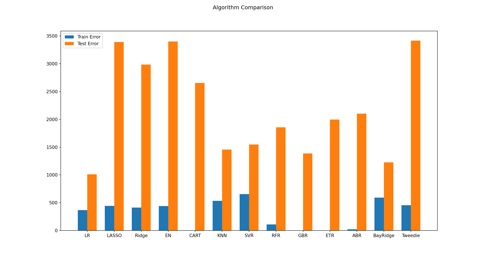

# Training and evaluating regression models


Machine learning models such as regression aim to predict the dependent variable, "y." This chapter describes the machine learning processes to predict a time series. We will predict the ASURB.MX close price. As independent variables, we will use some macroeconomic variables. 

$$ASURB.MX\_price_{t}=\beta_{0}+\beta_{1}\ ER_{t-1} + \beta_{2}\ inflation_{t-1} + \beta_{3}\ srate_{t-1}+ \beta_{4}\\ growth_{t-1}+ \beta_{5}\ mrate_{t-1}+ \beta_{6}\ inv_{t-1} + \beta_{7}\ MR_{t-1} +\beta_{8}\ SMA_{t-1}+\beta_{9}\ MACD_{t-1}+ e_{t}$$
Where $ER$ is the exchange rate USD-MXN, $inflation$ is the Mexican inflation, $srate$ is the short term Mexican treasury bills (28 days), $growth$ is the monthly Mexican economic growth indicator, $mrate$ is the 1 year Mexican treasury bills, $inv$is the Mexican gross fixed investment, $MR$ is the Mexican stock market index, $SMA_{t-1}$ is smooth moving average, $MACD_{t-1}$ is the Moving Average Convergence Divergence (MACD) indicator and $e$ is the error term. 

## Data collection and cleaning. 

In this section, we use the APIs we cover in Chapter 1. Also, we will use other sources of information. In some cases, we will detect and clean missing values. First we download the yahoo finance information.


```python
import numpy as np
import pandas as pd
import yfinance as yf
from sie_banxico import SIEBanxico
from sklearn.metrics import mean_squared_error

import matplotlib.pyplot as plt
```


```python
# This function download market data from Yahoo! Finance's
# It returns a data frame with a specific format date. 
# Parameters:
# tickers: a list with the Yahoo Finance ticker symbol
# inter: intervals: 1m,2m,5m,15m,30m,60m,90m,1h,1d,5d,1wk,1mo,3mo
# price_type: Open', 'High', 'Low', 'Close', 'Volume', 'Dividends', 'Stock Splits
# format_date:  index format date
# d_ini: initial date if the subset
# d_fin: final date of the subset

def my_yahoo_tickers(tickers,inter,price_type,format_date,d_ini,d_fin):
    def my_yahoo(ticker,inter,price_type,format_date,d_ini,d_fin):
        x = yf.Ticker(ticker)
        hist = x.history(start=d_ini,end=d_fin,interval=inter)
        date=list(hist.index)
        hist_date=[date.strftime(format_date) for date in date]
        price=list(hist[price_type])
        hist={ticker:price}
        hist=pd.DataFrame(hist,index=hist_date)
        return hist.loc[d_ini:d_fin]
    if len(tickers)==1:
        s1=my_yahoo(tickers[0],inter,price_type,format_date,d_ini,d_fin)
    else:
        s1=my_yahoo(tickers[0],inter,price_type,format_date,d_ini,d_fin)
        for ticker in range(1,len(tickers)):
            s2=my_yahoo(tickers[ticker],inter,price_type,format_date,d_ini,d_fin)
            s1=pd.concat([s1,s2],axis=1)
    return s1
inter='1mo'
price_type="Close"
format_date="%Y-%m-%d"
d_ini="2020-06-01"
d_fin="2023-04-01"
tickers = ["ASURB.MX","^MXX"]
```


```{}
df=my_yahoo_tickers(tickers,inter,price_type,format_date,d_ini,d_fin)
df.head()
```


```{=html}
<style type="text/css">
</style>
<table id="T_a249b">
  <thead>
    <tr>
      <th class="blank level0" >&nbsp;</th>
      <th id="T_a249b_level0_col0" class="col_heading level0 col0" >ASURB.MX</th>
      <th id="T_a249b_level0_col1" class="col_heading level0 col1" >^MXX</th>
    </tr>
  </thead>
  <tbody>
    <tr>
      <th id="T_a249b_level0_row0" class="row_heading level0 row0" >2020-06-01</th>
      <td id="T_a249b_row0_col0" class="data row0 col0" >235.398758</td>
      <td id="T_a249b_row0_col1" class="data row0 col1" >37716.429688</td>
    </tr>
    <tr>
      <th id="T_a249b_level0_row1" class="row_heading level0 row1" >2020-07-01</th>
      <td id="T_a249b_row1_col0" class="data row1 col0" >202.884109</td>
      <td id="T_a249b_row1_col1" class="data row1 col1" >37019.679688</td>
    </tr>
    <tr>
      <th id="T_a249b_level0_row2" class="row_heading level0 row2" >2020-08-01</th>
      <td id="T_a249b_row2_col0" class="data row2 col0" >227.446655</td>
      <td id="T_a249b_row2_col1" class="data row2 col1" >36840.730469</td>
    </tr>
    <tr>
      <th id="T_a249b_level0_row3" class="row_heading level0 row3" >2020-09-01</th>
      <td id="T_a249b_row3_col0" class="data row3 col0" >235.527176</td>
      <td id="T_a249b_row3_col1" class="data row3 col1" >37458.691406</td>
    </tr>
    <tr>
      <th id="T_a249b_level0_row4" class="row_heading level0 row4" >2020-10-01</th>
      <td id="T_a249b_row4_col0" class="data row4 col0" >224.731766</td>
      <td id="T_a249b_row4_col1" class="data row4 col1" >36987.859375</td>
    </tr>
  </tbody>
</table>

```


Also, we download the macroeconomic variables using the Banxico API we used in chapter 1.

```{=html}
<style type="text/css">
</style>
<table id="T_008b8">
  <thead>
    <tr>
      <th class="blank level0" >&nbsp;</th>
      <th id="T_008b8_level0_col0" class="col_heading level0 col0" >TC</th>
      <th id="T_008b8_level0_col1" class="col_heading level0 col1" >Cetes_28</th>
      <th id="T_008b8_level0_col2" class="col_heading level0 col2" >infla</th>
      <th id="T_008b8_level0_col3" class="col_heading level0 col3" >igae</th>
      <th id="T_008b8_level0_col4" class="col_heading level0 col4" >Cetes_1a</th>
      <th id="T_008b8_level0_col5" class="col_heading level0 col5" >inv_fija</th>
    </tr>
  </thead>
  <tbody>
    <tr>
      <th id="T_008b8_level0_row0" class="row_heading level0 row0" >2020-06-01</th>
      <td id="T_008b8_row0_col0" class="data row0 col0" >22.299000</td>
      <td id="T_008b8_row0_col1" class="data row0 col1" >5.060000</td>
      <td id="T_008b8_row0_col2" class="data row0 col2" >0.370000</td>
      <td id="T_008b8_row0_col3" class="data row0 col3" >97.955100</td>
      <td id="T_008b8_row0_col4" class="data row0 col4" >4.910000</td>
      <td id="T_008b8_row0_col5" class="data row0 col5" >78.690000</td>
    </tr>
    <tr>
      <th id="T_008b8_level0_row1" class="row_heading level0 row1" >2020-07-01</th>
      <td id="T_008b8_row1_col0" class="data row1 col0" >22.403300</td>
      <td id="T_008b8_row1_col1" class="data row1 col1" >4.820000</td>
      <td id="T_008b8_row1_col2" class="data row1 col2" >0.400000</td>
      <td id="T_008b8_row1_col3" class="data row1 col3" >102.421600</td>
      <td id="T_008b8_row1_col4" class="data row1 col4" >4.610000</td>
      <td id="T_008b8_row1_col5" class="data row1 col5" >80.340000</td>
    </tr>
    <tr>
      <th id="T_008b8_level0_row2" class="row_heading level0 row2" >2020-08-01</th>
      <td id="T_008b8_row2_col0" class="data row2 col0" >22.207200</td>
      <td id="T_008b8_row2_col1" class="data row2 col1" >4.490000</td>
      <td id="T_008b8_row2_col2" class="data row2 col2" >0.320000</td>
      <td id="T_008b8_row2_col3" class="data row2 col3" >102.838300</td>
      <td id="T_008b8_row2_col4" class="data row2 col4" >4.480000</td>
      <td id="T_008b8_row2_col5" class="data row2 col5" >85.850000</td>
    </tr>
    <tr>
      <th id="T_008b8_level0_row3" class="row_heading level0 row3" >2020-09-01</th>
      <td id="T_008b8_row3_col0" class="data row3 col0" >21.681000</td>
      <td id="T_008b8_row3_col1" class="data row3 col1" >4.380000</td>
      <td id="T_008b8_row3_col2" class="data row3 col2" >0.320000</td>
      <td id="T_008b8_row3_col3" class="data row3 col3" >103.512100</td>
      <td id="T_008b8_row3_col4" class="data row3 col4" >4.450000</td>
      <td id="T_008b8_row3_col5" class="data row3 col5" >85.640000</td>
    </tr>
    <tr>
      <th id="T_008b8_level0_row4" class="row_heading level0 row4" >2020-10-01</th>
      <td id="T_008b8_row4_col0" class="data row4 col0" >21.270500</td>
      <td id="T_008b8_row4_col1" class="data row4 col1" >4.200000</td>
      <td id="T_008b8_row4_col2" class="data row4 col2" >0.240000</td>
      <td id="T_008b8_row4_col3" class="data row4 col3" >109.458500</td>
      <td id="T_008b8_row4_col4" class="data row4 col4" >4.370000</td>
      <td id="T_008b8_row4_col5" class="data row4 col5" >88.400000</td>
    </tr>
  </tbody>
</table>

```


```{}

#---- Do not change anything from here ----

def my_banxico_py(token,my_series,my_series_name,d_in,d_fin,format_date):
    le=len(my_series)
    ser=0
    if(le==1):
        ser=0
        api = SIEBanxico(token = token, id_series = my_series[ser])
        timeseries_range=api.get_timeseries_range(init_date=d_in, end_date=d_fin)
        timeseries_range=timeseries_range['bmx']['series'][0]['datos']
        data=pd.DataFrame(timeseries_range)
        dates=[pd.Timestamp(date).strftime(format_date) for date in list(data["fecha"])]
        data=pd.DataFrame({my_series_name[ser]:list(data["dato"])},index=dates)
    else:
        ser=0
        api = SIEBanxico(token = token, id_series = my_series[ser])
        timeseries_range=api.get_timeseries_range(init_date=d_in, end_date=d_fin)
        timeseries_range=timeseries_range['bmx']['series'][0]['datos']
        data=pd.DataFrame(timeseries_range)
        dates=[pd.Timestamp(date).strftime(format_date) for date in list(data["fecha"])]
        data=pd.DataFrame({my_series_name[ser]:list(data["dato"])},index=dates)
        for ser in range(1,le):
            api = SIEBanxico(token = token, id_series = my_series[ser])
            timeseries_range=api.get_timeseries_range(init_date=d_in, end_date=d_fin)
            timeseries_range=timeseries_range['bmx']['series'][0]['datos']
            data2=pd.DataFrame(timeseries_range)
            dates2=[pd.Timestamp(date).strftime(format_date) for date in list(data2["fecha"])]
            data2=pd.DataFrame({my_series_name[ser]:list(data2["dato"])},index=dates2)
            data=pd.concat([data,data2],axis=1)
    ban_names=list(data.columns)
    for col_i in range(data.shape[1]):
        cel_num=[float(cel) for cel in data[ban_names[col_i]]]
        data[ban_names[col_i]]=cel_num
    return data
#----- To here ------------
    
token = "776cab8e243c5b661cee8571d7e3e5d573395471011cf093ab5684d233a80d67"

my_series=['SF17908' ,'SF282',"SP74660","SR16734","SF3367","SR16525"]
my_series_name=["TC","Cetes_28","infla","igae","Cetes_1a","inv_fija"]
d_ini="2020-02-01"
d_fin="2023-02-01"
format_date="%Y-%d-%m"
ban=my_banxico_py(token,my_series,my_series_name,d_ini,d_fin,format_date)
ban.head()
```

Here we concatenate the Banxico data and the Yahoo Finance one.
```{}
dataset=pd.concat([ban,yf],axis=1)
dataset.head()
```


```{=html}
<style type="text/css">
</style>
<table id="T_422e3">
  <thead>
    <tr>
      <th class="blank level0" >&nbsp;</th>
      <th id="T_422e3_level0_col0" class="col_heading level0 col0" >TC</th>
      <th id="T_422e3_level0_col1" class="col_heading level0 col1" >Cetes_28</th>
      <th id="T_422e3_level0_col2" class="col_heading level0 col2" >infla</th>
      <th id="T_422e3_level0_col3" class="col_heading level0 col3" >igae</th>
      <th id="T_422e3_level0_col4" class="col_heading level0 col4" >Cetes_1a</th>
      <th id="T_422e3_level0_col5" class="col_heading level0 col5" >inv_fija</th>
      <th id="T_422e3_level0_col6" class="col_heading level0 col6" >ASURB.MX</th>
      <th id="T_422e3_level0_col7" class="col_heading level0 col7" >^MXX</th>
    </tr>
  </thead>
  <tbody>
    <tr>
      <th id="T_422e3_level0_row0" class="row_heading level0 row0" >2020-06-01</th>
      <td id="T_422e3_row0_col0" class="data row0 col0" >22.299000</td>
      <td id="T_422e3_row0_col1" class="data row0 col1" >5.060000</td>
      <td id="T_422e3_row0_col2" class="data row0 col2" >0.370000</td>
      <td id="T_422e3_row0_col3" class="data row0 col3" >97.955100</td>
      <td id="T_422e3_row0_col4" class="data row0 col4" >4.910000</td>
      <td id="T_422e3_row0_col5" class="data row0 col5" >78.690000</td>
      <td id="T_422e3_row0_col6" class="data row0 col6" >235.398758</td>
      <td id="T_422e3_row0_col7" class="data row0 col7" >37716.429688</td>
    </tr>
    <tr>
      <th id="T_422e3_level0_row1" class="row_heading level0 row1" >2020-07-01</th>
      <td id="T_422e3_row1_col0" class="data row1 col0" >22.403300</td>
      <td id="T_422e3_row1_col1" class="data row1 col1" >4.820000</td>
      <td id="T_422e3_row1_col2" class="data row1 col2" >0.400000</td>
      <td id="T_422e3_row1_col3" class="data row1 col3" >102.421600</td>
      <td id="T_422e3_row1_col4" class="data row1 col4" >4.610000</td>
      <td id="T_422e3_row1_col5" class="data row1 col5" >80.340000</td>
      <td id="T_422e3_row1_col6" class="data row1 col6" >202.884109</td>
      <td id="T_422e3_row1_col7" class="data row1 col7" >37019.679688</td>
    </tr>
    <tr>
      <th id="T_422e3_level0_row2" class="row_heading level0 row2" >2020-08-01</th>
      <td id="T_422e3_row2_col0" class="data row2 col0" >22.207200</td>
      <td id="T_422e3_row2_col1" class="data row2 col1" >4.490000</td>
      <td id="T_422e3_row2_col2" class="data row2 col2" >0.320000</td>
      <td id="T_422e3_row2_col3" class="data row2 col3" >102.838300</td>
      <td id="T_422e3_row2_col4" class="data row2 col4" >4.480000</td>
      <td id="T_422e3_row2_col5" class="data row2 col5" >85.850000</td>
      <td id="T_422e3_row2_col6" class="data row2 col6" >227.446655</td>
      <td id="T_422e3_row2_col7" class="data row2 col7" >36840.730469</td>
    </tr>
    <tr>
      <th id="T_422e3_level0_row3" class="row_heading level0 row3" >2020-09-01</th>
      <td id="T_422e3_row3_col0" class="data row3 col0" >21.681000</td>
      <td id="T_422e3_row3_col1" class="data row3 col1" >4.380000</td>
      <td id="T_422e3_row3_col2" class="data row3 col2" >0.320000</td>
      <td id="T_422e3_row3_col3" class="data row3 col3" >103.512100</td>
      <td id="T_422e3_row3_col4" class="data row3 col4" >4.450000</td>
      <td id="T_422e3_row3_col5" class="data row3 col5" >85.640000</td>
      <td id="T_422e3_row3_col6" class="data row3 col6" >235.527176</td>
      <td id="T_422e3_row3_col7" class="data row3 col7" >37458.691406</td>
    </tr>
    <tr>
      <th id="T_422e3_level0_row4" class="row_heading level0 row4" >2020-10-01</th>
      <td id="T_422e3_row4_col0" class="data row4 col0" >21.270500</td>
      <td id="T_422e3_row4_col1" class="data row4 col1" >4.200000</td>
      <td id="T_422e3_row4_col2" class="data row4 col2" >0.240000</td>
      <td id="T_422e3_row4_col3" class="data row4 col3" >109.458500</td>
      <td id="T_422e3_row4_col4" class="data row4 col4" >4.370000</td>
      <td id="T_422e3_row4_col5" class="data row4 col5" >88.400000</td>
      <td id="T_422e3_row4_col6" class="data row4 col6" >224.731766</td>
      <td id="T_422e3_row4_col7" class="data row4 col7" >36987.859375</td>
    </tr>
  </tbody>
</table>

```

The next function is to generate smooth moving average variables:

```python
# This function creates moving average variables SMAs
# It returns a data frame with the SMAs. 
# Parameters:
# data: Data fame with the variables
# n: initial SMA
# m: final SMA
# col: column name of the variable we want to create the SMA´s
def lag_gen(data,n,m,col):
    data_c=data.copy()
    data_c['SMA'+str(n)] = data_c[col].rolling(n).mean()
    for n in range(n+1,m+1):
        data_c['SMA'+str(n)] = data_c[col].rolling(n).mean()
    return data_c.iloc[m-1:,]
n=2
m=3
data_sme=lag_gen(dataset,n,m,"ASURB.MX")
data_sme.head()
#>                  TC  Cetes_28  infla  ...          ^MXX        SMA2        SMA3
#> 2020-08-01  22.2072      4.49   0.32  ...  36840.730469  215.165382  221.909841
#> 2020-09-01  21.6810      4.38   0.32  ...  37458.691406  231.486916  221.952647
#> 2020-10-01  21.2705      4.20   0.24  ...  36987.859375  230.129471  229.235199
#> 2020-11-01  20.3819      4.23  -0.08  ...  41778.871094  250.271126  245.356476
#> 2020-12-01  19.9651      4.27   0.55  ...  44066.878906  288.885147  267.500687
#> 
#> [5 rows x 10 columns]
```


Finally, we create the MACD indicators:

```python
# This function the MACD indicator. 
# It returns a data frame with the MACD indicator and its signal. 
# Parameters:
# df: Data fame containing the variable we want to create the MACD
# col: colum name of the variable we want to create the MACD
# n_fast: fast SMA
# n_slow: slow SMA
# signal: signal SMA
def computeMACD (data, col,n_fast, n_slow, signal):
    fastEMA = data[col].ewm(span=n_fast, min_periods=n_slow).mean()
    slowEMA = data[col].ewm(span=n_slow, min_periods=n_slow).mean()
    MACD = pd.Series(fastEMA-slowEMA, name = 'MACD')
    MACDsig = pd.Series(MACD.ewm(span=signal, min_periods=signal).mean(), name='MACDsig')
    data1 = data[[col]].join(MACD)
    data1 = data1.join(MACDsig)
    return data1.iloc[signal:,1:]
fast=4
slow=2
signal=1
macd=computeMACD(dataset,"ASURB.MX", fast, slow, signal)
macd=macd.iloc[signal:,]
macd.head()
#>                  MACD    MACDsig
#> 2020-08-01  -1.001977  -1.001977
#> 2020-09-01  -3.371782  -3.371782
#> 2020-10-01  -0.371240  -0.371240
#> 2020-11-01 -12.348315 -12.348315
#> 2020-12-01 -18.100869 -18.100869
```


We concatenate the object "data_sme" with the macd. In this case, we add the
argument: join="inner" to avoid having more observations of the macd objec. 

```python
dataset=pd.concat([data_sme,macd],axis=1,join="inner")
dataset.head()
#>                  TC  Cetes_28  infla  ...        SMA3       MACD    MACDsig
#> 2020-08-01  22.2072      4.49   0.32  ...  221.909841  -1.001977  -1.001977
#> 2020-09-01  21.6810      4.38   0.32  ...  221.952647  -3.371782  -3.371782
#> 2020-10-01  21.2705      4.20   0.24  ...  229.235199  -0.371240  -0.371240
#> 2020-11-01  20.3819      4.23  -0.08  ...  245.356476 -12.348315 -12.348315
#> 2020-12-01  19.9651      4.27   0.55  ...  267.500687 -18.100869 -18.100869
#> 
#> [5 rows x 12 columns]
```


```python
dataset.tail()
#>                  TC  Cetes_28  infla  ...        SMA3       MACD    MACDsig
#> 2022-11-01  19.4449      9.42   0.45  ...  437.777802 -18.206929 -18.206929
#> 2022-12-01  19.5930      9.96   0.65  ...  456.737162  -7.524922  -7.524922
#> 2023-01-01  18.9863     10.61   0.71  ...  471.529449 -18.081344 -18.081344
#> 2023-02-01  18.5986     10.92   0.61  ...  486.354401 -18.934665 -18.934665
#> 2023-03-01  18.3749     11.23   0.52  ...  518.118927 -21.204506 -21.204506
#> 
#> [5 rows x 12 columns]
```


### Definition of the independent variable

Here we define the independent variable and do some tests. 

As we mention below, we want to predict the `r `ticker` price in one month. Then, our model state that we have to lag one period, one month in this case, the dependent variable 
$ASURB.MX\_price_{t}$. Remember that our model is:

$$ASURB.MX\_price_{t}=\beta_{0}+\beta_{1}\ ER_{t-1} + \beta_{2}\ inflation_{t-1} + \beta_{3}\ srate_{t-1}+ \beta_{4}\\ growth_{t-1}+ \beta_{5}\ mrate_{t-1}+ \beta_{6}\ inv_{t-1} + \beta_{7}\ MR_{t-1} +\beta_{8}\ SMA_{t-1}+\beta_{9}\ MACD_{t-1}+ e_{t}$$
Where the suffix $t-1$ indicates the variable one period before period $t$.


To automate the procedure, we define:

```python
var="ASURB.MX" # name of the ticker we want to predict
lag=-1 # number of periods we want to lag
```

We use the function shift():
```{}
y_lag=dataset[var].shift(lag) 
y_lag.head()
```


```
#> 2020-08-01    235.527176
#> 2020-09-01    224.731766
#> 2020-10-01    275.810486
#> 2020-11-01    301.959808
#> 2020-12-01    295.823730
#> Name: ASURB.MX, dtype: float64
```

Then we insert the lagged variable in the data set, adding the text "_lag":

```{}
dataset[var+"_lag"]= y_lag
dataset.head() #
```


```{=html}
<style type="text/css">
</style>
<table id="T_b90be">
  <thead>
    <tr>
      <th class="blank level0" >&nbsp;</th>
      <th id="T_b90be_level0_col0" class="col_heading level0 col0" >TC</th>
      <th id="T_b90be_level0_col1" class="col_heading level0 col1" >Cetes_28</th>
      <th id="T_b90be_level0_col2" class="col_heading level0 col2" >infla</th>
      <th id="T_b90be_level0_col3" class="col_heading level0 col3" >igae</th>
      <th id="T_b90be_level0_col4" class="col_heading level0 col4" >Cetes_1a</th>
      <th id="T_b90be_level0_col5" class="col_heading level0 col5" >inv_fija</th>
      <th id="T_b90be_level0_col6" class="col_heading level0 col6" >ASURB.MX</th>
      <th id="T_b90be_level0_col7" class="col_heading level0 col7" >^MXX</th>
      <th id="T_b90be_level0_col8" class="col_heading level0 col8" >SMA2</th>
      <th id="T_b90be_level0_col9" class="col_heading level0 col9" >SMA3</th>
      <th id="T_b90be_level0_col10" class="col_heading level0 col10" >MACD</th>
      <th id="T_b90be_level0_col11" class="col_heading level0 col11" >MACDsig</th>
      <th id="T_b90be_level0_col12" class="col_heading level0 col12" >ASURB.MX_lag</th>
    </tr>
  </thead>
  <tbody>
    <tr>
      <th id="T_b90be_level0_row0" class="row_heading level0 row0" >2020-08-01</th>
      <td id="T_b90be_row0_col0" class="data row0 col0" >22.207200</td>
      <td id="T_b90be_row0_col1" class="data row0 col1" >4.490000</td>
      <td id="T_b90be_row0_col2" class="data row0 col2" >0.320000</td>
      <td id="T_b90be_row0_col3" class="data row0 col3" >102.838300</td>
      <td id="T_b90be_row0_col4" class="data row0 col4" >4.480000</td>
      <td id="T_b90be_row0_col5" class="data row0 col5" >85.850000</td>
      <td id="T_b90be_row0_col6" class="data row0 col6" >227.446655</td>
      <td id="T_b90be_row0_col7" class="data row0 col7" >36840.730469</td>
      <td id="T_b90be_row0_col8" class="data row0 col8" >215.165382</td>
      <td id="T_b90be_row0_col9" class="data row0 col9" >221.909841</td>
      <td id="T_b90be_row0_col10" class="data row0 col10" >-1.001977</td>
      <td id="T_b90be_row0_col11" class="data row0 col11" >-1.001977</td>
      <td id="T_b90be_row0_col12" class="data row0 col12" >235.527176</td>
    </tr>
    <tr>
      <th id="T_b90be_level0_row1" class="row_heading level0 row1" >2020-09-01</th>
      <td id="T_b90be_row1_col0" class="data row1 col0" >21.681000</td>
      <td id="T_b90be_row1_col1" class="data row1 col1" >4.380000</td>
      <td id="T_b90be_row1_col2" class="data row1 col2" >0.320000</td>
      <td id="T_b90be_row1_col3" class="data row1 col3" >103.512100</td>
      <td id="T_b90be_row1_col4" class="data row1 col4" >4.450000</td>
      <td id="T_b90be_row1_col5" class="data row1 col5" >85.640000</td>
      <td id="T_b90be_row1_col6" class="data row1 col6" >235.527176</td>
      <td id="T_b90be_row1_col7" class="data row1 col7" >37458.691406</td>
      <td id="T_b90be_row1_col8" class="data row1 col8" >231.486916</td>
      <td id="T_b90be_row1_col9" class="data row1 col9" >221.952647</td>
      <td id="T_b90be_row1_col10" class="data row1 col10" >-3.371782</td>
      <td id="T_b90be_row1_col11" class="data row1 col11" >-3.371782</td>
      <td id="T_b90be_row1_col12" class="data row1 col12" >224.731766</td>
    </tr>
    <tr>
      <th id="T_b90be_level0_row2" class="row_heading level0 row2" >2020-10-01</th>
      <td id="T_b90be_row2_col0" class="data row2 col0" >21.270500</td>
      <td id="T_b90be_row2_col1" class="data row2 col1" >4.200000</td>
      <td id="T_b90be_row2_col2" class="data row2 col2" >0.240000</td>
      <td id="T_b90be_row2_col3" class="data row2 col3" >109.458500</td>
      <td id="T_b90be_row2_col4" class="data row2 col4" >4.370000</td>
      <td id="T_b90be_row2_col5" class="data row2 col5" >88.400000</td>
      <td id="T_b90be_row2_col6" class="data row2 col6" >224.731766</td>
      <td id="T_b90be_row2_col7" class="data row2 col7" >36987.859375</td>
      <td id="T_b90be_row2_col8" class="data row2 col8" >230.129471</td>
      <td id="T_b90be_row2_col9" class="data row2 col9" >229.235199</td>
      <td id="T_b90be_row2_col10" class="data row2 col10" >-0.371240</td>
      <td id="T_b90be_row2_col11" class="data row2 col11" >-0.371240</td>
      <td id="T_b90be_row2_col12" class="data row2 col12" >275.810486</td>
    </tr>
    <tr>
      <th id="T_b90be_level0_row3" class="row_heading level0 row3" >2020-11-01</th>
      <td id="T_b90be_row3_col0" class="data row3 col0" >20.381900</td>
      <td id="T_b90be_row3_col1" class="data row3 col1" >4.230000</td>
      <td id="T_b90be_row3_col2" class="data row3 col2" >-0.080000</td>
      <td id="T_b90be_row3_col3" class="data row3 col3" >111.325800</td>
      <td id="T_b90be_row3_col4" class="data row3 col4" >4.360000</td>
      <td id="T_b90be_row3_col5" class="data row3 col5" >89.880000</td>
      <td id="T_b90be_row3_col6" class="data row3 col6" >275.810486</td>
      <td id="T_b90be_row3_col7" class="data row3 col7" >41778.871094</td>
      <td id="T_b90be_row3_col8" class="data row3 col8" >250.271126</td>
      <td id="T_b90be_row3_col9" class="data row3 col9" >245.356476</td>
      <td id="T_b90be_row3_col10" class="data row3 col10" >-12.348315</td>
      <td id="T_b90be_row3_col11" class="data row3 col11" >-12.348315</td>
      <td id="T_b90be_row3_col12" class="data row3 col12" >301.959808</td>
    </tr>
    <tr>
      <th id="T_b90be_level0_row4" class="row_heading level0 row4" >2020-12-01</th>
      <td id="T_b90be_row4_col0" class="data row4 col0" >19.965100</td>
      <td id="T_b90be_row4_col1" class="data row4 col1" >4.270000</td>
      <td id="T_b90be_row4_col2" class="data row4 col2" >0.550000</td>
      <td id="T_b90be_row4_col3" class="data row4 col3" >111.193100</td>
      <td id="T_b90be_row4_col4" class="data row4 col4" >4.320000</td>
      <td id="T_b90be_row4_col5" class="data row4 col5" >90.710000</td>
      <td id="T_b90be_row4_col6" class="data row4 col6" >301.959808</td>
      <td id="T_b90be_row4_col7" class="data row4 col7" >44066.878906</td>
      <td id="T_b90be_row4_col8" class="data row4 col8" >288.885147</td>
      <td id="T_b90be_row4_col9" class="data row4 col9" >267.500687</td>
      <td id="T_b90be_row4_col10" class="data row4 col10" >-18.100869</td>
      <td id="T_b90be_row4_col11" class="data row4 col11" >-18.100869</td>
      <td id="T_b90be_row4_col12" class="data row4 col12" >295.823730</td>
    </tr>
  </tbody>
</table>

```

As we see, the last row has a missing value, the one we lost by doing the lag. 
```{}
dataset.tail()
```


```{=html}
<style type="text/css">
</style>
<table id="T_16a2c">
  <thead>
    <tr>
      <th class="blank level0" >&nbsp;</th>
      <th id="T_16a2c_level0_col0" class="col_heading level0 col0" >TC</th>
      <th id="T_16a2c_level0_col1" class="col_heading level0 col1" >Cetes_28</th>
      <th id="T_16a2c_level0_col2" class="col_heading level0 col2" >infla</th>
      <th id="T_16a2c_level0_col3" class="col_heading level0 col3" >igae</th>
      <th id="T_16a2c_level0_col4" class="col_heading level0 col4" >Cetes_1a</th>
      <th id="T_16a2c_level0_col5" class="col_heading level0 col5" >inv_fija</th>
      <th id="T_16a2c_level0_col6" class="col_heading level0 col6" >ASURB.MX</th>
      <th id="T_16a2c_level0_col7" class="col_heading level0 col7" >^MXX</th>
      <th id="T_16a2c_level0_col8" class="col_heading level0 col8" >SMA2</th>
      <th id="T_16a2c_level0_col9" class="col_heading level0 col9" >SMA3</th>
      <th id="T_16a2c_level0_col10" class="col_heading level0 col10" >MACD</th>
      <th id="T_16a2c_level0_col11" class="col_heading level0 col11" >MACDsig</th>
      <th id="T_16a2c_level0_col12" class="col_heading level0 col12" >ASURB.MX_lag</th>
    </tr>
  </thead>
  <tbody>
    <tr>
      <th id="T_16a2c_level0_row0" class="row_heading level0 row0" >2022-11-01</th>
      <td id="T_16a2c_row0_col0" class="data row0 col0" >19.444900</td>
      <td id="T_16a2c_row0_col1" class="data row0 col1" >9.420000</td>
      <td id="T_16a2c_row0_col2" class="data row0 col2" >0.450000</td>
      <td id="T_16a2c_row0_col3" class="data row0 col3" >116.235500</td>
      <td id="T_16a2c_row0_col4" class="data row0 col4" >10.840000</td>
      <td id="T_16a2c_row0_col5" class="data row0 col5" >103.440000</td>
      <td id="T_16a2c_row0_col6" class="data row0 col6" >469.163208</td>
      <td id="T_16a2c_row0_col7" class="data row0 col7" >51684.859375</td>
      <td id="T_16a2c_row0_col8" class="data row0 col8" >462.530212</td>
      <td id="T_16a2c_row0_col9" class="data row0 col9" >437.777802</td>
      <td id="T_16a2c_row0_col10" class="data row0 col10" >-18.206929</td>
      <td id="T_16a2c_row0_col11" class="data row0 col11" >-18.206929</td>
      <td id="T_16a2c_row0_col12" class="data row0 col12" >445.151062</td>
    </tr>
    <tr>
      <th id="T_16a2c_level0_row1" class="row_heading level0 row1" >2022-12-01</th>
      <td id="T_16a2c_row1_col0" class="data row1 col0" >19.593000</td>
      <td id="T_16a2c_row1_col1" class="data row1 col1" >9.960000</td>
      <td id="T_16a2c_row1_col2" class="data row1 col2" >0.650000</td>
      <td id="T_16a2c_row1_col3" class="data row1 col3" >115.657400</td>
      <td id="T_16a2c_row1_col4" class="data row1 col4" >10.870000</td>
      <td id="T_16a2c_row1_col5" class="data row1 col5" >107.190000</td>
      <td id="T_16a2c_row1_col6" class="data row1 col6" >445.151062</td>
      <td id="T_16a2c_row1_col7" class="data row1 col7" >48463.859375</td>
      <td id="T_16a2c_row1_col8" class="data row1 col8" >457.157135</td>
      <td id="T_16a2c_row1_col9" class="data row1 col9" >456.737162</td>
      <td id="T_16a2c_row1_col10" class="data row1 col10" >-7.524922</td>
      <td id="T_16a2c_row1_col11" class="data row1 col11" >-7.524922</td>
      <td id="T_16a2c_row1_col12" class="data row1 col12" >500.274078</td>
    </tr>
    <tr>
      <th id="T_16a2c_level0_row2" class="row_heading level0 row2" >2023-01-01</th>
      <td id="T_16a2c_row2_col0" class="data row2 col0" >18.986300</td>
      <td id="T_16a2c_row2_col1" class="data row2 col1" >10.610000</td>
      <td id="T_16a2c_row2_col2" class="data row2 col2" >0.710000</td>
      <td id="T_16a2c_row2_col3" class="data row2 col3" >112.099500</td>
      <td id="T_16a2c_row2_col4" class="data row2 col4" >11.090000</td>
      <td id="T_16a2c_row2_col5" class="data row2 col5" >106.030000</td>
      <td id="T_16a2c_row2_col6" class="data row2 col6" >500.274078</td>
      <td id="T_16a2c_row2_col7" class="data row2 col7" >54564.269531</td>
      <td id="T_16a2c_row2_col8" class="data row2 col8" >472.712570</td>
      <td id="T_16a2c_row2_col9" class="data row2 col9" >471.529449</td>
      <td id="T_16a2c_row2_col10" class="data row2 col10" >-18.081344</td>
      <td id="T_16a2c_row2_col11" class="data row2 col11" >-18.081344</td>
      <td id="T_16a2c_row2_col12" class="data row2 col12" >513.638062</td>
    </tr>
    <tr>
      <th id="T_16a2c_level0_row3" class="row_heading level0 row3" >2023-02-01</th>
      <td id="T_16a2c_row3_col0" class="data row3 col0" >18.598600</td>
      <td id="T_16a2c_row3_col1" class="data row3 col1" >10.920000</td>
      <td id="T_16a2c_row3_col2" class="data row3 col2" >0.610000</td>
      <td id="T_16a2c_row3_col3" class="data row3 col3" >109.550400</td>
      <td id="T_16a2c_row3_col4" class="data row3 col4" >11.660000</td>
      <td id="T_16a2c_row3_col5" class="data row3 col5" >105.420000</td>
      <td id="T_16a2c_row3_col6" class="data row3 col6" >513.638062</td>
      <td id="T_16a2c_row3_col7" class="data row3 col7" >52758.058594</td>
      <td id="T_16a2c_row3_col8" class="data row3 col8" >506.956070</td>
      <td id="T_16a2c_row3_col9" class="data row3 col9" >486.354401</td>
      <td id="T_16a2c_row3_col10" class="data row3 col10" >-18.934665</td>
      <td id="T_16a2c_row3_col11" class="data row3 col11" >-18.934665</td>
      <td id="T_16a2c_row3_col12" class="data row3 col12" >540.444641</td>
    </tr>
    <tr>
      <th id="T_16a2c_level0_row4" class="row_heading level0 row4" >2023-03-01</th>
      <td id="T_16a2c_row4_col0" class="data row4 col0" >18.374900</td>
      <td id="T_16a2c_row4_col1" class="data row4 col1" >11.230000</td>
      <td id="T_16a2c_row4_col2" class="data row4 col2" >0.520000</td>
      <td id="T_16a2c_row4_col3" class="data row4 col3" >115.293800</td>
      <td id="T_16a2c_row4_col4" class="data row4 col4" >11.880000</td>
      <td id="T_16a2c_row4_col5" class="data row4 col5" >nan</td>
      <td id="T_16a2c_row4_col6" class="data row4 col6" >540.444641</td>
      <td id="T_16a2c_row4_col7" class="data row4 col7" >53904.000000</td>
      <td id="T_16a2c_row4_col8" class="data row4 col8" >527.041351</td>
      <td id="T_16a2c_row4_col9" class="data row4 col9" >518.118927</td>
      <td id="T_16a2c_row4_col10" class="data row4 col10" >-21.204506</td>
      <td id="T_16a2c_row4_col11" class="data row4 col11" >-21.204506</td>
      <td id="T_16a2c_row4_col12" class="data row4 col12" >nan</td>
    </tr>
  </tbody>
</table>

```

That missing value would´t allow us to perform some procedures below. Then we cut it, using the method shape, which shows the number of rows and columns of a data frame.


in this case the data set has 32 rows and 13 columns.   

```{}
dataset_lag=dataset.iloc[:dataset.shape[0]-1,]
dataset_lag.head()
```


```{=html}
<style type="text/css">
</style>
<table id="T_0b4de">
  <thead>
    <tr>
      <th class="blank level0" >&nbsp;</th>
      <th id="T_0b4de_level0_col0" class="col_heading level0 col0" >TC</th>
      <th id="T_0b4de_level0_col1" class="col_heading level0 col1" >Cetes_28</th>
      <th id="T_0b4de_level0_col2" class="col_heading level0 col2" >infla</th>
      <th id="T_0b4de_level0_col3" class="col_heading level0 col3" >igae</th>
      <th id="T_0b4de_level0_col4" class="col_heading level0 col4" >Cetes_1a</th>
      <th id="T_0b4de_level0_col5" class="col_heading level0 col5" >inv_fija</th>
      <th id="T_0b4de_level0_col6" class="col_heading level0 col6" >ASURB.MX</th>
      <th id="T_0b4de_level0_col7" class="col_heading level0 col7" >^MXX</th>
      <th id="T_0b4de_level0_col8" class="col_heading level0 col8" >SMA2</th>
      <th id="T_0b4de_level0_col9" class="col_heading level0 col9" >SMA3</th>
      <th id="T_0b4de_level0_col10" class="col_heading level0 col10" >MACD</th>
      <th id="T_0b4de_level0_col11" class="col_heading level0 col11" >MACDsig</th>
      <th id="T_0b4de_level0_col12" class="col_heading level0 col12" >ASURB.MX_lag</th>
    </tr>
  </thead>
  <tbody>
    <tr>
      <th id="T_0b4de_level0_row0" class="row_heading level0 row0" >2020-08-01</th>
      <td id="T_0b4de_row0_col0" class="data row0 col0" >22.207200</td>
      <td id="T_0b4de_row0_col1" class="data row0 col1" >4.490000</td>
      <td id="T_0b4de_row0_col2" class="data row0 col2" >0.320000</td>
      <td id="T_0b4de_row0_col3" class="data row0 col3" >102.838300</td>
      <td id="T_0b4de_row0_col4" class="data row0 col4" >4.480000</td>
      <td id="T_0b4de_row0_col5" class="data row0 col5" >85.850000</td>
      <td id="T_0b4de_row0_col6" class="data row0 col6" >227.446655</td>
      <td id="T_0b4de_row0_col7" class="data row0 col7" >36840.730469</td>
      <td id="T_0b4de_row0_col8" class="data row0 col8" >215.165382</td>
      <td id="T_0b4de_row0_col9" class="data row0 col9" >221.909841</td>
      <td id="T_0b4de_row0_col10" class="data row0 col10" >-1.001977</td>
      <td id="T_0b4de_row0_col11" class="data row0 col11" >-1.001977</td>
      <td id="T_0b4de_row0_col12" class="data row0 col12" >235.527176</td>
    </tr>
    <tr>
      <th id="T_0b4de_level0_row1" class="row_heading level0 row1" >2020-09-01</th>
      <td id="T_0b4de_row1_col0" class="data row1 col0" >21.681000</td>
      <td id="T_0b4de_row1_col1" class="data row1 col1" >4.380000</td>
      <td id="T_0b4de_row1_col2" class="data row1 col2" >0.320000</td>
      <td id="T_0b4de_row1_col3" class="data row1 col3" >103.512100</td>
      <td id="T_0b4de_row1_col4" class="data row1 col4" >4.450000</td>
      <td id="T_0b4de_row1_col5" class="data row1 col5" >85.640000</td>
      <td id="T_0b4de_row1_col6" class="data row1 col6" >235.527176</td>
      <td id="T_0b4de_row1_col7" class="data row1 col7" >37458.691406</td>
      <td id="T_0b4de_row1_col8" class="data row1 col8" >231.486916</td>
      <td id="T_0b4de_row1_col9" class="data row1 col9" >221.952647</td>
      <td id="T_0b4de_row1_col10" class="data row1 col10" >-3.371782</td>
      <td id="T_0b4de_row1_col11" class="data row1 col11" >-3.371782</td>
      <td id="T_0b4de_row1_col12" class="data row1 col12" >224.731766</td>
    </tr>
    <tr>
      <th id="T_0b4de_level0_row2" class="row_heading level0 row2" >2020-10-01</th>
      <td id="T_0b4de_row2_col0" class="data row2 col0" >21.270500</td>
      <td id="T_0b4de_row2_col1" class="data row2 col1" >4.200000</td>
      <td id="T_0b4de_row2_col2" class="data row2 col2" >0.240000</td>
      <td id="T_0b4de_row2_col3" class="data row2 col3" >109.458500</td>
      <td id="T_0b4de_row2_col4" class="data row2 col4" >4.370000</td>
      <td id="T_0b4de_row2_col5" class="data row2 col5" >88.400000</td>
      <td id="T_0b4de_row2_col6" class="data row2 col6" >224.731766</td>
      <td id="T_0b4de_row2_col7" class="data row2 col7" >36987.859375</td>
      <td id="T_0b4de_row2_col8" class="data row2 col8" >230.129471</td>
      <td id="T_0b4de_row2_col9" class="data row2 col9" >229.235199</td>
      <td id="T_0b4de_row2_col10" class="data row2 col10" >-0.371240</td>
      <td id="T_0b4de_row2_col11" class="data row2 col11" >-0.371240</td>
      <td id="T_0b4de_row2_col12" class="data row2 col12" >275.810486</td>
    </tr>
    <tr>
      <th id="T_0b4de_level0_row3" class="row_heading level0 row3" >2020-11-01</th>
      <td id="T_0b4de_row3_col0" class="data row3 col0" >20.381900</td>
      <td id="T_0b4de_row3_col1" class="data row3 col1" >4.230000</td>
      <td id="T_0b4de_row3_col2" class="data row3 col2" >-0.080000</td>
      <td id="T_0b4de_row3_col3" class="data row3 col3" >111.325800</td>
      <td id="T_0b4de_row3_col4" class="data row3 col4" >4.360000</td>
      <td id="T_0b4de_row3_col5" class="data row3 col5" >89.880000</td>
      <td id="T_0b4de_row3_col6" class="data row3 col6" >275.810486</td>
      <td id="T_0b4de_row3_col7" class="data row3 col7" >41778.871094</td>
      <td id="T_0b4de_row3_col8" class="data row3 col8" >250.271126</td>
      <td id="T_0b4de_row3_col9" class="data row3 col9" >245.356476</td>
      <td id="T_0b4de_row3_col10" class="data row3 col10" >-12.348315</td>
      <td id="T_0b4de_row3_col11" class="data row3 col11" >-12.348315</td>
      <td id="T_0b4de_row3_col12" class="data row3 col12" >301.959808</td>
    </tr>
    <tr>
      <th id="T_0b4de_level0_row4" class="row_heading level0 row4" >2020-12-01</th>
      <td id="T_0b4de_row4_col0" class="data row4 col0" >19.965100</td>
      <td id="T_0b4de_row4_col1" class="data row4 col1" >4.270000</td>
      <td id="T_0b4de_row4_col2" class="data row4 col2" >0.550000</td>
      <td id="T_0b4de_row4_col3" class="data row4 col3" >111.193100</td>
      <td id="T_0b4de_row4_col4" class="data row4 col4" >4.320000</td>
      <td id="T_0b4de_row4_col5" class="data row4 col5" >90.710000</td>
      <td id="T_0b4de_row4_col6" class="data row4 col6" >301.959808</td>
      <td id="T_0b4de_row4_col7" class="data row4 col7" >44066.878906</td>
      <td id="T_0b4de_row4_col8" class="data row4 col8" >288.885147</td>
      <td id="T_0b4de_row4_col9" class="data row4 col9" >267.500687</td>
      <td id="T_0b4de_row4_col10" class="data row4 col10" >-18.100869</td>
      <td id="T_0b4de_row4_col11" class="data row4 col11" >-18.100869</td>
      <td id="T_0b4de_row4_col12" class="data row4 col12" >295.823730</td>
    </tr>
  </tbody>
</table>

```

Here we define the dependent variable (Y):

```python
Y=dataset_lag[var+"_lag"] # esto es el resultado, pero quiero automatizarlo
Y.head()
#> 2020-08-01    235.527176
#> 2020-09-01    224.731766
#> 2020-10-01    275.810486
#> 2020-11-01    301.959808
#> 2020-12-01    295.823730
#> Name: ASURB.MX_lag, dtype: float64
```

### Testing for stationary in the dependet variable (Y)

A stationary time series process is one whose probability distributions are stable over time in the following sense: If we take any collection of random variables in the sequence and then shift that sequence ahead h time periods, the joint probability distribution must remain unchanged.

On a practical level, if we want to understand the relationship between two or more variables using regression analysis, such as the model: 

$$ASURB.MX\_price_{t}=\beta_{0}+\beta_{1}\ ER_{t-1} + \beta_{2}\ inflation_{t-1} +.. + e_{t},$$

we need to assume some sort of stability over time. If we allow the relationship between two variables those variables in the equation to change arbitrarily in each time period, then we cannot hope to learn much about how a change in one variable affects the other variable if we only have access to a single time series realization [@wooldridge]. In the Appendix we extend this explanation.

Because this is an introductory machine learning book, we only would apply the Augmented Dickey-Fuller (ADF) (see [@wooldridge] for a further reading). 


```python
# This method shows the ADF statistic and P-value 
# Parameters:
# data: is a data frame of time Pandas Series with the time serie 
#---- Do not change anything from here ----

from statsmodels.tsa.stattools import adfuller
def adf(data):
    ADF = adfuller(data)  
    return print(f'ADF Statistic: {ADF[0]}',f'p-value: {ADF[1]}')
#----- To here ------------
adf(Y)
#> ADF Statistic: -0.7321673782995486 p-value: 0.838240618032143
```

If the second term of the output, the P-value, is less than 10% (0.1), then we can perform the prediction with that time series. If it is greater than 10%(0.1), we have to adjust, such as the change of the variable.

in this case, the P-value is less than 10%(0.1), then the time series is not stationary, then we have to do an adjustment. The adjustment we will do is to do the change in the independent varible:

$$\Delta ASURB.MX\_price_{t}=\beta_{0}+\beta_{1}\ ER_{t-1} + \beta_{2}\ inflation_{t-1} +.. + e_{t},$$
The $\Delta ASURB.MX$ means the change in the variable, $ASURB.MX\_price_{t}-ASURB.MX\_price_{t-1}$. To do that we use the method diff. First we need to do a copy of the 
dataset_lag, other wise we could get a warning about the method. 
```{}
dataset_lag_dif=dataset_lag.copy() 
dataset_lag_dif[var+"_lag_dif"]=Y.diff()
dataset_lag_dif.head()
```


```{=html}
<style type="text/css">
</style>
<table id="T_c9563">
  <thead>
    <tr>
      <th class="blank level0" >&nbsp;</th>
      <th id="T_c9563_level0_col0" class="col_heading level0 col0" >TC</th>
      <th id="T_c9563_level0_col1" class="col_heading level0 col1" >Cetes_28</th>
      <th id="T_c9563_level0_col2" class="col_heading level0 col2" >infla</th>
      <th id="T_c9563_level0_col3" class="col_heading level0 col3" >igae</th>
      <th id="T_c9563_level0_col4" class="col_heading level0 col4" >Cetes_1a</th>
      <th id="T_c9563_level0_col5" class="col_heading level0 col5" >inv_fija</th>
      <th id="T_c9563_level0_col6" class="col_heading level0 col6" >ASURB.MX</th>
      <th id="T_c9563_level0_col7" class="col_heading level0 col7" >^MXX</th>
      <th id="T_c9563_level0_col8" class="col_heading level0 col8" >SMA2</th>
      <th id="T_c9563_level0_col9" class="col_heading level0 col9" >SMA3</th>
      <th id="T_c9563_level0_col10" class="col_heading level0 col10" >MACD</th>
      <th id="T_c9563_level0_col11" class="col_heading level0 col11" >MACDsig</th>
      <th id="T_c9563_level0_col12" class="col_heading level0 col12" >ASURB.MX_lag</th>
      <th id="T_c9563_level0_col13" class="col_heading level0 col13" >ASURB.MX_lag_dif</th>
    </tr>
  </thead>
  <tbody>
    <tr>
      <th id="T_c9563_level0_row0" class="row_heading level0 row0" >2020-08-01</th>
      <td id="T_c9563_row0_col0" class="data row0 col0" >22.207200</td>
      <td id="T_c9563_row0_col1" class="data row0 col1" >4.490000</td>
      <td id="T_c9563_row0_col2" class="data row0 col2" >0.320000</td>
      <td id="T_c9563_row0_col3" class="data row0 col3" >102.838300</td>
      <td id="T_c9563_row0_col4" class="data row0 col4" >4.480000</td>
      <td id="T_c9563_row0_col5" class="data row0 col5" >85.850000</td>
      <td id="T_c9563_row0_col6" class="data row0 col6" >227.446655</td>
      <td id="T_c9563_row0_col7" class="data row0 col7" >36840.730469</td>
      <td id="T_c9563_row0_col8" class="data row0 col8" >215.165382</td>
      <td id="T_c9563_row0_col9" class="data row0 col9" >221.909841</td>
      <td id="T_c9563_row0_col10" class="data row0 col10" >-1.001977</td>
      <td id="T_c9563_row0_col11" class="data row0 col11" >-1.001977</td>
      <td id="T_c9563_row0_col12" class="data row0 col12" >235.527176</td>
      <td id="T_c9563_row0_col13" class="data row0 col13" >nan</td>
    </tr>
    <tr>
      <th id="T_c9563_level0_row1" class="row_heading level0 row1" >2020-09-01</th>
      <td id="T_c9563_row1_col0" class="data row1 col0" >21.681000</td>
      <td id="T_c9563_row1_col1" class="data row1 col1" >4.380000</td>
      <td id="T_c9563_row1_col2" class="data row1 col2" >0.320000</td>
      <td id="T_c9563_row1_col3" class="data row1 col3" >103.512100</td>
      <td id="T_c9563_row1_col4" class="data row1 col4" >4.450000</td>
      <td id="T_c9563_row1_col5" class="data row1 col5" >85.640000</td>
      <td id="T_c9563_row1_col6" class="data row1 col6" >235.527176</td>
      <td id="T_c9563_row1_col7" class="data row1 col7" >37458.691406</td>
      <td id="T_c9563_row1_col8" class="data row1 col8" >231.486916</td>
      <td id="T_c9563_row1_col9" class="data row1 col9" >221.952647</td>
      <td id="T_c9563_row1_col10" class="data row1 col10" >-3.371782</td>
      <td id="T_c9563_row1_col11" class="data row1 col11" >-3.371782</td>
      <td id="T_c9563_row1_col12" class="data row1 col12" >224.731766</td>
      <td id="T_c9563_row1_col13" class="data row1 col13" >-10.795410</td>
    </tr>
    <tr>
      <th id="T_c9563_level0_row2" class="row_heading level0 row2" >2020-10-01</th>
      <td id="T_c9563_row2_col0" class="data row2 col0" >21.270500</td>
      <td id="T_c9563_row2_col1" class="data row2 col1" >4.200000</td>
      <td id="T_c9563_row2_col2" class="data row2 col2" >0.240000</td>
      <td id="T_c9563_row2_col3" class="data row2 col3" >109.458500</td>
      <td id="T_c9563_row2_col4" class="data row2 col4" >4.370000</td>
      <td id="T_c9563_row2_col5" class="data row2 col5" >88.400000</td>
      <td id="T_c9563_row2_col6" class="data row2 col6" >224.731766</td>
      <td id="T_c9563_row2_col7" class="data row2 col7" >36987.859375</td>
      <td id="T_c9563_row2_col8" class="data row2 col8" >230.129471</td>
      <td id="T_c9563_row2_col9" class="data row2 col9" >229.235199</td>
      <td id="T_c9563_row2_col10" class="data row2 col10" >-0.371240</td>
      <td id="T_c9563_row2_col11" class="data row2 col11" >-0.371240</td>
      <td id="T_c9563_row2_col12" class="data row2 col12" >275.810486</td>
      <td id="T_c9563_row2_col13" class="data row2 col13" >51.078720</td>
    </tr>
    <tr>
      <th id="T_c9563_level0_row3" class="row_heading level0 row3" >2020-11-01</th>
      <td id="T_c9563_row3_col0" class="data row3 col0" >20.381900</td>
      <td id="T_c9563_row3_col1" class="data row3 col1" >4.230000</td>
      <td id="T_c9563_row3_col2" class="data row3 col2" >-0.080000</td>
      <td id="T_c9563_row3_col3" class="data row3 col3" >111.325800</td>
      <td id="T_c9563_row3_col4" class="data row3 col4" >4.360000</td>
      <td id="T_c9563_row3_col5" class="data row3 col5" >89.880000</td>
      <td id="T_c9563_row3_col6" class="data row3 col6" >275.810486</td>
      <td id="T_c9563_row3_col7" class="data row3 col7" >41778.871094</td>
      <td id="T_c9563_row3_col8" class="data row3 col8" >250.271126</td>
      <td id="T_c9563_row3_col9" class="data row3 col9" >245.356476</td>
      <td id="T_c9563_row3_col10" class="data row3 col10" >-12.348315</td>
      <td id="T_c9563_row3_col11" class="data row3 col11" >-12.348315</td>
      <td id="T_c9563_row3_col12" class="data row3 col12" >301.959808</td>
      <td id="T_c9563_row3_col13" class="data row3 col13" >26.149323</td>
    </tr>
    <tr>
      <th id="T_c9563_level0_row4" class="row_heading level0 row4" >2020-12-01</th>
      <td id="T_c9563_row4_col0" class="data row4 col0" >19.965100</td>
      <td id="T_c9563_row4_col1" class="data row4 col1" >4.270000</td>
      <td id="T_c9563_row4_col2" class="data row4 col2" >0.550000</td>
      <td id="T_c9563_row4_col3" class="data row4 col3" >111.193100</td>
      <td id="T_c9563_row4_col4" class="data row4 col4" >4.320000</td>
      <td id="T_c9563_row4_col5" class="data row4 col5" >90.710000</td>
      <td id="T_c9563_row4_col6" class="data row4 col6" >301.959808</td>
      <td id="T_c9563_row4_col7" class="data row4 col7" >44066.878906</td>
      <td id="T_c9563_row4_col8" class="data row4 col8" >288.885147</td>
      <td id="T_c9563_row4_col9" class="data row4 col9" >267.500687</td>
      <td id="T_c9563_row4_col10" class="data row4 col10" >-18.100869</td>
      <td id="T_c9563_row4_col11" class="data row4 col11" >-18.100869</td>
      <td id="T_c9563_row4_col12" class="data row4 col12" >295.823730</td>
      <td id="T_c9563_row4_col13" class="data row4 col13" >-6.136078</td>
    </tr>
  </tbody>
</table>

```

As we see the lost one observation at the begining, then we cut that row. 

```{}
dataset_lag_dif=dataset_lag_dif.iloc[1:,]
dataset_lag_dif.head()
```


```{=html}
<style type="text/css">
</style>
<table id="T_58678">
  <thead>
    <tr>
      <th class="blank level0" >&nbsp;</th>
      <th id="T_58678_level0_col0" class="col_heading level0 col0" >TC</th>
      <th id="T_58678_level0_col1" class="col_heading level0 col1" >Cetes_28</th>
      <th id="T_58678_level0_col2" class="col_heading level0 col2" >infla</th>
      <th id="T_58678_level0_col3" class="col_heading level0 col3" >igae</th>
      <th id="T_58678_level0_col4" class="col_heading level0 col4" >Cetes_1a</th>
      <th id="T_58678_level0_col5" class="col_heading level0 col5" >inv_fija</th>
      <th id="T_58678_level0_col6" class="col_heading level0 col6" >ASURB.MX</th>
      <th id="T_58678_level0_col7" class="col_heading level0 col7" >^MXX</th>
      <th id="T_58678_level0_col8" class="col_heading level0 col8" >SMA2</th>
      <th id="T_58678_level0_col9" class="col_heading level0 col9" >SMA3</th>
      <th id="T_58678_level0_col10" class="col_heading level0 col10" >MACD</th>
      <th id="T_58678_level0_col11" class="col_heading level0 col11" >MACDsig</th>
      <th id="T_58678_level0_col12" class="col_heading level0 col12" >ASURB.MX_lag</th>
      <th id="T_58678_level0_col13" class="col_heading level0 col13" >ASURB.MX_lag_dif</th>
    </tr>
  </thead>
  <tbody>
    <tr>
      <th id="T_58678_level0_row0" class="row_heading level0 row0" >2020-09-01</th>
      <td id="T_58678_row0_col0" class="data row0 col0" >21.681000</td>
      <td id="T_58678_row0_col1" class="data row0 col1" >4.380000</td>
      <td id="T_58678_row0_col2" class="data row0 col2" >0.320000</td>
      <td id="T_58678_row0_col3" class="data row0 col3" >103.512100</td>
      <td id="T_58678_row0_col4" class="data row0 col4" >4.450000</td>
      <td id="T_58678_row0_col5" class="data row0 col5" >85.640000</td>
      <td id="T_58678_row0_col6" class="data row0 col6" >235.527176</td>
      <td id="T_58678_row0_col7" class="data row0 col7" >37458.691406</td>
      <td id="T_58678_row0_col8" class="data row0 col8" >231.486916</td>
      <td id="T_58678_row0_col9" class="data row0 col9" >221.952647</td>
      <td id="T_58678_row0_col10" class="data row0 col10" >-3.371782</td>
      <td id="T_58678_row0_col11" class="data row0 col11" >-3.371782</td>
      <td id="T_58678_row0_col12" class="data row0 col12" >224.731766</td>
      <td id="T_58678_row0_col13" class="data row0 col13" >-10.795410</td>
    </tr>
    <tr>
      <th id="T_58678_level0_row1" class="row_heading level0 row1" >2020-10-01</th>
      <td id="T_58678_row1_col0" class="data row1 col0" >21.270500</td>
      <td id="T_58678_row1_col1" class="data row1 col1" >4.200000</td>
      <td id="T_58678_row1_col2" class="data row1 col2" >0.240000</td>
      <td id="T_58678_row1_col3" class="data row1 col3" >109.458500</td>
      <td id="T_58678_row1_col4" class="data row1 col4" >4.370000</td>
      <td id="T_58678_row1_col5" class="data row1 col5" >88.400000</td>
      <td id="T_58678_row1_col6" class="data row1 col6" >224.731766</td>
      <td id="T_58678_row1_col7" class="data row1 col7" >36987.859375</td>
      <td id="T_58678_row1_col8" class="data row1 col8" >230.129471</td>
      <td id="T_58678_row1_col9" class="data row1 col9" >229.235199</td>
      <td id="T_58678_row1_col10" class="data row1 col10" >-0.371240</td>
      <td id="T_58678_row1_col11" class="data row1 col11" >-0.371240</td>
      <td id="T_58678_row1_col12" class="data row1 col12" >275.810486</td>
      <td id="T_58678_row1_col13" class="data row1 col13" >51.078720</td>
    </tr>
    <tr>
      <th id="T_58678_level0_row2" class="row_heading level0 row2" >2020-11-01</th>
      <td id="T_58678_row2_col0" class="data row2 col0" >20.381900</td>
      <td id="T_58678_row2_col1" class="data row2 col1" >4.230000</td>
      <td id="T_58678_row2_col2" class="data row2 col2" >-0.080000</td>
      <td id="T_58678_row2_col3" class="data row2 col3" >111.325800</td>
      <td id="T_58678_row2_col4" class="data row2 col4" >4.360000</td>
      <td id="T_58678_row2_col5" class="data row2 col5" >89.880000</td>
      <td id="T_58678_row2_col6" class="data row2 col6" >275.810486</td>
      <td id="T_58678_row2_col7" class="data row2 col7" >41778.871094</td>
      <td id="T_58678_row2_col8" class="data row2 col8" >250.271126</td>
      <td id="T_58678_row2_col9" class="data row2 col9" >245.356476</td>
      <td id="T_58678_row2_col10" class="data row2 col10" >-12.348315</td>
      <td id="T_58678_row2_col11" class="data row2 col11" >-12.348315</td>
      <td id="T_58678_row2_col12" class="data row2 col12" >301.959808</td>
      <td id="T_58678_row2_col13" class="data row2 col13" >26.149323</td>
    </tr>
    <tr>
      <th id="T_58678_level0_row3" class="row_heading level0 row3" >2020-12-01</th>
      <td id="T_58678_row3_col0" class="data row3 col0" >19.965100</td>
      <td id="T_58678_row3_col1" class="data row3 col1" >4.270000</td>
      <td id="T_58678_row3_col2" class="data row3 col2" >0.550000</td>
      <td id="T_58678_row3_col3" class="data row3 col3" >111.193100</td>
      <td id="T_58678_row3_col4" class="data row3 col4" >4.320000</td>
      <td id="T_58678_row3_col5" class="data row3 col5" >90.710000</td>
      <td id="T_58678_row3_col6" class="data row3 col6" >301.959808</td>
      <td id="T_58678_row3_col7" class="data row3 col7" >44066.878906</td>
      <td id="T_58678_row3_col8" class="data row3 col8" >288.885147</td>
      <td id="T_58678_row3_col9" class="data row3 col9" >267.500687</td>
      <td id="T_58678_row3_col10" class="data row3 col10" >-18.100869</td>
      <td id="T_58678_row3_col11" class="data row3 col11" >-18.100869</td>
      <td id="T_58678_row3_col12" class="data row3 col12" >295.823730</td>
      <td id="T_58678_row3_col13" class="data row3 col13" >-6.136078</td>
    </tr>
    <tr>
      <th id="T_58678_level0_row4" class="row_heading level0 row4" >2021-01-01</th>
      <td id="T_58678_row4_col0" class="data row4 col0" >19.921500</td>
      <td id="T_58678_row4_col1" class="data row4 col1" >4.220000</td>
      <td id="T_58678_row4_col2" class="data row4 col2" >0.360000</td>
      <td id="T_58678_row4_col3" class="data row4 col3" >105.545700</td>
      <td id="T_58678_row4_col4" class="data row4 col4" >4.220000</td>
      <td id="T_58678_row4_col5" class="data row4 col5" >90.370000</td>
      <td id="T_58678_row4_col6" class="data row4 col6" >295.823730</td>
      <td id="T_58678_row4_col7" class="data row4 col7" >42985.730469</td>
      <td id="T_58678_row4_col8" class="data row4 col8" >298.891769</td>
      <td id="T_58678_row4_col9" class="data row4 col9" >291.198008</td>
      <td id="T_58678_row4_col10" class="data row4 col10" >-12.813249</td>
      <td id="T_58678_row4_col11" class="data row4 col11" >-12.813249</td>
      <td id="T_58678_row4_col12" class="data row4 col12" >359.018616</td>
      <td id="T_58678_row4_col13" class="data row4 col13" >63.194885</td>
    </tr>
  </tbody>
</table>

```


Again we define the Y variable:


```python
Y=dataset_lag_dif[var+"_lag_dif"]
Y.head()
#> 2020-09-01   -10.795410
#> 2020-10-01    51.078720
#> 2020-11-01    26.149323
#> 2020-12-01    -6.136078
#> 2021-01-01    63.194885
#> Name: ASURB.MX_lag_dif, dtype: float64
```

Now we make a subset to get the independent variables (X´s): 

```python
X=dataset_lag_dif.drop(columns=[var,var+"_lag",var+"_lag_dif"],axis=1)
X.head()
#>                  TC  Cetes_28  infla  ...        SMA3       MACD    MACDsig
#> 2020-09-01  21.6810      4.38   0.32  ...  221.952647  -3.371782  -3.371782
#> 2020-10-01  21.2705      4.20   0.24  ...  229.235199  -0.371240  -0.371240
#> 2020-11-01  20.3819      4.23  -0.08  ...  245.356476 -12.348315 -12.348315
#> 2020-12-01  19.9651      4.27   0.55  ...  267.500687 -18.100869 -18.100869
#> 2021-01-01  19.9215      4.22   0.36  ...  291.198008 -12.813249 -12.813249
#> 
#> [5 rows x 11 columns]
```

## Training and test set (Back testing)

In the machine learning literature is common to apply that testing procedure for several observations. We call this back-testing, which divides the data set into training and testing, often called in_sample and out_sample. 

To answer why we need a back-testing, think that if we want to validate the prediction performance, we have at least two alternatives:

Alternative 1: Estimate a ML model, make a prediction and wait in time, for example, 30 days, to verify if the prediction is good or not; if the forecast is not good (it is not close to the real value), then we have to train and test it again, let’s say other 30 days and so on.

Alternative 2 (The one we will apply): Take aside some observations, assuming those are observations we don’t know and store them in a data frame called “test.” Train and test the ML model. If we are not making a good prediction, we train and test the model again until we get a good prediction performance.


```python
validation_size = 0.2

#In case the data is not dependent on the time series, then train and test split randomly
# seed = 7
# X_train, X_test, Y_train, Y_test = train_test_split(X, Y, test_size=validation_size, random_state=seed)

#In case the data is not dependent on the time series, then train and test split should be done based on sequential sample
#This can be done by selecting an arbitrary split point in the ordered list of observations and creating two new datasets.
train_size = int(len(X) * (1-validation_size))
X_train, X_test = X[0:train_size], X[train_size:len(X)]
Y_train, Y_test = Y[0:train_size], Y[train_size:len(X)]
```

We start by running the Linear regression model, one of several machine learning models.


```python
from sklearn.linear_model import LinearRegression
model = LinearRegression()
model.fit(X_train, Y_train)
```

```{=html}
<style>#sk-container-id-1 {color: black;background-color: white;}#sk-container-id-1 pre{padding: 0;}#sk-container-id-1 div.sk-toggleable {background-color: white;}#sk-container-id-1 label.sk-toggleable__label {cursor: pointer;display: block;width: 100%;margin-bottom: 0;padding: 0.3em;box-sizing: border-box;text-align: center;}#sk-container-id-1 label.sk-toggleable__label-arrow:before {content: "▸";float: left;margin-right: 0.25em;color: #696969;}#sk-container-id-1 label.sk-toggleable__label-arrow:hover:before {color: black;}#sk-container-id-1 div.sk-estimator:hover label.sk-toggleable__label-arrow:before {color: black;}#sk-container-id-1 div.sk-toggleable__content {max-height: 0;max-width: 0;overflow: hidden;text-align: left;background-color: #f0f8ff;}#sk-container-id-1 div.sk-toggleable__content pre {margin: 0.2em;color: black;border-radius: 0.25em;background-color: #f0f8ff;}#sk-container-id-1 input.sk-toggleable__control:checked~div.sk-toggleable__content {max-height: 200px;max-width: 100%;overflow: auto;}#sk-container-id-1 input.sk-toggleable__control:checked~label.sk-toggleable__label-arrow:before {content: "▾";}#sk-container-id-1 div.sk-estimator input.sk-toggleable__control:checked~label.sk-toggleable__label {background-color: #d4ebff;}#sk-container-id-1 div.sk-label input.sk-toggleable__control:checked~label.sk-toggleable__label {background-color: #d4ebff;}#sk-container-id-1 input.sk-hidden--visually {border: 0;clip: rect(1px 1px 1px 1px);clip: rect(1px, 1px, 1px, 1px);height: 1px;margin: -1px;overflow: hidden;padding: 0;position: absolute;width: 1px;}#sk-container-id-1 div.sk-estimator {font-family: monospace;background-color: #f0f8ff;border: 1px dotted black;border-radius: 0.25em;box-sizing: border-box;margin-bottom: 0.5em;}#sk-container-id-1 div.sk-estimator:hover {background-color: #d4ebff;}#sk-container-id-1 div.sk-parallel-item::after {content: "";width: 100%;border-bottom: 1px solid gray;flex-grow: 1;}#sk-container-id-1 div.sk-label:hover label.sk-toggleable__label {background-color: #d4ebff;}#sk-container-id-1 div.sk-serial::before {content: "";position: absolute;border-left: 1px solid gray;box-sizing: border-box;top: 0;bottom: 0;left: 50%;z-index: 0;}#sk-container-id-1 div.sk-serial {display: flex;flex-direction: column;align-items: center;background-color: white;padding-right: 0.2em;padding-left: 0.2em;position: relative;}#sk-container-id-1 div.sk-item {position: relative;z-index: 1;}#sk-container-id-1 div.sk-parallel {display: flex;align-items: stretch;justify-content: center;background-color: white;position: relative;}#sk-container-id-1 div.sk-item::before, #sk-container-id-1 div.sk-parallel-item::before {content: "";position: absolute;border-left: 1px solid gray;box-sizing: border-box;top: 0;bottom: 0;left: 50%;z-index: -1;}#sk-container-id-1 div.sk-parallel-item {display: flex;flex-direction: column;z-index: 1;position: relative;background-color: white;}#sk-container-id-1 div.sk-parallel-item:first-child::after {align-self: flex-end;width: 50%;}#sk-container-id-1 div.sk-parallel-item:last-child::after {align-self: flex-start;width: 50%;}#sk-container-id-1 div.sk-parallel-item:only-child::after {width: 0;}#sk-container-id-1 div.sk-dashed-wrapped {border: 1px dashed gray;margin: 0 0.4em 0.5em 0.4em;box-sizing: border-box;padding-bottom: 0.4em;background-color: white;}#sk-container-id-1 div.sk-label label {font-family: monospace;font-weight: bold;display: inline-block;line-height: 1.2em;}#sk-container-id-1 div.sk-label-container {text-align: center;}#sk-container-id-1 div.sk-container {/* jupyter's `normalize.less` sets `[hidden] { display: none; }` but bootstrap.min.css set `[hidden] { display: none !important; }` so we also need the `!important` here to be able to override the default hidden behavior on the sphinx rendered scikit-learn.org. See: https://github.com/scikit-learn/scikit-learn/issues/21755 */display: inline-block !important;position: relative;}#sk-container-id-1 div.sk-text-repr-fallback {display: none;}</style><div id="sk-container-id-1" class="sk-top-container"><div class="sk-text-repr-fallback"><pre>LinearRegression()</pre><b>In a Jupyter environment, please rerun this cell to show the HTML representation or trust the notebook. <br />On GitHub, the HTML representation is unable to render, please try loading this page with nbviewer.org.</b></div><div class="sk-container" hidden><div class="sk-item"><div class="sk-estimator sk-toggleable"><input class="sk-toggleable__control sk-hidden--visually" id="sk-estimator-id-1" type="checkbox" checked><label for="sk-estimator-id-1" class="sk-toggleable__label sk-toggleable__label-arrow">LinearRegression</label><div class="sk-toggleable__content"><pre>LinearRegression()</pre></div></div></div></div></div>
```

Apparently, we did not get a result. But in the model object we store some information, such as the coefficients of the model:

$$ASURB.MX\_price_{t}=\beta_{0}+\beta_{1}\ ER_{t-1} + \beta_{2}\ inflation_{t-1} + \beta_{3}\ srate_{t-1}+ \beta_{4}\ growth_{t-1}+ \beta_{5}\ mrate_{t-1}+ \beta_{6}\ inv_{t-1} + \beta_{7}\ MR_{t-1} + e_{t}$$


We do the prediction of the ASURB.MX price, in the X_test data set:

```python
y_pred=model.predict(X_test)
y_pred
#> array([ 14.47731332, -15.05378659,   6.84411905,  17.04899556,
#>         18.88154119,  25.479381  ])
```

### Performance Measure Root Mean Square Error (RMSE).


In the previous section, we discussed whether the prediction was good (the prediction performance). This section formally defines the metrics for the prediction performance. 

The first metric is the Root Mean Square Error (RMSE). The mathematical formula to compute the RMSE is:

$$RMSE =\sqrt{\frac{1}{n}\ \sum_{i=1}^{n} (y_{i}-\hat{y_{i}})^{2}} $$


where $\hat{y_{i}}$ is the prediction for the ith observation, $y_{i}$ is the ith observation of the independent variable we store in the  test set, and n is the number of observations. 

$$\hat{y_{i}}=\hat{\beta_{0}}+\hat{\beta_{1}}x_{1}+,..,+\hat{\beta_{n}}x_{n}$$

We can estimate the RMSE using the training data set. But generally, we do not care how well the model works on the training set. Rather, we are interested in the model performance tested on unseen data; then, we try the RMSE on the test data set or the validation set for cross-validation. The lower the test RMSE, the better the prediction.


### Mean absolute error (MAE)

```python
from sklearn.metrics import mean_squared_error
import math
mse=mean_squared_error(Y_test, y_pred)
rmse=math.sqrt(mse)
rmse
#> 31.781940294101783
```

The RMSE is generally the preferred performance measure for regression models. However, measuring the model performance with the MAE is useful when the data has some outliers. 


$$MAE =\frac{1}{n}\ \sum_{i=1}^{n} |y_{i}-\hat{y_{i}}|$$

In our example, the Mean absolute error test (MAE) is:


```python
mean_squared_error(Y_test, y_pred)
#> 1010.0917288578506
```


## Several models

In the next sections, we aim to improve the prediction performance by minimizing the RMSE. We will look for another machine learning model, besides LinearRegression(), that can help us improve the RMSE.  The following code was taken from [@blueprints]. Which is a very good book for machine learning in finance. 


```python
from sklearn.linear_model import LinearRegression
from sklearn.linear_model import Lasso
from sklearn.linear_model import Ridge
from sklearn.linear_model import ElasticNet
from sklearn.tree import DecisionTreeRegressor
from sklearn.neighbors import KNeighborsRegressor
from sklearn.svm import SVR
from sklearn.ensemble import RandomForestRegressor
from sklearn.ensemble import GradientBoostingRegressor
from sklearn.ensemble import ExtraTreesRegressor
from sklearn.ensemble import AdaBoostRegressor
from sklearn.linear_model import BayesianRidge
from sklearn.linear_model import TweedieRegressor
```


```python
models = []
models.append(('LR', LinearRegression()))
models.append(('LASSO', Lasso()))
models.append(('Ridge', Ridge()))
models.append(('EN', ElasticNet()))
models.append(('CART', DecisionTreeRegressor()))
models.append(('KNN', KNeighborsRegressor()))
models.append(('SVR', SVR()))
models.append(('RFR', RandomForestRegressor()))
models.append(('GBR', GradientBoostingRegressor()))
models.append(('ETR', ExtraTreesRegressor()))
models.append(('ABR', AdaBoostRegressor()))
models.append(('BayRidge', BayesianRidge()))
models.append(('Tweedie', TweedieRegressor()))
# Bagging methods
models
#> [('LR', LinearRegression()), ('LASSO', Lasso()), ('Ridge', Ridge()), ('EN', ElasticNet()), ('CART', DecisionTreeRegressor()), ('KNN', KNeighborsRegressor()), ('SVR', SVR()), ('RFR', RandomForestRegressor()), ('GBR', GradientBoostingRegressor()), ('ETR', ExtraTreesRegressor()), ('ABR', AdaBoostRegressor()), ('BayRidge', BayesianRidge()), ('Tweedie', TweedieRegressor())]
```


```python
names = []
test_results = []
train_results = []
for name, model in models:
    names.append(name)
    res = model.fit(X_train, Y_train)
    train_result = mean_squared_error(res.predict(X_train), Y_train)
    train_results.append(train_result)
    # Test results
    test_result = mean_squared_error(res.predict(X_test), Y_test)
    test_results.append(test_result)
#> C:\Users\L01413~1\AppData\Local\MINICO~1\lib\site-packages\sklearn\linear_model\_glm\glm.py:284: ConvergenceWarning: lbfgs failed to converge (status=1):
#> STOP: TOTAL NO. of ITERATIONS REACHED LIMIT.
#> 
#> Increase the number of iterations (max_iter) or scale the data as shown in:
#>     https://scikit-learn.org/stable/modules/preprocessing.html
#>   self.n_iter_ = _check_optimize_result("lbfgs", opt_res)
```


```python
from matplotlib import pyplot
fig = pyplot.figure()

ind = np.arange(len(names))  # the x locations for the groups
width = 0.35  # the width of the bars

fig.suptitle('Algorithm Comparison')
ax = fig.add_subplot(111)
pyplot.bar(ind - width/2, train_results,  width=width, label='Train Error')
#> <BarContainer object of 13 artists>
pyplot.bar(ind + width/2, test_results, width=width, label='Test Error')
#> <BarContainer object of 13 artists>
fig.set_size_inches(15,8)
pyplot.legend()
ax.set_xticks(ind)
ax.set_xticklabels(names)
pyplot.show()
```




```python
res=pd.DataFrame({"names": names,"res":test_results}).sort_values('res', ascending=True)
best=res["names"].iloc[0:1,].tolist()[0]
model_1=dict(models)[best]
model_1
```

```{=html}
<style>#sk-container-id-2 {color: black;background-color: white;}#sk-container-id-2 pre{padding: 0;}#sk-container-id-2 div.sk-toggleable {background-color: white;}#sk-container-id-2 label.sk-toggleable__label {cursor: pointer;display: block;width: 100%;margin-bottom: 0;padding: 0.3em;box-sizing: border-box;text-align: center;}#sk-container-id-2 label.sk-toggleable__label-arrow:before {content: "▸";float: left;margin-right: 0.25em;color: #696969;}#sk-container-id-2 label.sk-toggleable__label-arrow:hover:before {color: black;}#sk-container-id-2 div.sk-estimator:hover label.sk-toggleable__label-arrow:before {color: black;}#sk-container-id-2 div.sk-toggleable__content {max-height: 0;max-width: 0;overflow: hidden;text-align: left;background-color: #f0f8ff;}#sk-container-id-2 div.sk-toggleable__content pre {margin: 0.2em;color: black;border-radius: 0.25em;background-color: #f0f8ff;}#sk-container-id-2 input.sk-toggleable__control:checked~div.sk-toggleable__content {max-height: 200px;max-width: 100%;overflow: auto;}#sk-container-id-2 input.sk-toggleable__control:checked~label.sk-toggleable__label-arrow:before {content: "▾";}#sk-container-id-2 div.sk-estimator input.sk-toggleable__control:checked~label.sk-toggleable__label {background-color: #d4ebff;}#sk-container-id-2 div.sk-label input.sk-toggleable__control:checked~label.sk-toggleable__label {background-color: #d4ebff;}#sk-container-id-2 input.sk-hidden--visually {border: 0;clip: rect(1px 1px 1px 1px);clip: rect(1px, 1px, 1px, 1px);height: 1px;margin: -1px;overflow: hidden;padding: 0;position: absolute;width: 1px;}#sk-container-id-2 div.sk-estimator {font-family: monospace;background-color: #f0f8ff;border: 1px dotted black;border-radius: 0.25em;box-sizing: border-box;margin-bottom: 0.5em;}#sk-container-id-2 div.sk-estimator:hover {background-color: #d4ebff;}#sk-container-id-2 div.sk-parallel-item::after {content: "";width: 100%;border-bottom: 1px solid gray;flex-grow: 1;}#sk-container-id-2 div.sk-label:hover label.sk-toggleable__label {background-color: #d4ebff;}#sk-container-id-2 div.sk-serial::before {content: "";position: absolute;border-left: 1px solid gray;box-sizing: border-box;top: 0;bottom: 0;left: 50%;z-index: 0;}#sk-container-id-2 div.sk-serial {display: flex;flex-direction: column;align-items: center;background-color: white;padding-right: 0.2em;padding-left: 0.2em;position: relative;}#sk-container-id-2 div.sk-item {position: relative;z-index: 1;}#sk-container-id-2 div.sk-parallel {display: flex;align-items: stretch;justify-content: center;background-color: white;position: relative;}#sk-container-id-2 div.sk-item::before, #sk-container-id-2 div.sk-parallel-item::before {content: "";position: absolute;border-left: 1px solid gray;box-sizing: border-box;top: 0;bottom: 0;left: 50%;z-index: -1;}#sk-container-id-2 div.sk-parallel-item {display: flex;flex-direction: column;z-index: 1;position: relative;background-color: white;}#sk-container-id-2 div.sk-parallel-item:first-child::after {align-self: flex-end;width: 50%;}#sk-container-id-2 div.sk-parallel-item:last-child::after {align-self: flex-start;width: 50%;}#sk-container-id-2 div.sk-parallel-item:only-child::after {width: 0;}#sk-container-id-2 div.sk-dashed-wrapped {border: 1px dashed gray;margin: 0 0.4em 0.5em 0.4em;box-sizing: border-box;padding-bottom: 0.4em;background-color: white;}#sk-container-id-2 div.sk-label label {font-family: monospace;font-weight: bold;display: inline-block;line-height: 1.2em;}#sk-container-id-2 div.sk-label-container {text-align: center;}#sk-container-id-2 div.sk-container {/* jupyter's `normalize.less` sets `[hidden] { display: none; }` but bootstrap.min.css set `[hidden] { display: none !important; }` so we also need the `!important` here to be able to override the default hidden behavior on the sphinx rendered scikit-learn.org. See: https://github.com/scikit-learn/scikit-learn/issues/21755 */display: inline-block !important;position: relative;}#sk-container-id-2 div.sk-text-repr-fallback {display: none;}</style><div id="sk-container-id-2" class="sk-top-container"><div class="sk-text-repr-fallback"><pre>LinearRegression()</pre><b>In a Jupyter environment, please rerun this cell to show the HTML representation or trust the notebook. <br />On GitHub, the HTML representation is unable to render, please try loading this page with nbviewer.org.</b></div><div class="sk-container" hidden><div class="sk-item"><div class="sk-estimator sk-toggleable"><input class="sk-toggleable__control sk-hidden--visually" id="sk-estimator-id-2" type="checkbox" checked><label for="sk-estimator-id-2" class="sk-toggleable__label sk-toggleable__label-arrow">LinearRegression</label><div class="sk-toggleable__content"><pre>LinearRegression()</pre></div></div></div></div></div>
```


```python
def my_forward(X,Y,model):
    def model_step(x,y,model1):
        validation_size = 0.2
        train_size = int(len(x) * (1-validation_size))
        x_train, x_test = x[0:train_size], x[train_size:len(x)]
        y_train, y_test = y[0:train_size], y[train_size:len(x)]
        model = model1
        model.fit(x_train, y_train)
        y_pred=model.predict(x_test)
        return mean_squared_error(y_test, y_pred)
    rmse_f=[]
    names_d={}
    n=2
    for col in range(1,X.shape[1]):
        x=X.iloc[:,0:col]
        rmse_f.append(model_step(x,Y,model))
        names_d[model_step(x,Y,model)]=x.columns.tolist()
    res2=pd.DataFrame(list(names_d.keys()),columns=["rmse"]).sort_values('rmse', ascending=True)
    res3=names_d[res2.iloc[0,].tolist()[0]]
    rmse=round(res2.iloc[0,].tolist()[0],8)
    print(f'Best RMSE: {rmse}',f'vars: {res3}')
my_forward(X,Y,model_1)
#> Best RMSE: 1010.09172886 vars: ['TC', 'Cetes_28', 'infla', 'igae', 'Cetes_1a', 'inv_fija', '^MXX', 'SMA2', 'SMA3', 'MACD']
```

## Appendix

### Stationary and Nonstationary Time Series

Historically, the notion of a stationary process has played an important role in the analysis of time series. A stationary time series process is one whose probability distributions are stable over time in the following sense: If we take any collection of random variables in the sequence and then shift that sequence ahead h time periods, the joint probability distribution must remain unchanged.

The stochastic process $x_{t}: t=1,2,..., $ is stationary if
for every collection of time indices $1 \leq t_{1} < t_{2} < … < t_{m}$, the joint distribution of $(x_{t1}  , x_{t2} , …, x_t{m})$ is the same as the joint distribution of $(x_{t1+h}=x_{t2+h},...,x_{tn+h})$ for all integers $h \geq 1$.

Covariance Stationary Process. A stochastic process ${x_{t}: t = 1, 2, …}$ with a finite
second moment $E(x_{t}^2) < \infty$ is covariance stationary if (i) $E(x_{t})$ is constant; (ii) $Var(x_{t})$ is constant; and (iii) for any $t, h \geq 1, Cov(x_{t}, x_{t+h})$ depends only on h and not on t.

On a practical level, if we want to understand the relationship between two or more variables using regression analysis, we need to assume some sort of stability over time.

If we allow the relationship between two variables (say, yt and xt) to change arbitrarily in each time period, then we cannot hope to learn much about how a change in one variable affects the other variable if we only have access to a single time series realization.

In stating a multiple regression model for time series data, we are assuming a certain
form of stationarity in that the $\beta_{j}$ do not change over time.


### The MACD indicator


Moving Average Convergence Divergence (MACD) is a trend-following momentum indicator that shows the relationship between two moving averages of a security’s price. The MACD is calculated by subtracting the 26-period Exponential Moving Average (EMA) from the 12-period EMA.

The result of that calculation is the MACD line. A nine-day EMA of the MACD called the “signal line,” is then plotted with the MACD line, which can be a signal for buy and sell. Traders may buy the security when the MACD crosses above its signal line and sell - or short - the security when the MACD crosses below the signal line.

An exponential moving average (EMA) is a type of moving average (MA) that places a greater weight and significance on the most recent data points. The exponential moving average is also referred to as the exponentially weighted moving average. An exponentially weighted moving average reacts more significantly to recent price changes than a simple moving average (SMA), which applies an equal weight to all observations in the period.

In the next example, by default, the function MACD creates a 12 days EMA and 26-days EMA (Investopedia, 2023).

