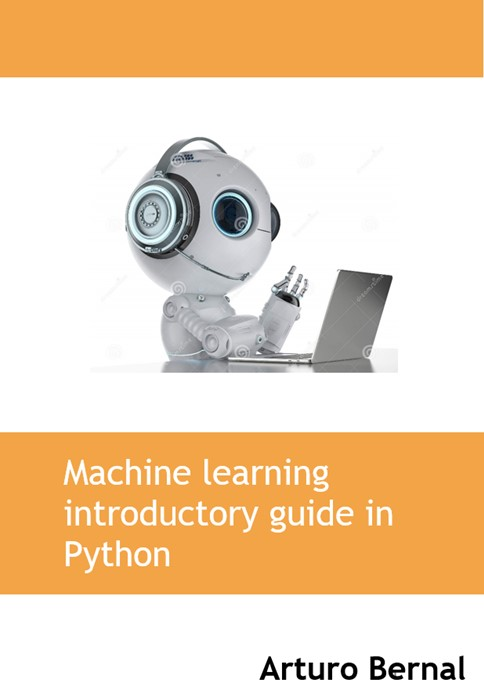

--- 
title: "Machine learning introductory guide Python"
author: "L. Arturo Bernal"
date: "2023-05-23"
knit: "bookdown::render_book"
site: bookdown::bookdown_site
output: bookdown::bs4_book
documentclass: book
bibliography: book.bib
biblio-style: apalike
link-citations: true
links-as-notes: true
colorlinks: true
github-repo: abernal30/ml_book 
cover-image: images/Picture1.jpg
url: https://www.arturo-bernal.com/book
description: "A guide Machine learning introductory in Python"
---

# Machine learning introductory guide {-}

This is the for the book *Machine learning introductory guide*! 

This is a work by [Aturo Bernal](https://www.arturo-bernal.com/index.html) 
Visit the [GitHub repository for this site](https://github.com/abernal30/ml_book). 

# Preface {-}

This text and examples aim to generate a basic guide for the Machine Learning (ML) methodology. I am writing the book inspired by the students of the Accounting and AI course of Tecnologico de Monterrey in the spring of 2023.

The following steps may differ from other books, data scientists, or experts because there are many ways to deal whit machine learning. But that is precisely the richness of this area of expertise. If there existed only one way to apply machine learning, everybody could use it!!

The Python codes and other files are stored in the [GitHub repository for this site](https://github.com/abernal30/ML_python). 

## Outline {-}

