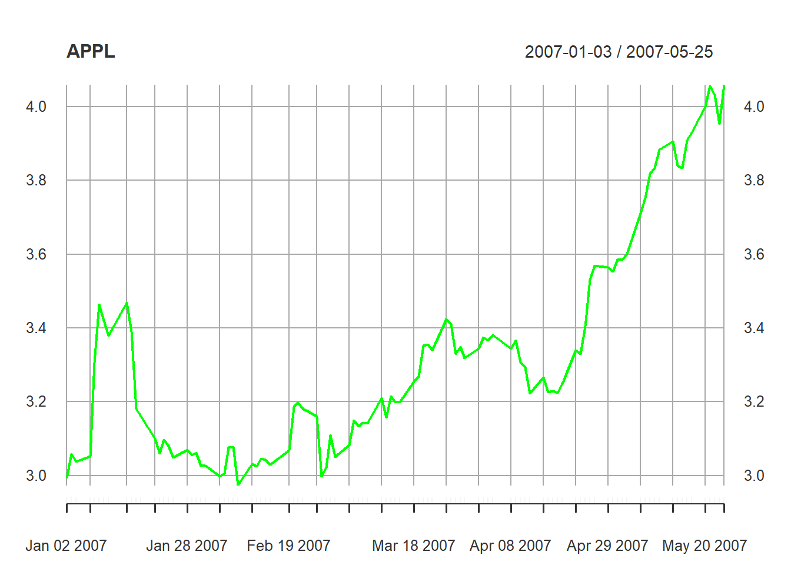
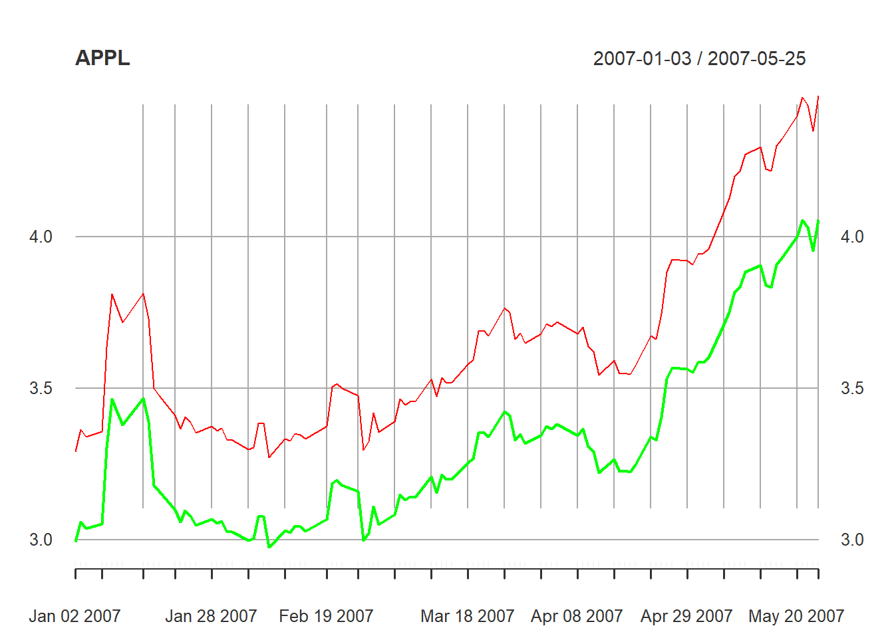
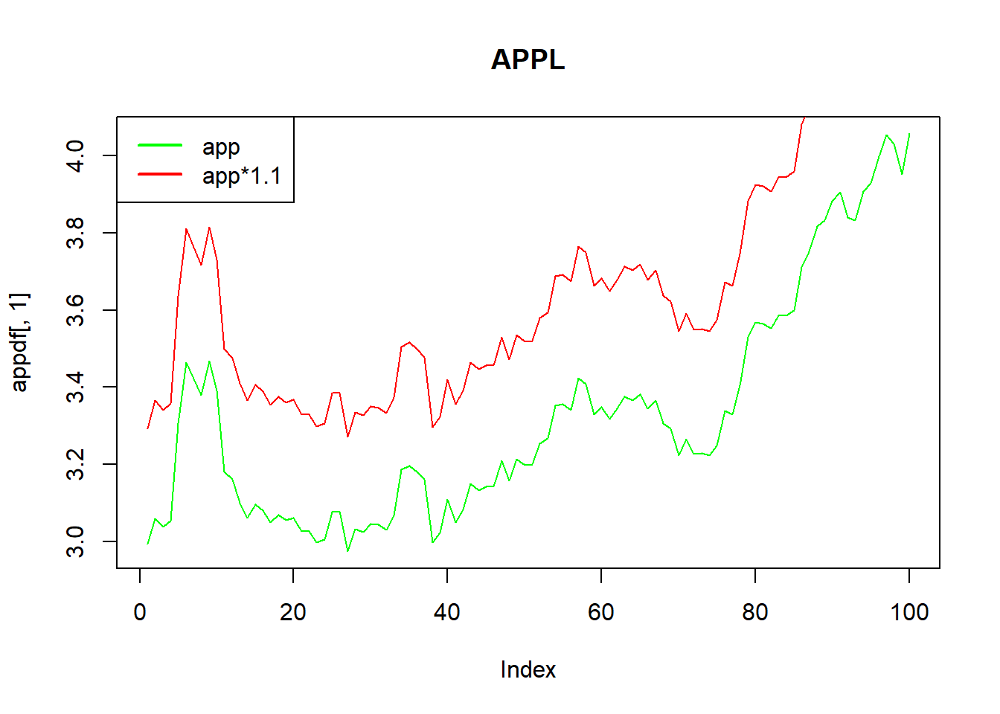

# APIS and R graphs {#graphs}


## 1. APIs  API´s (Application Programming Interface)


### 1.1 Quantmod API
Quantitative Financial Modelling Framework


The quantmod package for R is designed to assist the quantitative trader in the development, testing, and deployment of statistically based trading models.

The function getSymbols is a wrapper to load data from various sources, local or remote. One of the more popular adn the default is yahoo fiannce,  https://finance.yahoo.com/,  
getSymbols("Symbol"):


```r
library(quantmod)

getSymbols("AAPL")
#> [1] "AAPL"
class(AAPL)
#> [1] "xts" "zoo"
```


As you can see, the object class is xts. 

To eliminate warnings, we could add the argument warnings = F

Getting the data from an specific date:

getSymbols("symbol", from="YY/m/d",to="YY/m/d")

Where: YY= is 4 digit year, m= 2 digit month, d= 2 digit day.
           

```r
getSymbols("AMZN", from="2020/04/01",to="2022/04/04")
#> [1] "AMZN"
```

The previous way to download the data store the information in an object on the environment, and by default assign a name to that object, in the previous example would be "AMZN". 

Another way to do it or to store with a different name, form example with the name "data", is the following:

data <- new.env()
getSymbols("ticker",env=data)

```r
apple2 <- new.env()
getSymbols("AAPL", env=apple2)
#> [1] "AAPL"
class(apple2)
#> [1] "environment"
```
The object class is a list. To get the information we have to apply the following code.


```r
apple3<-apple2[["AAPL"]]
```

The previous method is useful when we have tickers like Bitcoin:


```r
getSymbols("BTC-USD")
#> [1] "BTC-USD"
```
Because apparently the name of that object in the environment is "BTC-USD", but if we want to modify it with that name, it would show a debug like: "object 'BTC' not found" 


```r
# bit<-BTC-USD[,4]
```

This is because even when looks  "BTC-USD" the name has these kind of brackets:


```r
# `BTC-USD`
```

Anhother alternative, wich is helpful when we apply loops to get the onformation from the environment is:

```r
bit<-get("BTC-USD")
head(bit)
#>            BTC-USD.Open BTC-USD.High BTC-USD.Low BTC-USD.Close BTC-USD.Volume
#> 2014-09-17      465.864      468.174     452.422       457.334       21056800
#> 2014-09-18      456.860      456.860     413.104       424.440       34483200
#> 2014-09-19      424.103      427.835     384.532       394.796       37919700
#> 2014-09-20      394.673      423.296     389.883       408.904       36863600
#> 2014-09-21      408.085      412.426     393.181       398.821       26580100
#> 2014-09-22      399.100      406.916     397.130       402.152       24127600
#>            BTC-USD.Adjusted
#> 2014-09-17          457.334
#> 2014-09-18          424.440
#> 2014-09-19          394.796
#> 2014-09-20          408.904
#> 2014-09-21          398.821
#> 2014-09-22          402.152
```


If we would like to download intraday data, we could use the Alphavantage

https://www.alphavantage.co/

getSymbols("ticker", src="av", api.key="yourKey", output.size="full",
periodicity="intraday")


```r
getSymbols("AAPL", src="av", api.key="yourKey", output.size="full",
periodicity="intraday",interval="5min")
#> [1] "AAPL"
```


Dividends
getDividends("ticker"), the xts objetc if the ticker  needs to be in the R environment

```r
# Al parecer solo si ticker tiene iformación de divididendos
ap_div<-getDividends("AAPL")
```


### 1.2 In-house Api 

(this will not be covered in the final exam or activities, is only for exposition)

```r
library(xml2)
library(rvest)
```

Harvesting the web with rvest (to get tickers)


This code is to read characters from web pages. In this case, to get the tickers from yahoo finance.


```r
# the page of of the criptocurrencies
#yf <- "https://finance.yahoo.com/cryptocurrencies/"

# for the IPC components
yf <- "https://finance.yahoo.com/quote/%5EMXX/components?p=%5EMXX"
html <- read_html(yf)
# To get the node a, wich contains characters 
node <- html_nodes(html,"a")

# To read the text in the node
node<-html_text(node, trim=TRUE)

# To get the elements that have USD (the tickers). For the IPC tickers, replace "USD" with ".MX". For other tickers, print the node object and look for patterns or select by rows.
#tickers<-grep(pattern = "USD", x = node, value = TRUE)

tickers<-grep(pattern = ".MX", x = node, value = TRUE)

# to get only the first 5 tickers

tickers1<-tickers
tickers1
#>  [1] "IENOVA.MX"     "ALSEA.MX"      "MEGACPO.MX"    "ASURB.MX"     
#>  [5] "ALPEKA.MX"     "FEMSAUBD.MX"   "LABB.MX"       "GCARSOA1.MX"  
#>  [9] "BIMBOA.MX"     "AMXL.MX"       "GCC.MX"        "GMEXICOB.MX"  
#> [13] "CEMEXCPO.MX"   "BOLSAA.MX"     "PINFRA.MX"     "CUERVO.MX"    
#> [17] "TLEVISACPO.MX" "GENTERA.MX"    "LIVEPOLC1.MX"  "MEXCHEM.MX"   
#> [21] "GAPB.MX"       "GRUMAB.MX"     "BBAJIOO.MX"    "AC.MX"        
#> [25] "GFNORTEO.MX"   "KOFL.MX"       "KIMBERA.MX"    "PEOLES.MX"    
#> [29] "OMAB.MX"       "SITESB1.MX"
```


```r
getSymbols(tickers1[1:2]) 
#> [1] "IENOVA.MX" "ALSEA.MX"
```

### 1.3 Nasdaq Data Link API

You need to create an account (I suggest for you a free academic account)

Nasdaq Data Link API (before it eas Quandl)  https://data.nasdaq.com/


The class of objects from Quandl are Data Frames, but if e add the argument: type="xts", an xts object we get.

Emerging Markets High Grade Corporate Bond Index Yield


```r
library(Quandl)
# por default como data frame, pero podemos darle unargumento para que sea xts la descarga
eurex<-Quandl("ML/EMHGY", api_key="e7Z7FD5siZ8mDi_yTVLD",type="xts")
# api_key 
head(eurex)
#>            [,1]
#> 1998-12-31 8.48
#> 1999-01-04 8.48
#> 1999-01-05 8.46
#> 1999-01-06 8.37
#> 1999-01-07 8.43
#> 1999-01-08 8.40
```


## 3. Graphs (Plots)
 The  basic function for ploting is plot(x, type = "h", col = "red", lwd = 10, "xlab","ylab").
In help plot.xy and plot.default we can see the arguments.
Plot the HSI close price

```r
#tickers<-c("AAPL","AMZN")
# vector de caracteres
getSymbols("AAPL")
#> [1] "AAPL"
#> [1] "AAPL" "AMZN"
app<-AAPL[1:100,4]
#am<-AMZN[1:110,4]
#both<-cbind(app,am) 
```


```r
plot(app,type="l",col="green", main = "APPL")
```



```r

# to add anhother time series, for example: apple*1.1

lines(app[,1]*1.1,col="red")
```




Note: After applying the function plot, to add another line, it must be in the same  data frame, otherwise it may not appear in the plot.  

Adding leggend

The function legends only work with data frames, not xts., then we transform it in dataframe
as.data.frame(object). 

To add a legend, but it only works for data frames objects, not in xts. Then we need to transform it into data frame.

legend(x= "topleft", legend = c("objst","objt2"),lty = 1,col=c("green","red"))

```r
appdf<-as.data.frame(app)
app_1df<-as.data.frame(app[,1]*1.1)

plot(appdf[,1],type="l",col="green", main = "APPL") 
lines(app_1df[,1],col="red") 
legend(x= "topleft", legend = c("app","app*1.1"),lty = 1,lwd=2,col=c("green","red"))
```



For more details of legends look in http://www.sthda.com/english, for the legend function arguments.

