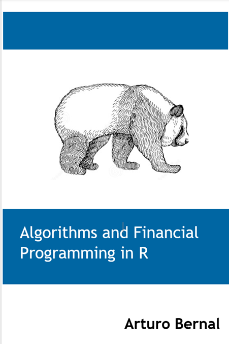

--- 
title: "Algorithms and Financial Programing in R"
author: "Arturo Bernal"
date: "`r Sys.Date()`"
knit: "bookdown::render_book"
site: bookdown::bookdown_site
output: bookdown::bs4_book
documentclass: book
bibliography: [book.bib]
biblio-style: apalike
link-citations: true
links-as-notes: true
colorlinks: true
github-repo: abernal30/BookAFP 
cover-image: images/coverf.png
url: https://www.arturo-bernal.com/book
description: "A guide financial modeling in R"
---

```{r include=FALSE}
# automatically create a bib database for R packages
knitr::write_bib(c(
  .packages(), 'bookdown', 'knitr', 'rmarkdown', 'rmallet'
), 'packages.bib')
```


# Algorithms and Financial Programing in R {-}

<a href=""></a>

This is the for the book *Algorithms and Financial Programing in R*! 

This is a work by [Aturo Bernal](https://www.arturo-bernal.com/index.html) 
Visit the [GitHub repository for this site](https://github.com/abernal30/BookAFP). 

<script>
  (function(i,s,o,g,r,a,m){i['GoogleAnalyticsObject']=r;i[r]=i[r]||function(){
  (i[r].q=i[r].q||[]).push(arguments)},i[r].l=1*new Date();a=s.createElement(o),
  m=s.getElementsByTagName(o)[0];a.async=1;a.src=g;m.parentNode.insertBefore(a,m)
  })(window,document,'script','https://www.google-analytics.com/analytics.js','ga');

  ga('create', 'UA-68765210-2', 'auto');
  ga('send', 'pageview');

</script>


# Preface {-}

We started writing this book as guidance for some undergraduate courses related to algorithms and financial programming. We extend the content to become a book for those who wish to start learning to program in R or want to expand their knowledge in programming with applications in finance. The codes of this book are in R and were written in RStudio Markdowns because it is a worldwide known programming language.   
This book aims to get some introductory programming competencies, as well as in the topics of data cleaning, data analysis, and machine learning, and to employ those concepts in finance.

The R and other files are stored in the [GitHub repository for this site](https://github.com/abernal30/BookAFP). 

## Outline {-}

